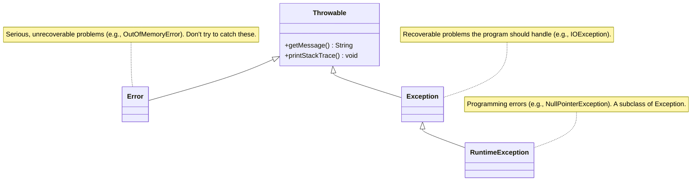

# 06 - Exception Handling: Dealing with the Unexpected

In a perfect world, programs would always run without errors. Files would always exist, networks would never fail, and users would never enter bad data. But we don't live in a perfect world. As language designers, we had to provide a robust mechanism to handle errors gracefully.

**What's in this chapter:**
*   [The `Throwable` Hierarchy: A Family of Problems](#1-the-throwable-hierarchy-a-family-of-problems)
*   [Handling Exceptions: `try`, `catch`, `finally`](#2-handling-exceptions-try-catch-finally)
*   [The Modern Way: `try-with-resources`](#3-the-modern-way-try-with-resources)
*   [Checked vs. Unchecked: A Design Philosophy](#4-checked-vs-unchecked-a-design-philosophy)
*   [Hands-On Lab: Safe File Reading](#5-hands-on-lab-safe-file-reading)
*   [Interview Deep Dives](#interview-deep-dives)

---

## 1. The `Throwable` Hierarchy: A Family of Problems

In Java, all "problem" events are objects that inherit from the `Throwable` class. Understanding this hierarchy is key to understanding how errors and exceptions are organized.



*   **`Error`:** Represents critical, abnormal conditions that are external to the application and usually unrecoverable (e.g., the JVM running out of memory). Your program should not try to `catch` these.
*   **`Exception`:** Represents conditions that a well-written application should anticipate and can often recover from.

---

## 2. Handling Exceptions: `try`, `catch`, `finally`

This is the classic mechanism for handling exceptions.
*   **`try`:** You place the code that might throw an exception in the `try` block.
*   **`catch`:** You use a `catch` block to define the "recovery" code that runs if a specific exception is thrown.
*   **`finally`:** The `finally` block is our guarantee that a piece of code will *always* run, whether an exception was thrown or not. This is essential for cleanup tasks like closing files.

```java
public void oldSchoolFileReader(String path) {
    FileReader reader = null;
    try {
        reader = new FileReader(path);
        // ... read from the file ...
    } catch (FileNotFoundException e) {
        System.err.println("Error: File not found at " + path);
    } finally {
        if (reader != null) {
            try {
                reader.close(); // Closing the resource
            } catch (IOException e) {
                // Handle the exception from closing the resource
                e.printStackTrace();
            }
        }
    }
}
```
As you can see, the `finally` block can become quite verbose and is itself prone to errors. This led us to design a better way.

---

## 3. The Modern Way: `try-with-resources`

Introduced in Java 7, the `try-with-resources` statement is the preferred way to handle resources that need to be closed (like files, database connections, etc.). It's safer and much more concise.

Any object that implements the `java.lang.AutoCloseable` interface can be used in a `try-with-resources` statement.

```java
public void modernFileReader(String path) {
    // The FileReader is declared inside the parentheses.
    try (FileReader reader = new FileReader(path)) {
        // ... read from the file ...
    } catch (FileNotFoundException e) {
        System.err.println("Error: File not found at " + path);
    } catch (IOException e) {
        // The .close() method can also throw an IOException
        System.err.println("Error closing the file: " + e.getMessage());
    }
    // No 'finally' block needed! The 'reader' is automatically closed.
}
```

---

## 4. Checked vs. Unchecked: A Design Philosophy

This was one of our most controversial design decisions. We divided the `Exception` family into two categories to guide developers on what they should handle.

*   **Checked Exceptions:** These are for predictable, recoverable error conditions. The compiler *checks* that you have handled them.
    *   **Examples:** `IOException`, `SQLException`, `FileNotFoundException`.
    *   **Rule:** You must either `catch` the exception or declare that your method `throws` it.
    *   **Why?** We wanted to force developers to build more robust applications by thinking about error conditions upfront.

*   **Unchecked (Runtime) Exceptions:** These represent programming errors (bugs) that are generally not recoverable.
    *   **Examples:** `NullPointerException`, `ArrayIndexOutOfBoundsException`, `IllegalArgumentException`.
    *   **Rule:** You are not required to handle them, though you can if you want.
    *   **Why?** Forcing checks for these everywhere would severely clutter the code. The best "fix" is to write correct code in the first place.

| Type      | When to Use                                       | Example                      | How to Handle                               |
|-----------|---------------------------------------------------|------------------------------|---------------------------------------------|
| **Checked** | For predictable, recoverable, external conditions. | `FileNotFoundException`      | Must `try-catch` or `throws`.               |
| **Unchecked** | For bugs and programming errors.                  | `NullPointerException`       | Don't catch. Fix your code.                 |
| **`Error`**   | For critical, unrecoverable JVM errors.           | `OutOfMemoryError`           | Don't catch. The program is likely to crash. |

---

## 5. Hands-On Lab: Safe File Reading

To see these concepts in action, we've created a small project in the `code/` subdirectory. It demonstrates:
*   Using `try-with-resources` to read a file.
*   Handling a `FileNotFoundException`.
*   Creating and throwing a custom checked exception.

**To run it:**
1.  Navigate to the `code/` directory.
2.  Run `mvn compile exec:java`. The program will first fail because a file is missing.
3.  Create a file named `sample.txt` in the `code/` directory.
4.  Run the program again to see it succeed.

---

## Interview Deep Dives

(Content from the original `README.md` for Q22-Q25 would be included here, with minor formatting improvements.)
