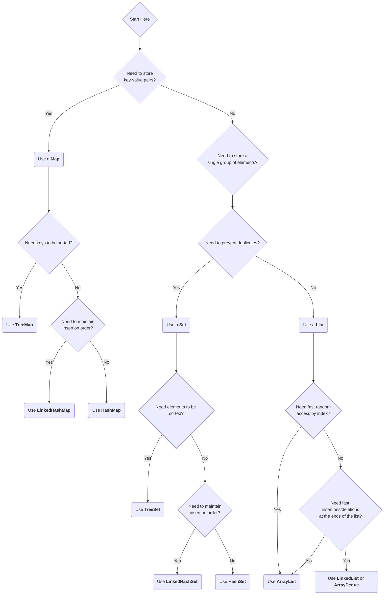

# 07 - The Java Collections Framework: A Deeper Look

We've already touched on some data structures. Now, let's look at the design philosophy behind the entire **Java Collections Framework (JCF)**. We designed it to be a unified architecture for representing and manipulating collections, enabling them to be manipulated independently of the details of their representation.

**What's in this chapter:**
*   [The JCF Hierarchy: A Map of the Tools](#1-the-jcf-hierarchy-a-map-of-the-tools)
*   [How to Choose the Right Collection](#2-how-to-choose-the-right-collection)
*   [Sorting: `Comparable` vs. `Comparator`](#3-sorting-comparable-vs-comparator)
*   [Hands-On Lab: A Collection Showcase](#4-hands-on-lab-a-collection-showcase)
*   [Interview Deep Dives](#interview-deep-dives)

---

## 1. The JCF Hierarchy: A Map of the Tools

The cornerstone of the JCF is a set of core interfaces. Understanding this hierarchy helps you understand the capabilities of each part of the framework.

```mermaid
graph TD
    Iterable --> Collection
    Collection --> List
    Collection --> Set
    Collection --> Queue

    subgraph Interfaces
        Iterable
        Collection
        List
        Set
        Queue
        Map
    end

    subgraph Common Implementations
        List --> ArrayList
        List --> LinkedList

        Set --> HashSet
        Set --> LinkedHashSet
        Set --> TreeSet

        Queue --> PriorityQueue
        Queue --> ArrayDeque

        Map --> HashMap
        Map --> LinkedHashMap
        Map --> TreeMap
    end

    note for Map "Map is conceptually part of the JCF but does not extend Collection."
```
**The Core Interfaces:**
*   **`Collection`:** The root of the hierarchy. Represents a group of objects.
*   **`List`:** An **ordered** collection (a sequence) that allows duplicates. You can access elements by their integer index.
*   **`Set`:** A collection that contains **no duplicate** elements.
*   **`Queue`:** A collection used to hold elements prior to processing. Typically orders elements in a **FIFO** (first-in, first-out) manner.
*   **`Map`:** An object that maps **keys to values**. It cannot contain duplicate keys.

---

## 2. How to Choose the Right Collection

This is a critical skill for a Java developer. Use this decision guide to help you choose.



---

## 3. Sorting: `Comparable` vs. `Comparator`

We provided two mechanisms for defining how objects are ordered.

*   **`Comparable`:** For defining the **natural order** of an object. A class implements `Comparable` itself. There can be only one natural order.
    *   **Example:** A `Person` class might be naturally ordered by their unique ID.
    *   **Method:** `public int compareTo(Person other)`

*   **`Comparator`:** For defining **custom or external orderings**. A `Comparator` is implemented in a separate class. You can have many different `Comparator`s for the same object.
    *   **Example:** You might want to sort `Person` objects by name, or by age, or by city.
    *   **Method:** `public int compare(Person p1, Person p2)`

**Key Takeaway:** If a class has a clear, single, obvious order, implement `Comparable`. For all other sorting needs, create `Comparator`s. With Java 8 lambdas, creating custom comparators on the fly is extremely common and powerful.

---

## 4. Hands-On Lab: A Collection Showcase

We've created a runnable project in the `code/` directory that demonstrates:
*   The use of `List`, `Set`, and `Map`.
*   Sorting a custom `Person` object using both `Comparable` and multiple `Comparator`s.
*   Using a `PriorityQueue` to process tasks based on priority.

**To run it:**
1.  Navigate to the `code/` directory.
2.  Run `mvn compile exec:java`.
3.  Explore the source code to see how these collections solve different problems.

---

## Interview Deep Dives

(Content from the original `README.md` for Q26-Q30 would be included here.)
