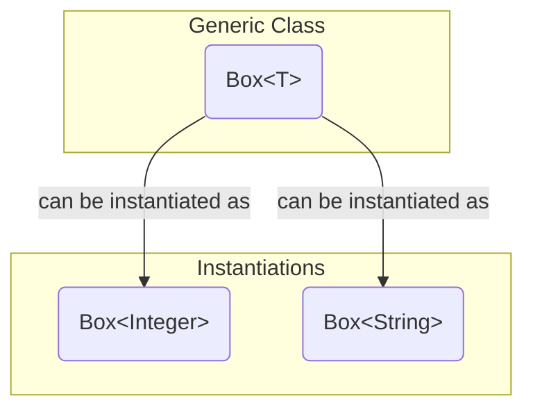
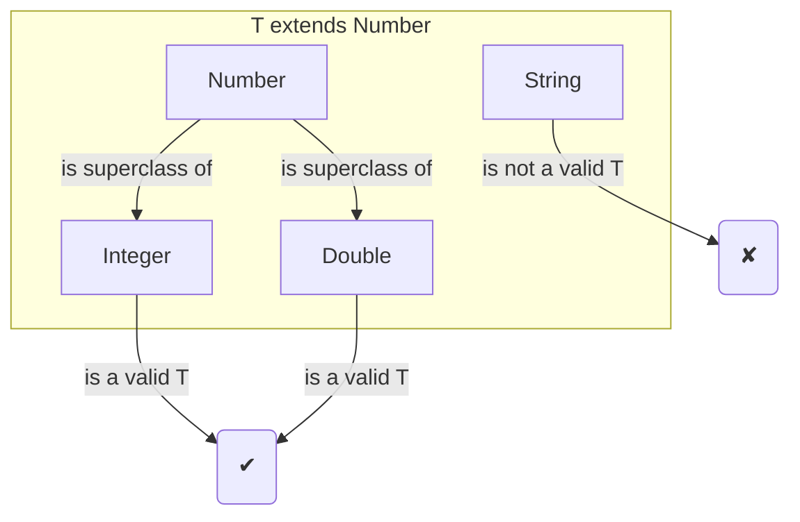

# 08 - Generics: Writing Flexible, Type-Safe Code

For the first few years of Java's life, we had a problem. Collections stored everything as a generic `Object`. When you retrieved an item, you had to cast it back to its original type. This was clumsy and, worse, it was not type-safe. A `ClassCastException` at runtime was a common bug.

We introduced **Generics** in Java 5 to solve this. Generics add "type parameters" to classes and methods, allowing the compiler to enforce type safety at compile-time, not runtime.

**What's in this chapter:**
*   [Generic Classes: The `Box<T>` Example](#1-generic-classes-the-boxt-example)
*   [Generic Methods](#2-generic-methods)
*   [Bounded Generics: Limiting Your Types](#3-bounded-generics-limiting-your-types)
*   [Wildcards and The PECS Principle](#4-wildcards-and-the-pecs-principle)
*   [JVM Deep Dive: Type Erasure](#5-jvm-deep-dive-type-erasure)
*   [Hands-On Lab: Generic Utilities](#6-hands-on-lab-generic-utilities)
*   [Interview Deep Dives](#interview-deep-dives)

---

## 1. Generic Classes: The `Box<T>` Example

You can create your own classes that work with generic types. The classic example is a `Box`. A `Box` can hold anything, but we want to know *what* it holds when we create it.

```java
// T is a "type parameter" that will be replaced by a real type.
public class Box<T> {
    private T item;

    public void put(T item) {
        this.item = item;
    }

    public T get() {
        return item;
    }
}
```

Now, we can create `Box` objects that are guaranteed to hold a specific type:

```java
// A box specifically for Integers
Box<Integer> integerBox = new Box<>();
integerBox.put(10);
Integer myInt = integerBox.get(); // No cast needed!

// A box specifically for Strings
Box<String> stringBox = new Box<>();
stringBox.put("Hello");
String myString = stringBox.get(); // No cast needed!

// The compiler will prevent this error:
// integerBox.put("Some String"); // COMPILE ERROR!
```



---

## 2. Generic Methods

You can also create a single method that is generic, without its containing class being generic.

```java
public <T> void printArray(T[] inputArray) {
    for(T element : inputArray) {
        System.out.printf("%s ", element);
    }
    System.out.println();
}
```
You can call this with any type of array: `printArray(integerArray);` or `printArray(stringArray);`.

---

## 3. Bounded Generics: Limiting Your Types

Sometimes you want to restrict the types that can be used as a type parameter. For this, we use the `extends` keyword to set an **upper bound**.

For example, a method that works with any kind of `Number`:
```java
// T can be Integer, Double, Float, etc., but not String.
public <T extends Number> double doubleValue(T number) {
    return number.doubleValue();
}
```



---

## 4. Wildcards and The PECS Principle

Wildcards (`?`) are used to create flexible APIs that can accept generics of "unknown" type.

*   `List<?>`: A list of unknown type. You can't add anything to it (except `null`).
*   `List<? extends T>`: An **upper-bounded** wildcard. The list holds `T` or a subclass of `T`.
*   `List<? super T>`: A **lower-bounded** wildcard. The list holds `T` or a superclass of `T`.

This leads to a famous mnemonic: **PECS (Producer Extends, Consumer Super)**.
*   **Producer Extends:** If a generic structure is a **producer** (you only get values *out* of it), use `extends`.
    ```java
    // This method can print a list of any kind of Animal.
    public void printAnimals(List<? extends Animal> animals) {
        for (Animal a : animals) { // We are GETTING animals out.
            System.out.println(a);
        }
    }
    ```
*   **Consumer Super:** If a generic structure is a **consumer** (you only put values *into* it), use `super`.
    ```java
    // This method can add a Dog to a list of Dogs, a list of Animals, or a list of Objects.
    public void addDog(List<? super Dog> dogs) {
        dogs.add(new Dog()); // We are PUTTING a dog in.
    }
    ```

---

## 5. JVM Deep Dive: Type Erasure

This might surprise you, but the JVM doesn't actually know about generics. We implemented generics using a technique called **type erasure**. The compiler uses the generic type information to check for type errors, but then it **erases** that information.

*   `Box<T>` becomes `Box`.
*   `T` becomes `Object` (or the upper bound, like `Number`, if one was specified).
*   The compiler secretly inserts casts for you when you retrieve an item.

We chose this approach for **backward compatibility**. It allowed new generic code to work with old, pre-Java 5 code.

**Consequences of Type Erasure:**
*   You cannot do `new T()`. The compiler doesn't know what `T` is.
*   You cannot do `T.class`.
*   You cannot create an array of a generic type, like `new T[10]`.

---

## 6. Hands-On Lab: Generic Utilities

We've created a runnable project in the `code/` subdirectory that demonstrates:
*   A generic `Box<T>` class.
*   A generic method that operates on lists.
*   The PECS principle in action with a `copy` method.

**To run it:**
1.  Navigate to the `code/` directory.
2.  Run `mvn compile exec:java`.
3.  Explore the source code to see how generics create flexible, reusable, and type-safe code.

---

## Interview Deep Dives

(Content from the original `README.md` for Q31 would be included and expanded here.)
