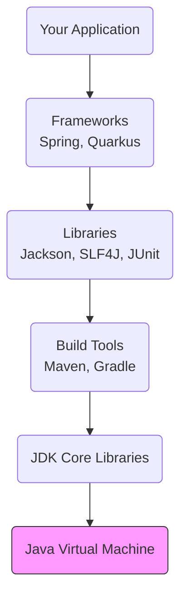

# 13 - The Java Ecosystem: Tools of the Trade

The Java language and the JVM are only the foundation. Java's true power and longevity come from its **ecosystem**: the vast collection of open-source tools, libraries, and frameworks built by the community. A professional Java developer must know how to navigate and leverage this ecosystem.

## The Java Ecosystem at a Glance

Think of the ecosystem as layers built upon the JVM.



---

## 1. Build & Dependency Management

These tools automate how you build your code and manage its dependencies.
*   **Maven:** The long-standing standard. Uses XML for configuration (`pom.xml`). It's reliable and well-understood.
*   **Gradle:** A more modern tool. Uses Groovy or Kotlin for build scripts, making it more flexible and often faster than Maven. **Recommended for new projects.**

---

## 2. Frameworks: Your Application's Skeleton

Frameworks provide the structure for your application, saving you from writing tons of boilerplate code.
*   **Spring Framework (and Spring Boot):** The de facto standard for building everything from REST APIs to complex enterprise systems. Spring Boot, in particular, makes it incredibly easy to create stand-alone, production-grade applications.
*   **Quarkus & Micronaut:** Modern, cloud-native frameworks designed for fast startup times and low memory consumption, making them excellent for serverless functions and microservices.

---

## 3. Key Libraries: Your Toolkit

You should rarely have to build common functionality from scratch. There is almost always a high-quality library for it.
*   **Web:** `spring-boot-starter-web` (includes Tomcat and Spring MVC by default).
*   **Data Access:** `spring-boot-starter-data-jpa` (provides Hibernate), or `jOOQ` for type-safe SQL.
*   **Testing:** `JUnit 5` (the standard for tests), `Mockito` (for mocking dependencies), `Testcontainers` (for integration tests with real databases, etc.), `AssertJ` (for fluent, readable assertions).
*   **JSON Handling:** `Jackson` (the default in Spring) or `Gson`.
*   **Logging:** `SLF4J` (a logging abstraction) with `Logback` (a powerful logging implementation).
*   **HTTP Clients:** Java 11's built-in `HttpClient` or `OkHttp`.

---

## A Principal's Production Playbook for Spring Boot

Spring Boot is the dominant platform for building Java applications. Here is an opinionated guide to using it effectively.

#### a. Core Dependencies
A typical REST API should start with these dependencies in your `pom.xml` or `build.gradle`:
*   `spring-boot-starter-web`
*   `spring-boot-starter-actuator` (for production monitoring: health checks, metrics)
*   `spring-boot-starter-data-jpa` (for database access)
*   `spring-boot-starter-test` (includes JUnit, Mockito, AssertJ)

#### b. Application Structure
Separate your code by feature or by layer. A common layered approach is:
*   `com.example.web`: REST Controllers.
*   `com.example.service`: Business logic.
*   `com.example.repository`: Data access interfaces (e.g., Spring Data JPA repositories).
*   `com.example.domain`: Your core entities (e.g., `User`, `Product`).

#### c. Type-Safe Configuration
Externalize configuration in `application.yml` and use `@ConfigurationProperties` for type-safe access.

*   **`application.yml`:**
    ```yaml
    app:
      jwt:
        secret-key: "your-secret"
        expiration-ms: 3600000
    ```
*   **Java Class:**
    ```java
    @ConfigurationProperties(prefix = "app.jwt")
    public record JwtProperties(String secretKey, long expirationMs) {}
    ```

#### d. A Balanced Testing Strategy
*   **Unit Tests:** Use `@Test` and `@ExtendWith(MockitoExtension.class)` to test a single class in isolation. Mock all dependencies.
*   **Integration Tests:** Use `@SpringBootTest` to test the interaction between several components (e.g., service and repository). Use **Testcontainers** to spin up a real Docker container for your database.
    ```java
    @SpringBootTest
    @Testcontainers
    class UserRepositoryIntegrationTest {
        @Container
        static PostgreSQLContainer<?> postgres = new PostgreSQLContainer<>("postgres:14-alpine");
    }
    ```
*   **API / End-to-End Tests:** Test the full flow from the web layer to the database.
    ```java
    @SpringBootTest(webEnvironment = SpringBootTest.WebEnvironment.RANDOM_PORT)
    class UserApiEndToEndTest {
        @Autowired
        private TestRestTemplate restTemplate;
    }
    ```
