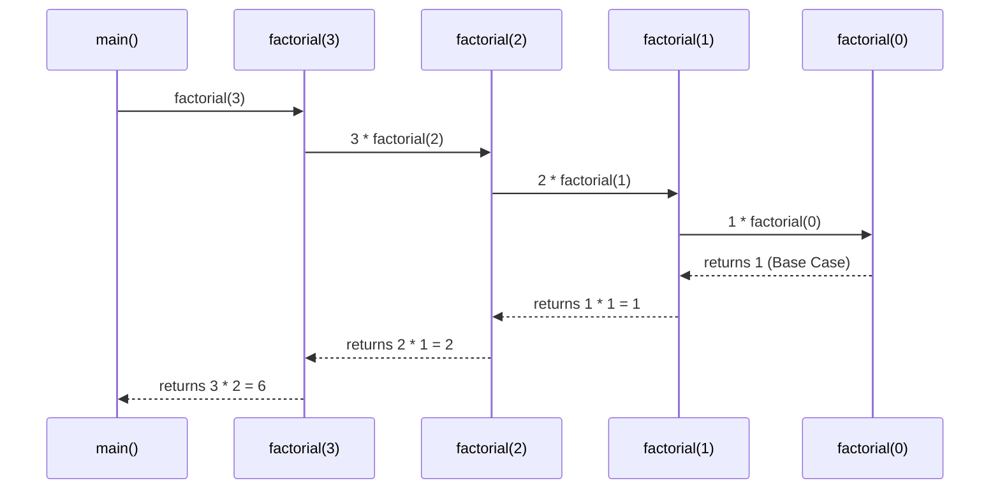
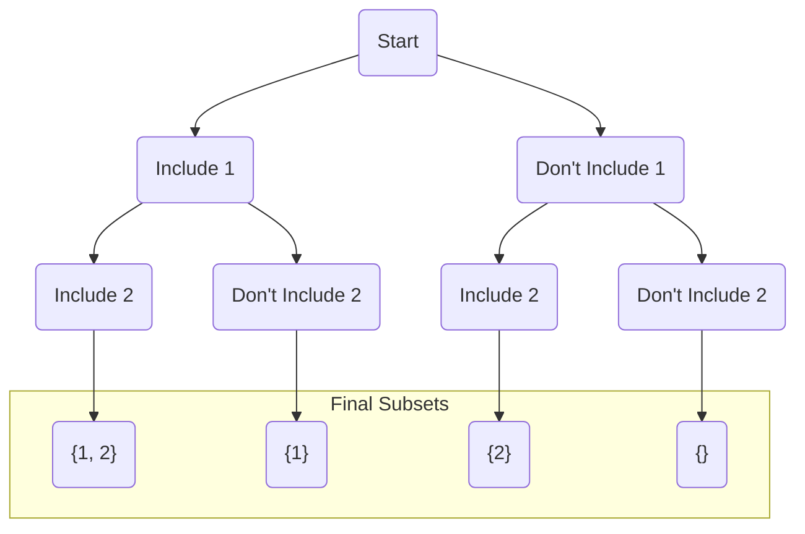

# 24 - Recursion and Backtracking

Recursion is a fundamental programming technique where a function calls itself to solve smaller instances of the same problem. **Backtracking** is a specific, powerful application of recursion used to solve problems that involve exploring a set of possibilities, like finding all valid solutions to a puzzle.

**What's in this chapter:**
*   [Recursion: Thinking in Self-Similar Terms](#1-recursion-thinking-in-self-similar-terms)
*   [Backtracking: The Art of Exploration](#2-backtracking-the-art-of-exploration)
*   [A Template for Backtracking](#3-a-template-for-backtracking)
*   [Hands-On Lab: Generating All Subsets](#4-hands-on-lab-generating-all-subsets)
*   [Classic Backtracking Problems (Exercises)](#5-classic-backtracking-problems-exercises)

---

## 1. Recursion: Thinking in Self-Similar Terms

Every recursive function has two essential parts:
1.  **Base Case:** A condition that stops the recursion. This is the simplest version of the problem that can be solved directly.
2.  **Recursive Step:** The part of the function that calls itself, but with a "smaller" or "simpler" input.

Let's visualize the call stack for a simple `factorial(3)` function:



---

## 2. Backtracking: The Art of Exploration

Think of solving a maze. You go down one path. If you hit a dead end, you "backtrack" to the last intersection and try a different path. This is exactly what backtracking algorithms do. They explore a path of choices, and if the path doesn't lead to a solution, they "un-make" the choice and try another.

Let's visualize finding all subsets of `{1, 2}`. This creates a "decision tree".



---

## 3. A Template for Backtracking

Most backtracking problems can be solved with a variation of this template.

```java
void backtrack(State state, List<Choice> choices) {
    if (is_a_solution(state)) {
        add_to_solutions(state);
        return;
    }

    for (Choice choice : choices) {
        if (is_valid(choice)) {
            // 1. Choose
            make_choice(choice);

            // 2. Explore
            backtrack(new_state, new_choices);

            // 3. Un-choose (Backtrack)
            unmake_choice(choice);
        }
    }
}
```
The "Choose, Explore, Un-choose" pattern is the heart of backtracking.

---

## 4. Hands-On Lab: Generating All Subsets

We've created a runnable project in the `code/` directory that implements the backtracking template to solve the "Subsets" problem for a given set of numbers.

**To run it:**
1.  Navigate to the `code/` directory.
2.  Run `mvn compile exec:java`.
3.  Explore the source code to see the "Choose, Explore, Un-choose" pattern in action.

---

## 5. Classic Backtracking Problems (Exercises)

Now that you have the template, try applying it to these classic problems. The original `README` for this chapter contained solutions; try to solve them on your own first.

*   **Permutations:** Find all possible orderings of a set of elements. (Hint: The set of "available choices" changes at each step).
*   **Combinations:** Find all possible subsets of a specific size `k`. (Hint: Use a `start` index to prevent duplicate combinations).
*   **Generate Parentheses:** Given `n` pairs of parentheses, write a function to generate all combinations of well-formed parentheses.
*   **N-Queens:** The N-Queens puzzle is the problem of placing `N` chess queens on an `N×N` chessboard so that no two queens threaten each other.
