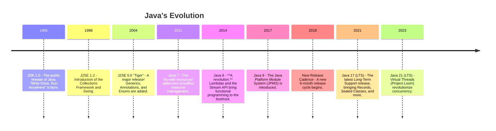

# 00 - A Conversation with the Designer: An Introduction to Java

**Authors' Note:** Welcome. We, the original architects of the Java language, are here to guide you. Our goal is to help you understand not just the *how* of Java, but the *why*. Why did we make the decisions we did? What problems were we trying to solve? This is the story of Java.

---

## The World Before Java: A Need for a New Language

In the early 1990s, the software world was fragmented. A program written for one type of computer wouldn't run on another. This was a significant barrier to progress. We envisioned a world where you could **"Write Once, Run Anywhere" (WORA)**. This became our guiding principle.

We set out to create a language that was:
*   **Simple and Familiar:** We borrowed the best ideas from C and C++, so experienced developers could be productive quickly.
*   **Robust and Secure:** We wanted a language for a networked world. This meant building in safeguards against common errors. Features like automatic memory management (the Garbage Collector) and strong type-checking were not afterthoughts; they were core to the design.
*   **Platform-Independent:** This was our solution to the fragmentation problem. The answer was the **Java Virtual Machine (JVM)**.

## The Birth of the JVM: The Heart of Java

The JVM is the magic behind "Write Once, Run Anywhere". It's an abstract computer, a program that pretends to be a hardware machine.

Here’s the process, which is central to understanding Java:

```mermaid
graph LR
    A[Java Source Code<br>(.java file)] -- javac compiler --> B(Java Bytecode<br>(.class file))
    B -- runs on --> C{JVM}
    subgraph Different Operating Systems
        direction LR
        C -- JIT Compilation --> D1[Linux<br>Machine Code]
        C -- JIT Compilation --> D2[Windows<br>Machine Code]
        C -- JIT Compilation --> D3[macOS<br>Machine Code]
    end
```

You write your code once. The compiler turns it into **bytecode**, a universal, intermediate language. The JVM on any given device then translates that bytecode into the native machine code for that specific device, often optimizing it on the fly with a **Just-In-Time (JIT) Compiler**.

The JVM is more than a translator; it's a manager. It manages memory, enforces security, and makes Java a portable and powerful platform.

## A Brief History of Java

Java's journey has been long and transformative. Here are some of the key milestones that have shaped the language and its ecosystem.



## Why Java Endures: A Legacy of Good Design

Java remains one of the most popular and influential languages in the world. Its endurance is a testament to its core design:

*   **Simplicity & Readability:** While powerful, Java's syntax favors clarity, making it excellent for large, long-lived applications maintained by teams of developers.
*   **Performance:** The modern JVM is an engineering marvel. Its JIT compilers can make Java code run at speeds rivaling, and sometimes exceeding, native code.
*   **A Thriving Ecosystem:** The language is only the beginning. The Java ecosystem—with frameworks like Spring, build tools like Maven, and countless libraries—is arguably the richest in the world.
*   **Evolution:** As the timeline shows, Java has never stood still. It has evolved to embrace new programming paradigms and meet the demands of modern software development.

## What to Expect From These Notes

This course is designed to take you from a beginner to a proficient Java developer, ready for real-world challenges. We will cover:
1.  **The Fundamentals:** Variables, loops, and the core syntax.
2.  **Object-Oriented Programming:** A deep dive into the paradigm that defines Java.
3.  **Data Structures & Algorithms:** How to write efficient and correct code.
4.  **Advanced Topics:** Concurrency, networking, and the inner workings of the JVM.
5.  **Real-World Skills:** Unit testing, project development, and best practices.

Let's begin the journey.

---

## Interview Deep Dives

### Q1: Where does Java fit among programming paradigms?

*   **Simple Answer:** Java is primarily an **Object-Oriented Programming (OOP)** language. However, modern Java has also deeply integrated features from **Functional Programming**.

*   **Detailed Explanation:**
    *   **Programming Paradigms** are different styles or "ways of thinking" about programming.
    *   **Imperative Programming:** This style tells the computer *how* to do something, step-by-step.
        *   **Object-Oriented Programming (OOP)** is a type of imperative programming where code is organized around objects. This is Java's core. It helps manage the complexity of large systems by modeling real-world entities.
    *   **Declarative Programming:** This style tells the computer *what* you want, not how to do it.
        *   **Functional Programming** is a type of declarative programming that treats computation as the evaluation of mathematical functions. With the introduction of Lambdas and Streams in Java 8, you can now write code in a more declarative style.

        For example, instead of writing a loop to find even numbers (imperative):
        ```java
        // Imperative style
        List<Integer> evens = new ArrayList<>();
        for (Integer number : numbers) {
            if (number % 2 == 0) {
                evens.add(number);
            }
        }
        ```
        You can declare what you want (declarative/functional):
        ```java
        // Declarative style with Streams
        List<Integer> evens = numbers.stream()
                                     .filter(n -> n % 2 == 0)
                                     .collect(Collectors.toList());
        ```

*   **The Key Takeaway:** Java was designed as an OOP language to build large, reliable systems. It has since evolved to include powerful functional features, giving developers the best of both worlds.

---

[Next: 01 - Getting Started: Your First Conversation with the JVM](../01-Getting-Started/README.md)
