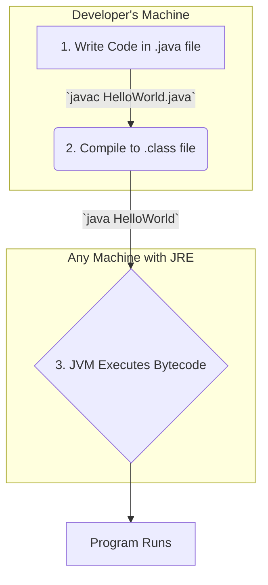

# 01 - Getting Started: Your First Conversation with the JVM

Now that you understand the *why* behind Java, let's get our hands dirty. This chapter will guide you through setting up your development environment and running your very first line of Java code.

**What's in this chapter:**
*   [Prerequisites: Your Toolkit](#1-prerequisites-your-toolkit)
*   [Your First Program: "Hello, JVM!"](#2-your-first-program-hello-jvm)
*   [The Compilation & Execution Rhythm](#3-the-compilation-and-execution-rhythm)
*   [Hands-On Lab: Your First Project](#4-hands-on-lab-your-first-project)
*   [Interview Deep Dives](#interview-deep-dives)

---

## 1. Prerequisites: Your Toolkit

To start writing Java, you need two essential tools: a translator and a smart notebook.

### a. The Java Development Kit (JDK): Your Translator

The JDK is the toolkit we designed to help you write programs that the JVM can understand. It's the foundation of all Java development.

Here's how the components relate to each other:

```mermaid
graph TD
    subgraph JDK [Java Development Kit]
        direction LR
        subgraph JRE [Java Runtime Environment]
            direction LR
            JVM[Java Virtual Machine]
            CoreLibs[Core Libraries]
        end
        Compiler[Compiler (javac)]
        Debugger[Debugger (jdb)]
        OtherTools[Other Tools]
    end

    style JDK fill:#f9f,stroke:#333,stroke-width:2px
    style JRE fill:#bbf,stroke:#333,stroke-width:2px
```

*   **JVM (Java Virtual Machine):** The heart of Java that runs the compiled code.
*   **JRE (Java Runtime Environment):** Contains the JVM and the core libraries needed to *run* Java applications.
*   **JDK (Java Development Kit):** Contains the entire JRE, plus the tools needed to *develop* Java applications, like the compiler (`javac`).

**As a developer, you need the JDK.**

**Where to get the JDK:**
We recommend starting with the latest **Long-Term Support (LTS)** version of Java (e.g., Java 17, 21). For a free, production-ready JDK, we suggest one of these popular distributions:
*   **Eclipse Temurin (from Adoptium)**
*   **Amazon Corretto**
*   **Oracle OpenJDK**

### b. The Integrated Development Environment (IDE): Your Smart Notebook

You could write Java in a simple text editor, but an IDE makes development much more efficient. It's a "smart notebook" that helps you write, compile, run, and debug your code all in one place.

We recommend you start with one of these industry-standard IDEs:
*   **IntelliJ IDEA Community Edition** (free)
*   **Visual Studio Code** (with the "Extension Pack for Java")
*   **Eclipse IDE for Java Developers**

---

## 2. Your First Program: "Hello, JVM!"

Let's write a simple program to verify your setup and say hello to the JVM.

```java
// Every Java program must live inside a class.
public class HelloWorld {

    // This is the main entry point for the program.
    // The JVM looks for this exact method signature to start execution.
    public static void main(String[] args) {

        // This line prints the text "Hello, JVM!" to the console.
        System.out.println("Hello, JVM!");
    }
}
```

Let's break this down from a designer's perspective:
*   `public class HelloWorld`: We designed Java to be object-oriented from the ground up. Every piece of code you write lives inside a class.
*   `public static void main(String[] args)`: This is a special method that we designated as the entry point for any Java application.
    *   `public`: So it can be called from anywhere.
    *   `static`: So it can be run without creating an object of the class.
    *   `void`: It doesn't return any value.
    *   `main`: The name the JVM looks for.
    *   `String[] args`: An array of strings to receive command-line arguments.
*   `System.out.println(...)`: A call to a method in the standard library we provided to make it easy to print text.

---

## 3. The Compilation and Execution Rhythm

When you work with Java, you're engaging in a conversation with the JVM. Here's the rhythm:



1.  **Write:** You save your code in a `HelloWorld.java` file.
2.  **Compile:** You use the JDK's compiler to translate it into bytecode: `javac HelloWorld.java`. This creates a `HelloWorld.class` file.
3.  **Run:** You ask the JVM to execute the bytecode: `java HelloWorld`. The JVM loads your class, finds the `main` method, and runs the code.

This cycle is fundamental to Java development. Your IDE automates these steps for you, but understanding the process is key.

---

## 4. Hands-On Lab: Your First Project

To make this real, we've created a simple, runnable "Hello, World!" project in the `code/` subdirectory.

**To run it:**
1.  Make sure you have a JDK (version 11 or higher) and Apache Maven installed.
2.  Open a terminal and navigate to the `code/` directory.
3.  Run the project using Maven: `mvn compile exec:java`
4.  You should see the output `Hello, 10X Developer!` on your console.

This is the best way to confirm your setup is working correctly before moving on.

---

## Interview Deep Dives

### Q2: What is the difference between the JDK, JRE, and JVM?

*   **Simple Answer:** You use the **JDK** to create Java programs. You need the **JRE** to run them. The **JVM** is the core part of the JRE that actually executes the code.
*   **Detailed Explanation:**
    *   **JVM (Java Virtual Machine):** The virtual machine that runs Java bytecode. It's the component that provides platform independence.
    *   **JRE (Java Runtime Environment):** The installation package that provides the JVM and the core Java libraries. It's the minimum requirement to *run* a Java application.
    *   **JDK (Java Development Kit):** The full toolkit for developers. It includes the entire JRE, plus the compiler (`javac`), debugger (`jdb`), and other development tools.
*   **Key Takeaway:** As a developer, you install the JDK. Your users (or your servers) only need the JRE.

### Q3: How do you compile and run a Java program from the command line?

*   **Simple Answer:** You use two commands: `javac` to compile and `java` to run.
*   **The Process:**
    1.  **Write:** Save your code in a file named `MyProgram.java`. The class name inside the file must match the filename.
    2.  **Compile:** Open a terminal and run `javac MyProgram.java`. This creates a new file, `MyProgram.class`, which contains the bytecode.
    3.  **Run:** In the same terminal, run `java MyProgram` (note: no `.class` at the end). The JVM will then execute your program.
*   **Why it's important:** While IDEs do this for you automatically, knowing the command-line process helps you understand what's happening behind the scenes and is essential for build automation.

---

[Previous: 00 - A Conversation with the Designer: An Introduction to Java](../00-Introduction/README.md) | [Next: 02 - Java Basics: The Building Blocks of the Language](../02-Java-Basics/README.md)
