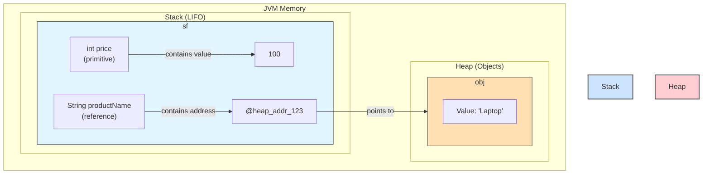

# 02 - Java Basics: The Building Blocks of the Language

Welcome back. Now that you've set up your environment, it's time to learn the basic vocabulary of the Java language. As we go through these concepts, we'll continue our peek behind the curtain to see how the JVM handles things.

**What's in this chapter:**
*   [Variables: Primitives vs. References](#1-variables-the-nouns-of-our-language)
*   [Operators: The Verbs of Our Language](#2-operators-the-verbs-of-our-language)
*   [Control Flow: The Grammar of Our Language](#3-control-flow-the-grammar-of-our-language)
*   [Your Mission: Power Up the Calculator](#4-your-mission-power-up-the-calculator)
*   [Interview Deep Dives](#interview-deep-dives)

---

## 1. Variables: The Nouns of Our Language

A variable is a named piece of memory that holds a value. When we designed Java, we decided to have two kinds of variables: **primitive types** and **reference types**. This distinction is crucial for understanding Java's performance and memory management.

### a. Primitive Types: The Simple Stuff

Primitives are the most basic data types. They are not objects. They hold a single, simple value directly in their allocated memory.

*   `int`, `long`, `short`, `byte`: For whole numbers.
*   `double`, `float`: For floating-point (decimal) numbers.
*   `char`: For a single character (e.g., `'A'`).
*   `boolean`: For `true` or `false` values.

### b. Reference Types: Pointers to Objects

A reference type variable does not hold the object itself, but rather a *reference* (a memory address) to an object. The object itself lives on the **heap**. The most common reference type you'll start with is `String`.

### JVM Deep Dive: Stack vs. Heap

The JVM organizes memory into two main areas: the **stack** and the **heap**.
*   **The Stack:** Fast, but small. Each thread gets its own stack. It's used for storing local variables (primitives and object references) and managing method calls. Memory is automatically reclaimed when a method finishes.
*   **The Heap:** Slower, but large. Shared by all threads. This is where all objects are created (`new`). Memory is managed by the **Garbage Collector (GC)**.

### Mental Model: Stack vs. Heap

A simple way to think about this:
*   **The Stack is like a stack of plates at a buffet.** When a new method is called, a new plate is put on top. This plate holds all the local variables for that method. When the method finishes, its plate is taken off the top, and all its variables are gone. It's fast, efficient, and strictly Last-In, First-Out (LIFO).
*   **The Heap is like a large, open library.** When you create an object (`new`), you're asking the librarian (JVM) to find a space in the library for a new book (the object). Your variable on the stack is just a library card with the location of that book. The library is huge and flexible, but finding and managing the books is a more complex job, which is handled by the Garbage Collector.

Let's visualize it:
```java
public void myMethod() {
    int price = 100; // Primitive
    String productName = "Laptop"; // Reference
}
```


The `price` variable's value (100) lives directly on the stack. The `productName` variable also lives on the stack, but its value is just a memory address pointing to the actual `String` object on the heap.

### A Deeper Dive: The Lifecycle of an `Integer` Object

As per your request for a more detailed example, let's look at what happens behind the scenes for a simple line of code like `Integer c = a + b;`. This example reveals several advanced concepts that the JVM handles for you automatically.

```java
public void integerAddition() {
    Integer a = 2;
    Integer b = 2;
    Integer c = a + b;
}
```

This seemingly simple operation involves autoboxing, the integer cache, unboxing, and the creation of new objects. Here is a step-by-step visual breakdown:

```mermaid
graph TD
    subgraph "JVM Memory"
        direction LR

        subgraph "Stack"
            direction TB
            sf["main() Stack Frame"]
            subgraph sf
                direction TB
                a["Integer a (ref)"]
                b["Integer b (ref)"]
                c["Integer c (ref)"]
            end
        end

        subgraph "Heap"
            direction TB

            subgraph "Integer Cache (-128 to 127)"
                direction LR
                cached_2["Integer(2)"]
            end

            subgraph "Other Heap Objects"
                direction LR
                new_4["Integer(4)"]
            end
        end
    end

    subgraph "Execution Steps"
        direction TD
        S1["1. `Integer a = 2;` (Autoboxing)"]
        S2["`Integer.valueOf(2)` is called."]
        S3["The value 2 is in the cache range.<br/>`a` points to the cached `Integer(2)` object."]

        S4["2. `Integer b = 2;` (Autoboxing)"]
        S5["`Integer.valueOf(2)` is called again."]
        S6["`b` points to the *same* cached `Integer(2)` object."]

        S7["3. `Integer c = a + b;`"]
        S8["Unboxing: `a.intValue() + b.intValue()` is executed.<br/>This results in the primitive value `4`."]
        S9["Autoboxing: `Integer.valueOf(4)` is called."]
        S10["A new `Integer(4)` object is created on the heap."]
        S11["`c` points to the new `Integer(4)` object."]
    end

    S1 --> S2 --> S3
    S3 --> a
    a -- points to --> cached_2

    S4 --> S5 --> S6
    S6 --> b
    b -- points to --> cached_2

    S7 --> S8 --> S9 --> S10 --> S11
    S11 --> c
    c -- points to --> new_4

    style cached_2 fill:#cde4ff,stroke:#666
    style new_4 fill:#ffcdd2,stroke:#666
```

This level of detail shows how the JVM optimizes memory for small integers and how it seamlessly moves between primitive types and their object wrappers. When the `integerAddition` method finishes, the stack frame is popped, and the references `a`, `b`, and `c` are destroyed. The `Integer(4)` object on the heap will eventually be removed by the Garbage Collector as it is no longer referenced. The cached `Integer(2)` object will remain.

---

## 2. Operators: The Verbs of Our Language

Operators are how we perform actions on variables.
*   **Arithmetic:** `+`, `-`, `*`, `/` (division), `%` (modulo/remainder)
*   **Assignment:** `=`, `+=`, `-=`
*   **Relational:** `==` (equal to), `!=` (not equal to), `>`, `<`
*   **Logical:** `&&` (and), `||` (or), `!` (not)
*   **Increment/Decrement:** `++`, `--`

---

## 3. Control Flow: The Grammar of Our Language

Control flow statements allow us to make decisions and repeat actions.

#### `if-else` statement (Conditional Branching)
```mermaid
graph TD
    A{Is stock > 0?} -->|Yes| B[Print "In stock"]
    A -->|No| C[Print "Out of stock"]
    B --> D((End))
    C --> D
```
```java
int stock = 10;
if (stock > 0) {
    System.out.println("In stock");
} else {
    System.out.println("Out of stock");
}
```

#### `for` loop (Fixed-Iteration Looping)
Use a `for` loop when you know how many times you want to repeat an action.
```java
// Print numbers from 1 to 5
for (int i = 1; i <= 5; i++) {
    System.out.println("Current number: " + i);
}
```

#### `while` loop (Condition-Based Looping)
Use a `while` loop when you want to repeat an action as long as a condition is true.
```java
int count = 0;
while (count < 3) {
    System.out.println("Hello!");
    count++; // Don't forget to change the condition variable!
}
```

#### `switch` statement (Multi-Way Branching)
The `switch` statement is a clean way to handle multiple options for a single value. Modern Java (14+) introduced a more powerful and less error-prone **switch expression**.

**The Old Way (pre-Java 14):**
```java
// Prone to errors if you forget 'break'!
switch (dayOfWeek) {
    case 1: dayName = "Monday"; break;
    // ...
}
```

**The Modern Way (Java 14+ Switch Expression):**
This is the preferred approach. It's more concise, safer, and can return a value.
```java
int dayOfWeek = 3;
String dayName = switch (dayOfWeek) {
    case 1 -> "Monday";
    case 2 -> "Tuesday";
    case 3 -> "Wednesday";
    case 4 -> "Thursday";
    case 5 -> "Friday";
    case 6, 7 -> "Weekend";
    default -> "Unknown";
};
System.out.println(dayName); // Wednesday
```

---

### Check Your Understanding

**Question 1:** You declare a variable `double temperature = 98.6;`. Does the `temperature` variable live on the Stack or the Heap?
<details>
  <summary>Answer</summary>
  The `temperature` variable itself lives on the Stack. Because `double` is a primitive type, its value (98.6) is stored directly on the Stack as well.
</details>

**Question 2:** When should you use a `for` loop versus a `while` loop?
<details>
  <summary>Answer</summary>
  Use a `for` loop when you know the exact number of times you want to iterate (e.g., 10 times, or once for every item in a list). Use a `while` loop when you want to iterate as long as a certain condition is true, and you don't know in advance when that condition will become false.
</details>

---

## 4. Your Mission: Power Up the Calculator

The code in the `code/` subdirectory is a simple calculator. It's a great example of all the concepts in this chapter. But we can make it better.

**Your Mission:**

1.  **Find the Code:** Open the `code/src/main/java/com/tenx/basics/Calculator.java` file.
2.  **Analyze the `switch` statement:** Notice how it handles `+`, `-`, `*`, and `/`.
3.  **Accept the Challenge:** Add a new case to the `switch` statement to handle the exponentiation (`^`) operator. For example, `2 ^ 3` should result in `8`.
    *   **Hint:** You can use the `Math.pow(base, exponent)` method, but you'll need to cast the result back to an `int`. For example: `(int) Math.pow(a, b)`.
4.  **Test Your Code:** Modify the `main` method to test your new case. Change the `operator` variable to `'^'` and run the program (`mvn compile exec:java`). Does it work?

**Bonus Mission:**

What happens if you try to divide by zero? The current code doesn't handle this. Add an `if` statement to check for division by zero before performing the `/` operation. If it's a division by zero, print an error message.

<details>
<summary>Stuck? Here's the solution</summary>

```java
package com.tenx.basics;

public class Calculator {
    public static void main(String[] args) {
        int a = 5;
        int b = 0;
        char operator = '/'; // Change this to test your new '^' case!
        int result = 0;

        // Bonus Mission: Check for division by zero
        if (operator == '/' && b == 0) {
            System.out.println("Error: Cannot divide by zero!");
        } else {
            switch (operator) {
                case '+': result = a + b; break;
                case '-': result = a - b; break;
                case '*': result = a * b; break;
                case '/': result = a / b; break;
                // Mission 1: Add the exponentiation case
                case '^': result = (int) Math.pow(a, b); break;
                default:
                    System.out.println("Error: Invalid operator!");
                    return; // Exit the program
            }
            System.out.printf("%d %c %d = %d%n", a, operator, b, result);
        }
    }
}
```
</details>

---

### Key Takeaways

*   **Two Types of Variables:** Java has **primitive types** (like `int`, `double`, `boolean`) which store simple values directly, and **reference types** (like `String` or any other object) which store a memory address pointing to the actual object.
*   **Stack vs. Heap:** The **Stack** is for fast, temporary storage of local variables and method calls. The **Heap** is for the long-term storage of all objects.
*   **Control Flow is Key:** Statements like `if-else`, `for`, `while`, and `switch` are essential for controlling the logic and flow of your program.
*   **Modern `switch` is better:** Java's modern `switch` expressions (Java 14+) are safer and more powerful than the old `switch` statements.

---

## Interview Deep Dives

(Content from the original `README.md` for Q4-Q9, with minor formatting improvements and a more detailed explanation for Q7)

### Q7: Is Java pass-by-value or pass-by-reference?

*   **Simple Answer:** Java is **strictly and always pass-by-value**.
*   **Detailed Explanation:** This is one of the most misunderstood concepts in Java.
    *   When you pass a **primitive type** (like `int`) to a method, a **copy of the value** is passed. Changes to that copy inside the method have no effect on the original variable.
    *   When you pass an **object reference** (like a `StringBuilder`) to a method, a **copy of the reference value (the memory address)** is passed.

    Let's be very precise.
    ```java
    public void messWithVariables() {
        int original_x = 10;
        StringBuilder original_sb = new StringBuilder("Hello");

        modify(original_x, original_sb);

        // What are the values now?
        // original_x is STILL 10.
        // original_sb now contains "Hello World".
    }

    public void modify(int x_copy, StringBuilder sb_copy) {
        // 1. Modifying the primitive copy
        x_copy = 20; // This only changes the copy. The original is untouched.

        // 2. Using the reference copy to change the ORIGINAL object
        sb_copy.append(" World"); // This follows the reference and modifies the object on the heap.

        // 3. Reassigning the reference copy
        sb_copy = new StringBuilder("Goodbye"); // This now points the *copy* to a new object. The original reference is untouched.
    }
    ```
*   **The Key Takeaway:** You can't change which object an original reference points to, but you *can* change the internal state of the object it points to.

... (Other questions Q4, Q5, Q6, Q8, Q9 would be included here) ...
