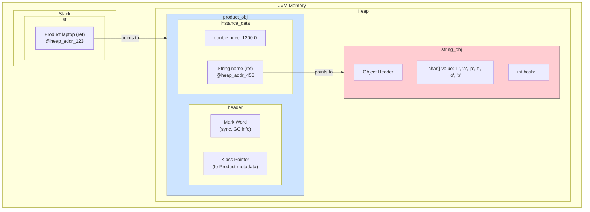
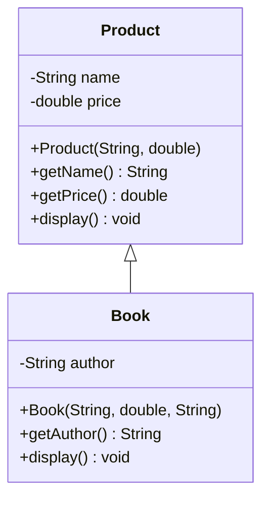

# 03 - Object-Oriented Programming: Building with Blueprints

> **Authors' Note:** Object-Oriented Programming (OOP) was at the very heart of our design for Java. We wanted to give you a way to model the real world in your code, to create "objects" that have both data (state) and behavior (methods). This chapter is your guide to thinking in objects.

**What's in this chapter:**

*   [The Core Idea: Classes and Objects](#1-classes-and-objects-blueprints-and-buildings)
*   [The Four Pillars of OOP](#2-the-four-pillars-of-oop-our-design-philosophy)
*   [Your Mission: Build an E-commerce System](#3-your-mission-build-an-e-commerce-system)
*   [Interview Deep Dives](#interview-deep-dives)

---

## 1. Classes and Objects: Blueprints and Buildings

The fundamental concept of OOP is the distinction between a *class* and an *object*.

*   **Class:** A class is the blueprint. It defines the structure (fields) and behavior (methods) of a type of object. It's an abstract concept.
*   **Object:** An object is the actual building created from the blueprint. It's a concrete *instance* of a class, with its own state.

Let's model a `Product` in our e-commerce application. A good `Product` class should encapsulate its data, hiding the internal details from the outside world.

```java
public class Product {
    // Private instance variables (state)
    private String name;
    private double price;

    // Constructor: a special method for creating objects
    public Product(String name, double price) {
        this.name = name;
        this.price = price;
    }

    // Getter methods (accessors)
    public String getName() {
        return name;
    }

    public double getPrice() {
        return price;
    }

    // Method (behavior)
    public void display() {
        System.out.println(name + ": $" + price);
    }
}
```

When you create an object (instantiate a class), you use the `new` keyword and the constructor to provide the initial state.

```java
Product laptop = new Product("Laptop", 1200.00);
laptop.display(); // Output: Laptop: $1200.0
```

### JVM Deep Dive: Object Layout on the Heap

When `new Product("Laptop", 1200.00)` is executed, a precise sequence of events happens inside the JVM:

1.  **Memory Allocation:** The JVM allocates a chunk of memory on the **heap** for the `Product` object. The size is determined by the fields in the class.
2.  **Object Header:** The first part of this memory chunk is the *Object Header*. This isn't something you can access directly in your Java code, but it's crucial for the JVM. It contains:
    *   **Mark Word:** Used for synchronization (locking) and garbage collection information.
    *   **Klass Pointer:** A reference to the class's metadata in the Metaspace, which tells the JVM everything it needs to know about the `Product` class (its methods, field names, etc.).
3.  **Instance Data:** The actual data for the object's fields (`name` and `price`).
    *   The `price` (a `double`) is a primitive type, so its 8 bytes are stored directly in the object's memory block.
    *   The `name` is a reference type. The variable `name` itself is just a pointer (a memory address) that points to a `String` object, which also lives on the heap. The string "Laptop" is a separate object!

Here is a simplified visualization:



---

## 2. The Four Pillars of OOP: Our Design Philosophy

We designed Java around four core principles that we believed were essential for building robust, scalable, and maintainable software.

### Mental Models for the Four Pillars

To make these concepts intuitive, let's use some analogies.

*   **Encapsulation is a Capsule:** Think of a medical capsule. The plastic casing (the `public` methods) protects the medicine inside (the `private` data). You don't need to know the chemical formula of the medicine to use it; you just swallow the capsule. It's a self-contained unit that protects its internal state.

*   **Inheritance is a Family Tree:** A child inherits traits like eye color and height from their parents. In OOP, a child class inherits fields and methods from its parent class. This creates a natural hierarchy and allows you to reuse common features without rewriting them. A `Book` *is a* `Product` and inherits its name and price.

*   **Polymorphism is a Universal Remote:** A universal remote has a single "Power" button. Depending on whether you point it at a TV, a Blu-ray player, or a sound system, that *same button* performs a different action. In Java, you can have a single method name (`display()`) that behaves differently depending on the actual object it's called on (`Product`, `Book`, `Clothing`).

*   **Abstraction is a Car's Dashboard:** When you drive a car, you use a simple interface: a steering wheel, pedals, and a gear stick. You don't need to know about the engine's combustion cycle or the transmission's inner workings. Abstraction hides the complex reality behind a simple interface.

### a. Encapsulation: The Black Box Principle

We believe that an object should be a "black box". Its internal data should be hidden from the outside world. This is achieved by making fields `private` and providing `public` methods (getters and setters) to access them.

This was a crucial design decision to prevent developers from accidentally corrupting the state of an object. It enforces a clear contract for how to interact with an object.

### b. Inheritance: Standing on the Shoulders of Giants

Inheritance allows you to create a new class (a *subclass* or *child class*) that inherits the properties and methods of an existing class (a *superclass* or *parent class*). This promotes code reuse and creates a natural hierarchy.

For our e-commerce app, we could have different types of products. A `Book` is a specific kind of `Product`.

```java
// Book is the subclass, Product is the superclass
public class Book extends Product {
    private String author;

    public Book(String name, double price, String author) {
        // Call the constructor of the superclass (Product)
        super(name, price);
        this.author = author;
    }

    public String getAuthor() {
        return author;
    }

    // We can also @Override methods
    @Override
    public void display() {
        // Call the superclass's display method, then add our own info
        super.display();
        System.out.println("Author: " + author);
    }
}
```

A `Book` object now has its own fields (`author`) plus the inherited fields (`name`, `price`).

Here's how this relationship looks:



### c. Polymorphism: One Interface, Many Forms

Polymorphism (from Greek, meaning "many forms") is the ability of an object to take on many forms. In Java, it means you can use a superclass reference to refer to a subclass object.

```java
Product myProduct = new Book("The Pragmatic Programmer", 45.00, "Andy Hunt");
myProduct.display(); // Calls the Book's display() method!
```

Even though `myProduct` is declared as a `Product`, the JVM knows it's *actually* a `Book` at runtime. This is called **runtime polymorphism** or **dynamic method dispatch**.

#### JVM Deep Dive: Virtual Method Tables (vtables)

How does the JVM know which `display()` method to call? This is where the magic of polymorphism comes in, and it's implemented using something called a "virtual method table" or "vtable".

Every class has a vtable that contains the memory addresses of its methods. When a subclass like `Book` overrides a method, the JVM updates the vtable for `Book` to point to the new, overridden method.

When you call `myProduct.display()`, the JVM:
1. Looks at the actual object `myProduct` refers to (a `Book` object).
2. Consults the `Book` class's vtable.
3. Finds the address for the `display()` method and executes it.

This is why the `Book`'s version of `display()` is called, even though the reference type is `Product`.

### d. Abstraction: Hiding the Details

Abstraction is about hiding the implementation details and showing only the essential features. We provided two main ways to achieve this in Java: **abstract classes** and **interfaces**. We'll dive deeper into these in the next chapter, but the core idea is to define a contract without a concrete implementation.

---

### Check Your Understanding

**Question 1:** If a `Car` class has a private field `int speed`, what principle of OOP prevents you from writing `myCar.speed = 100;` from outside the `Car` class?
<details>
  <summary>Answer</summary>
  **Encapsulation.** The data (`speed`) is hidden, and you should only be able to modify it through public methods (like `myCar.setSpeed(100);`).
</details>

**Question 2:** You have a `Product` variable, but it holds a `Book` object (`Product p = new Book(...)`). When you call `p.display()`, which `display` method is executed—the one from `Product` or the one from `Book`? What is this principle called?
<details>
  <summary>Answer</summary>
  The `display` method from the **`Book`** class is executed. This is called **Polymorphism**. The JVM determines the correct method to call at runtime based on the actual object type, not the reference type.
</details>

---

## 3. Your Mission: Build an E-commerce System

It's time to apply these pillars of OOP. We've created a small, runnable Maven project in the `code/` subdirectory that includes the `Product` and `Book` classes. Your mission is to extend this system.

**Part 1: Create a `Clothing` class**
1.  **Find the Code:** Open the `code/src/main/java/com/tenx/oop/` directory.
2.  **Create a New File:** Create a new Java class file named `Clothing.java`.
3.  **Accept the Challenge:**
    *   Make the `Clothing` class inherit from `Product`.
    *   Add two private fields: `String size` and `String color`.
    *   Create a constructor that initializes all fields, including the inherited ones from `Product`.
    *   Override the `display()` method to print the name, price, size, and color.

**Part 2: Test with Polymorphism**
1.  **Open `Main.java`:** This is the entry point of our application.
2.  **Create an Array:** Create an array or `ArrayList` of `Product`.
3.  **Add Your Objects:** Add a `Product` instance, a `Book` instance, and your new `Clothing` instance to the list.
4.  **Loop and Display:** Loop through the list and call the `display()` method on each object. Observe how polymorphism works—the correct `display()` method is called for each object type!

**Bonus Mission: The `final` Keyword**

What happens if you declare a method as `final` in the `Product` class? Try adding `final` to the `getPrice()` method. Can the `Book` class still override it? What about the `Product` class itself? Can you make it `final`? What error do you see?

<details>
<summary>Stuck? Here's a solution for Part 1 & 2</summary>

**Clothing.java:**
```java
package com.tenx.oop;

public class Clothing extends Product {
    private String size;
    private String color;

    public Clothing(String name, double price, String size, String color) {
        super(name, price);
        this.size = size;
        this.color = color;
    }

    @Override
    public void display() {
        super.display();
        System.out.println("Size: " + this.size + ", Color: " + this.color);
    }
}
```

**Main.java:**
```java
package com.tenx.oop;

import java.util.ArrayList;
import java.util.List;

public class Main {
    public static void main(String[] args) {
        List<Product> products = new ArrayList<>();
        products.add(new Product("Generic Monitor", 250.00));
        products.add(new Book("Clean Code", 40.00, "Robert C. Martin"));
        products.add(new Clothing("T-Shirt", 25.00, "L", "Blue"));

        for (Product p : products) {
            p.display();
            System.out.println("-----------------");
        }
    }
}
```
</details>

---

### Key Takeaways

*   **Class vs. Object:** A **class** is a blueprint (e.g., the plan for a house). An **object** is a concrete instance created from that blueprint (e.g., an actual house).
*   **Encapsulation:** Protect your object's data by making fields `private` and providing `public` methods for access. Think of it as a protective capsule.
*   **Inheritance:** Create new classes (`subclasses`) that reuse and extend the functionality of existing classes (`superclasses`). This forms an "is-a" relationship (a `Book` is a `Product`).
*   **Polymorphism:** Allows you to treat objects of different classes in a uniform way. You can have a `Product` reference that points to a `Book` or `Clothing` object, and the correct `display()` method will be called automatically.
*   **Abstraction:** Hide complex implementation details behind a simple interface. (This will be explored more in the next chapter).

---

## Interview Deep Dives

### Q10: What is the difference between an Inner Class and a Sub-Class?

*   **Simple Answer:** A sub-class inherits from a parent class (an "is-a" relationship). An inner class is a helper class defined inside another class.
*   **Detailed Explanation:**
    *   **Sub-class (e.g., `class EBook extends Product`):** This is standard inheritance. `EBook` *is a* `Product` and inherits its public/protected members. It's used for code reuse and polymorphism.
    *   **Inner Class (e.g., `class OrderLine` inside `class Order`):** This is a class defined within another class. It's used for helper classes that are tightly coupled to the outer class. The key feature is that an inner class object has access to the private fields of its outer class object.

### Q11: What is a singleton class?

*   **Simple Answer:** A class that is designed to have only one instance.
*   **How it works:**
    1.  Make the constructor `private`.
    2.  Create a `private static final` instance of the class.
    3.  Provide a `public static` method (`getInstance()`) to return that single instance.
*   **When to use it:** For global resources like a database connection manager or a configuration loader.
*   **Caution:** Singletons can make code hard to test because they introduce global state. Modern frameworks like Spring often provide better ways to manage single instances using dependency injection.

### Q12: What is a constructor and can it be overloaded?

*   **Simple Answer:** A constructor is a special method used to create an object. And yes, it can be overloaded.
*   **Detailed Explanation:**
    *   A constructor must have the same name as the class and has no return type.
    *   Its job is to initialize the object's fields.
    *   **Overloading:** You can have multiple constructors in the same class, as long as they have different parameters. This gives you flexible ways to create objects.

### Q13: What is the difference between Method Overloading and Method Overriding?

*   **Simple Answer:** Overloading is having multiple methods with the same name but different parameters in the *same class*. Overriding is when a *child class* provides a new implementation for a method from its parent class.
*   **Detailed Explanation:**
| Feature | Method Overloading | Method Overriding |
| :--- | :--- | :--- |
| **Location** | Same class | Parent and Child class |
| **Parameters**| Must be different | Must be the same |
| **Purpose** | Convenience (multiple ways to call a method) | Polymorphism (changing behavior in a child class) |

### Q14: Why doesn't Java support multiple inheritance for classes?

*   **Simple Answer:** To avoid the "Diamond Problem".
*   **The Diamond Problem:**
    *   Imagine class `A` has a method `foo()`.
    *   Classes `B` and `C` both inherit from `A` and override `foo()`.
    *   If class `D` could inherit from both `B` and `C`, which version of `foo()` would it get? It's ambiguous.

    ```mermaid
    graph TD
        subgraph "The Diamond Problem"
            A["SuperClass<br/>foo()"]
            B["SubClassB<br/>@Override foo()"]
            C["SubClassC<br/>@Override foo()"]
            D["ConflictedClass<br/>Which foo() to inherit?"]
        end

        A -- "extends" --> B
        A -- "extends" --> C
        B -- "extends" --> D
        C -- "extends" --> D

        subgraph "Ambiguity"
            direction TD
            q{D.foo() ?} --> b_impl{B.foo() implementation}
            q --> c_impl{C.foo() implementation}
        end

        style D fill:#ffcdd2,stroke:#c62828,stroke-width:2px
        style q fill:#fff9c4,stroke:#f57f17,stroke-width:2px
    ```
*   **Java's Solution:** A class can only `extend` one parent class. However, a class can `implement` multiple interfaces, which is how Java achieves a safe form of multiple inheritance for behavior.

---

[Next: 04 - Advanced OOP: Interfaces and Abstraction](../04-Advanced-OOP/README.md)
