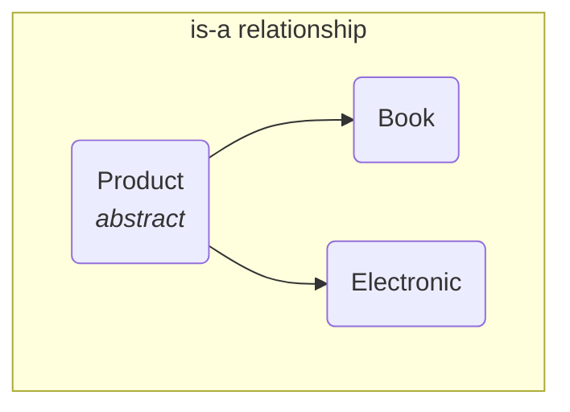
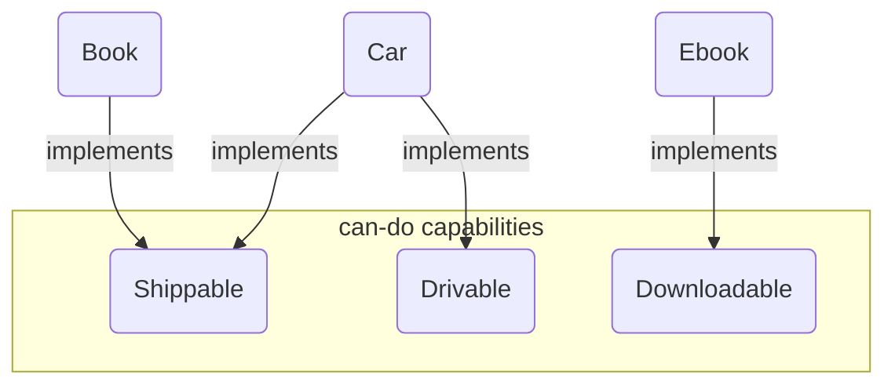
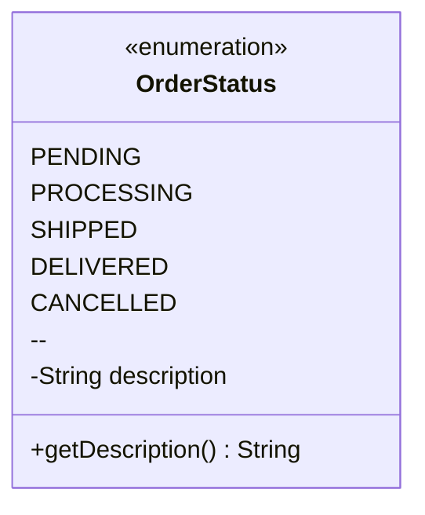

# 04 - Advanced OOP: Interfaces, Abstraction, and Enums

Now that you understand the core principles of OOP, let's explore some of the more advanced tools we gave you to design flexible, maintainable, and scalable software.

**What's in this chapter:**
*   [Abstraction: Abstract Classes vs. Interfaces](#1-abstraction-the-power-of-not-knowing)
*   [Enums: Type-Safe and Powerful Constants](#2-enums-type-safe-and-powerful-constants)
*   [Hands-On Lab: Designing a Product Catalog](#3-hands-on-lab-designing-a-product-catalog)
*   [Interview Deep Dives](#interview-deep-dives)

---

## 1. Abstraction: The Power of Not Knowing

Abstraction is the art of hiding implementation details. It allows you to define a *contract* for what a class can do, without worrying about *how* it does it. This is the key to building **loosely coupled** systems, where components can be changed or replaced without breaking everything else. Java provides two primary tools for this: **abstract classes** and **interfaces**.

### a. Abstract Classes: The "is-a" Relationship

An abstract class is a template for a group of related classes. It can provide shared code and define abstract methods that subclasses *must* implement. Use an abstract class when you have a clear "is-a" relationship.

**Example:** A `Book` *is-a* `Product`. An `Electronic` device *is-a* `Product`. They share common attributes like `name` and `price`.



### b. Interfaces: The "can-do" Capability

An interface is a pure contract. It defines a set of methods that a class *must* implement. A class can implement multiple interfaces, allowing it to "wear many hats". Use an interface to define a "can-do" or "has-a" capability.

**Example:** A `Book` *can be* shipped. A `Car` *can be* shipped. A `DigitalDownload` cannot. A `Car` *is* drivable. A `Book` is not.



### The Evolution of Interfaces: `default` methods

Originally, interfaces could only have abstract methods. But what if you wanted to add a new method to an interface? You would break all existing classes that implement it!

To solve this, Java 8 introduced **`default` methods**. A `default` method in an interface provides a default implementation. This allows us to add new functionality to interfaces without breaking existing code.

```java
public interface Shippable {
    double getWeight(); // abstract method

    // A default method provides a default implementation.
    default String getShippingLabel() {
        return "Standard Shipping";
    }
}
```

**Key Takeaway:** Prefer interfaces for defining contracts and capabilities. Use an abstract class only when you need to share state (fields) and implementation code among a tightly related group of classes.

---

## 2. Enums: Type-Safe and Powerful Constants

Before Java 5, developers often used `int` or `String` constants to represent a fixed set of values (e.g., `public static final int STATUS_PENDING = 0;`). This was error-prone and not type-safe.

We introduced **`enum`** to create a special type that represents a fixed set of constants.

```java
public enum OrderStatus {
    PENDING,
    PROCESSING,
    SHIPPED,
    DELIVERED,
    CANCELLED
}
```
This is far more than just a set of names. An `enum` is a full-fledged class. You can add fields, methods, and constructors to it, making it an incredibly powerful tool.



```java
public enum OrderStatus {
    PENDING("Order is pending confirmation."),
    PROCESSING("Order is being processed."),
    SHIPPED("Order has been shipped."),
    DELIVERED("Order has been delivered."),
    CANCELLED("Order has been cancelled.");

    private final String description;

    OrderStatus(String description) {
        this.description = description;
    }

    public String getDescription() {
        return description;
    }
}
```

---

## 3. Hands-On Lab: Designing a Product Catalog

We've created a runnable project in the `code/` directory that brings all these concepts together. It models a product catalog with:
*   An `abstract Product` base class.
*   `Shippable` and `Insurable` interfaces.
*   Concrete classes like `Book` and `Electronic` that extend the base class and implement interfaces.
*   An `enum` for `ProductCategory`.

**To run it:**
1.  Navigate to the `code/` directory.
2.  Run `mvn compile exec:java`.
3.  Explore the source code to see how these advanced OOP concepts create a flexible and extensible design.

---

## Interview Deep Dives

(Content from the original `README.md` for Q15-Q18, with minor formatting improvements and clarification on Shallow vs. Deep copy)

### Q18: What is Object Cloning and the difference between Shallow and Deep Copy?

*   **Simple Answer:** Cloning creates a copy of an object. A shallow copy just copies the fields, while a deep copy also copies any objects the fields refer to.
*   **Detailed Explanation:**
    *   **Shallow Copy:** The default behavior of `clone()`. It's fast but can be dangerous. If you change a referenced object in the copy, it also changes in the original, because they both point to the same object.
    *   **Deep Copy:** This requires more work. You have to manually override `clone()` to recursively clone all referenced objects. This creates a completely independent copy of the object and its entire graph.

    **Visualizing the Difference:**
    ```mermaid
    graph TD
        subgraph Original
            O1(Order) --> A1(Address)
        end
        subgraph Shallow Copy
            O2(Order Copy) --> A1
        end
        subgraph Deep Copy
            O3(Order Copy) --> A2(Address Copy)
        end
    ```

*   **Caution:** Java's `Cloneable` mechanism is considered tricky and is often avoided. It's usually better and safer to provide a **copy constructor** (`public Order(Order other)`) or a **static factory method** (`public static Order newInstance(Order other)`) to create copies.
