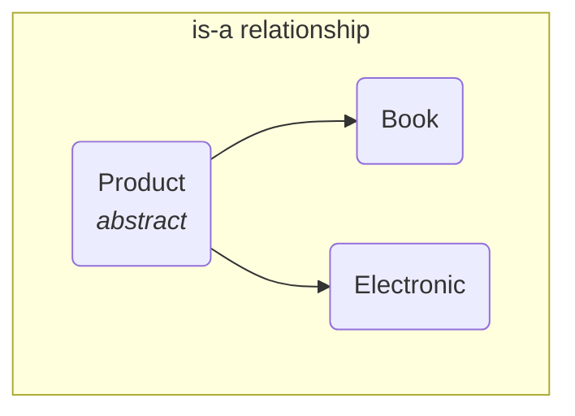
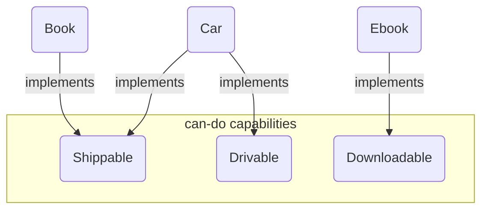

# 04 - Advanced OOP: Interfaces, Abstraction, and Enums

Now that you understand the core principles of OOP, let's explore some of the more advanced tools we gave you to design flexible, maintainable, and scalable software.

**What's in this chapter:**
*   [Abstraction: Abstract Classes vs. Interfaces](#1-abstraction-the-power-of-not-knowing)
*   [Enums: Type-Safe and Powerful Constants](#2-enums-type-safe-and-powerful-constants)
*   [Your Mission: Make Products Giftable](#3-your-mission-make-products-giftable)
*   [Interview Deep Dives](#interview-deep-dives)

---

## 1. Abstraction: The Power of Not Knowing

Abstraction is the art of hiding implementation details. It allows you to define a *contract* for what a class can do, without worrying about *how* it does it. This is the key to building **loosely coupled** systems, where components can be changed or replaced without breaking everything else. Java provides two primary tools for this: **abstract classes** and **interfaces**.

### Mental Models for Abstraction

*   **Abstract Class is a Recipe with Some Steps Missing:** Imagine a recipe for "Cake". It might have some steps already defined ("1. Preheat oven to 350°F.", "5. Bake for 30 minutes."). But it also has abstract steps like "2. Prepare the batter." and "4. Add the frosting.". You can't make a generic "Cake"; you have to create a specific *kind* of cake, like a `ChocolateCake` or a `CarrotCake`, that fills in those missing steps. An abstract class provides a base of shared implementation but forces subclasses to provide the rest.

*   **Interface is a Wall Socket:** A wall socket is a contract. It guarantees that anything you plug into it will receive electricity in a standard format. The socket doesn't know or care if you plug in a lamp, a phone charger, or a vacuum cleaner. It just provides a standard point of connection. An interface defines a "can-do" capability. Any class can promise to fulfill that contract by `implementing` the interface.

### a. Abstract Classes: The "is-a" Relationship

An abstract class is a template for a group of related classes. It can provide shared code and define abstract methods that subclasses *must* implement. Use an abstract class when you have a clear "is-a" relationship.

**Example:** A `Book` *is-a* `Product`. An `Electronic` device *is-a* `Product`. They share common attributes like `name` and `price`.



### b. Interfaces: The "can-do" Capability

An interface is a pure contract. It defines a set of methods that a class *must* implement. A class can implement multiple interfaces, allowing it to "wear many hats". Use an interface to define a "can-do" or "has-a" capability.

**Example:** A `Book` *can be* shipped. A `Car` *can be* shipped. A `DigitalDownload` cannot. A `Car` *is* drivable. A `Book` is not.



### The Evolution of Interfaces: `default` methods

Originally, interfaces could only have abstract methods. But what if you wanted to add a new method to an interface? You would break all existing classes that implement it!

To solve this, Java 8 introduced **`default` methods**. A `default` method in an interface provides a default implementation. This allows us to add new functionality to interfaces without breaking existing code.

```java
public interface Shippable {
    double getWeight(); // abstract method

    // A default method provides a default implementation.
    default String getShippingLabel() {
        return "Standard Shipping";
    }
}
```

**Key Takeaway:** Prefer interfaces for defining contracts and capabilities. Use an abstract class only when you need to share state (fields) and implementation code among a tightly related group of classes.

---

## 2. Enums: Type-Safe and Powerful Constants

Before Java 5, developers often used `int` or `String` constants to represent a fixed set of values (e.g., `public static final int STATUS_PENDING = 0;`). This was error-prone and not type-safe.

We introduced **`enum`** to create a special type that represents a fixed set of constants.

```java
public enum OrderStatus {
    PENDING,
    PROCESSING,
    SHIPPED,
    DELIVERED,
    CANCELLED
}
```
This is far more than just a set of names. An `enum` is a full-fledged class. You can add fields, methods, and constructors to it, making it an incredibly powerful tool.

```java
public enum OrderStatus {
    PENDING("Order is pending confirmation."),
    PROCESSING("Order is being processed."),
    SHIPPED("Order has been shipped."),
    DELIVERED("Order has been delivered."),
    CANCELLED("Order has been cancelled.");

    private final String description;

    OrderStatus(String description) {
        this.description = description;
    }

    public String getDescription() {
        return description;
    }
}
```

---

### Check Your Understanding

**Question 1:** You are designing a system for a zoo. You have `Lion`, `Tiger`, and `Bear` classes. They all share common behaviors like `eat()` and `sleep()`, so you create a `Mammal` base class for them. Should `Mammal` be an `abstract class` or an `interface`? Why?
<details>
  <summary>Answer</summary>
  It should be an **abstract class**. This is a classic "is-a" relationship (`Lion` is a `Mammal`). An abstract class is perfect here because you can provide shared implementation for `eat()` and `sleep()` that all mammals share, while perhaps leaving a method like `makeSound()` as abstract for each specific animal to implement.
</details>

**Question 2:** You want to add the ability for some of your zoo animals, like a `Parrot` and a `Seal`, to perform tricks. Other animals, like a `Lion`, cannot. Should the "can-perform-tricks" contract be an `abstract class` or an `interface`?
<details>
  <summary>Answer</summary>
  It should be an **interface**, likely named `Performable` or `TrickPerformer`. This is a "can-do" capability that is not shared by all animals. A `Parrot` can `extend Animal` and also `implement Performable`, allowing it to have the "is-a" relationship and the "can-do" capability.
</details>

---

## 3. Your Mission: Make Products Giftable

The code in the `code/` subdirectory contains the product catalog model we've been discussing. Your mission is to add a new "can-do" capability to this system. We want to allow certain products to be gift-wrapped.

**Part 1: Create the `Giftable` Interface**
1.  **Find the Code:** Open the `code/src/main/java/com/tenx/adv/oop/` directory.
2.  **Create a New Interface:** Create a new Java interface file named `Giftable.java`.
3.  **Define the Contract:** Inside `Giftable`, define two methods:
    *   `setMessage(String message)`: This method will set a gift message.
    *   `String getMessage()`: This method will retrieve the gift message.

**Part 2: Implement the Interface**
1.  **Modify the `Book` class:** Make the `Book` class `implement` the `Giftable` interface.
2.  **Add a Field:** Add a private `String giftMessage;` field to the `Book` class to store the message.
3.  **Implement the Methods:** Implement the `setMessage` and `getMessage` methods required by the `Giftable` interface. They will simply set and get the value of the `giftMessage` field.

**Part 3: Test Your Code**
1.  **Open `Main.java`:** In the `main` method, find the `Book` object.
2.  **Check and Cast:** Use the `instanceof` operator to check if the `Book` object is `Giftable`.
3.  **Set a Message:** If it is, cast the object to `Giftable` and use the `setMessage()` method to add a gift message like "Happy Birthday!". Then, print the message out using `getMessage()`.

<details>
<summary>Stuck? Here's the solution</summary>

**Giftable.java:**
```java
package com.tenx.adv.oop;

public interface Giftable {
    void setMessage(String message);
    String getMessage();
}
```

**Book.java (changes):**
```java
// Add 'implements Giftable' to the class definition
public class Book extends Product implements Shippable, Giftable {
    // ... existing code ...
    private String giftMessage;

    // ... existing constructor ...

    @Override
    public void setMessage(String message) {
        this.giftMessage = message;
    }

    @Override
    public String getMessage() {
        return this.giftMessage;
    }
}
```

**Main.java (changes):**
```java
// Inside the main method loop
if (product instanceof Giftable) {
    System.out.println("This product can be gifted!");
    Giftable gift = (Giftable) product;
    gift.setMessage("Happy Reading!");
    System.out.println("Gift Message: " + gift.getMessage());
}
```
</details>

---

### Key Takeaways

*   **Abstract Class vs. Interface:** This is a classic interview question.
    *   Use an **abstract class** for an "is-a" relationship when you want to provide shared code and state for a group of related classes (e.g., `Dog` is an `Animal`).
    *   Use an **interface** for a "can-do" capability that can be applied to many unrelated classes (e.g., a `Car` and a `Box` can both be `Shippable`).
*   **`default` Methods:** Java 8+ allows interfaces to have `default` methods with implementations. This is a powerful tool for evolving APIs without breaking existing code.
*   **Enums are Classes:** An `enum` is not just a constant; it's a special kind of class. You can add fields, methods, and constructors to them to create powerful, type-safe constants.
*   **Object Cloning is Tricky:** Be wary of Java's built-in `Cloneable` interface. A **copy constructor** or **static factory method** is often a safer and clearer way to create copies of your objects.

---

## Interview Deep Dives

(Content from the original `README.md` for Q15-Q18, with minor formatting improvements and clarification on Shallow vs. Deep copy)

### Q18: What is Object Cloning and the difference between Shallow and Deep Copy?

*   **Simple Answer:** Cloning creates a copy of an object. A shallow copy just copies the fields, while a deep copy also copies any objects the fields refer to.
*   **Detailed Explanation:**
    *   **Shallow Copy:** The default behavior of `clone()`. It's fast but can be dangerous. If you change a referenced object in the copy, it also changes in the original, because they both point to the same object.
    *   **Deep Copy:** This requires more work. You have to manually override `clone()` to recursively clone all referenced objects. This creates a completely independent copy of the object and its entire graph.

    **Visualizing the Difference:**
    ```mermaid
    graph TD
        subgraph Original
            O1(Order) --> A1(Address)
        end
        subgraph Shallow Copy
            O2(Order Copy) --> A1
        end
        subgraph Deep Copy
            O3(Order Copy) --> A2(Address Copy)
        end
    ```

*   **Caution:** Java's `Cloneable` mechanism is considered tricky and is often avoided. It's usually better and safer to provide a **copy constructor** (`public Order(Order other)`) or a **static factory method** (`public static Order newInstance(Order other)`) to create copies.
