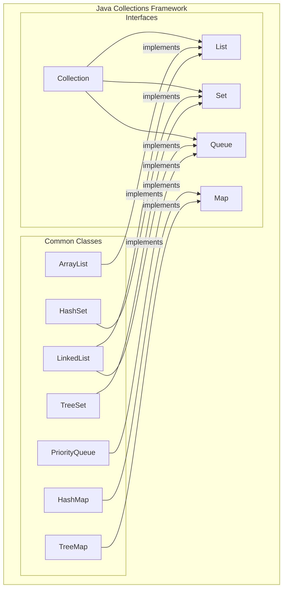
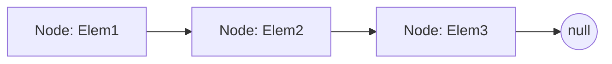

# 05 - An Overview of Core Data Structures

As language designers, we knew that providing powerful, efficient, and easy-to-use data structures was not just a feature—it was essential. The way you organize your data has a profound impact on your program's performance, scalability, and clarity.

This chapter provides a high-level overview of the most common data structures available in the **Java Collections Framework**. We will explore the design trade-offs we made for each, so you can learn to choose the right tool for the job. Deeper dives into specific structures and algorithms will follow in later chapters.



**What's in this chapter:**
*   [`ArrayList`: The Resizable Array](#1-arraylist-the-resizable-array)
*   [`LinkedList`: The Sequential Chain](#2-linkedlist-the-sequential-chain)
*   [`HashMap`: The Key-Value Store](#3-hashmap-the-key-value-store)
*   [Performance at a Glance: Big-O Notation](#4-performance-at-a-glance-big-o-notation)

---

## 1. `ArrayList`: The Resizable Array

An `ArrayList` is a list backed by a plain Java array. It's the most common list implementation and should generally be your default choice.

**How it works:**
It wraps a regular array, but when the array gets full, it automatically creates a new, larger array (typically 1.5x the size) and copies the old elements over.

```mermaid
graph TD
    subgraph ArrayList
        direction LR
        subgraph "Internal Array (capacity=10)"
            A[0: Elem]
            B[1: Elem]
            C[2: Elem]
            D[3: Elem]
            E[...]
        end
    end
    note for ArrayList "size = 4, capacity = 10"
```

**When to use it:**
*   When you need fast, index-based access to elements (`get(i)`).
*   When you are mostly adding elements to the end of the list.

---

## 2. `LinkedList`: The Sequential Chain

A `LinkedList` stores elements in a chain of nodes. Each node is an object that holds an element and a reference (a pointer) to the next node in the chain.

**How it works:**
To add an element, you just create a new node and update the pointers. To remove an element, you just "un-link" it by changing the pointers of its neighbors.



**When to use it:**
*   When you frequently add or remove elements from the beginning or middle of the list.
*   When you don't need fast random access (getting the 1000th element requires traversing 1000 nodes).
*   When you need the characteristics of a queue or a deque (more on this later).

---

## 3. `HashMap`: The Key-Value Store

A `HashMap` is a powerful structure that stores key-value pairs. It uses the `hashCode()` of the key to calculate an index, allowing for incredibly fast lookups.

**How it works:**
A `HashMap` uses an internal array of "buckets". When you `put(key, value)`, it calculates the key's hash code to determine which bucket to place the entry in. If multiple keys hash to the same bucket (a "collision"), the entries are stored as a linked list within that bucket. (Since Java 8, these lists are converted to balanced trees if they get too long, further improving performance).

```mermaid
graph TD
    subgraph HashMap
        direction LR
        subgraph "Internal Array of Buckets"
            B0[Bucket 0] --> E1("key1, val1") --> E2("keyA, valA")
            B1[Bucket 1]
            B2[Bucket 2] --> E3("key2, val2")
            B3[...]
        end
    end
    note for E2 "Hash Collision!"
```

**When to use it:**
*   Anytime you need to associate one piece of data with another.
*   When you need to look up data by a unique identifier. This is one of the most useful data structures in all of programming.

---

## 4. Performance at a Glance: Big-O Notation

Choosing the right data structure requires understanding its performance characteristics. Big-O notation gives us a standardized way to talk about this.

| Operation         | `ArrayList` | `LinkedList` | `HashMap`        | Notes                                                              |
|-------------------|-------------|--------------|------------------|--------------------------------------------------------------------|
| **`get(index)`**  | `O(1)`      | `O(n)`       | `N/A`            | `ArrayList` is the clear winner for random access.                 |
| **`add(element)`**| `O(1)`*     | `O(1)`       | `O(1)`*          | *Amortized constant time. Resizing can take O(n).                  |
| **`remove(index)`**| `O(n)`      | `O(n)`       | `N/A`            | `remove(element)` is O(n) for both lists.                          |
| **`contains(element)`**| `O(n)` | `O(n)`       | `O(1)`*          | For `HashMap`, this is `containsKey()`, which is extremely fast.   |

**Key Takeaways:**
*   **Default to `ArrayList`** for general-purpose lists.
*   Use `LinkedList` only when you have a high number of insertions/deletions at the *ends* of the list and don't need fast index-based access.
*   Use `HashMap` whenever you need to look up values by a key. Its performance is hard to beat.
