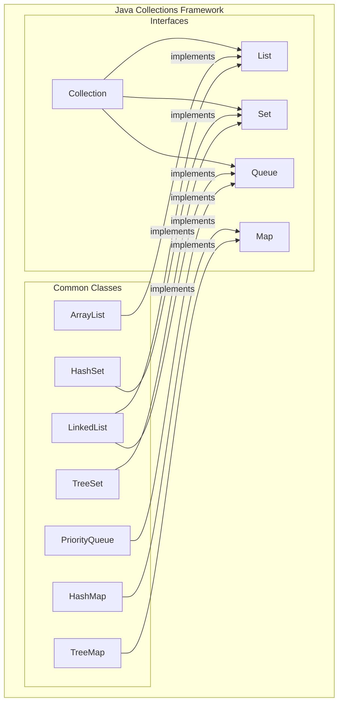
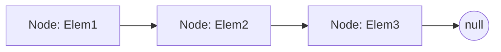

# 05 - An Overview of Core Data Structures

As language designers, we knew that providing powerful, efficient, and easy-to-use data structures was not just a feature—it was essential. The way you organize your data has a profound impact on your program's performance, scalability, and clarity.

This chapter provides a high-level overview of the most common data structures available in the **Java Collections Framework**. We will explore the design trade-offs we made for each, so you can learn to choose the right tool for the job. Deeper dives into specific structures and algorithms will follow in later chapters.



**What's in this chapter:**
*   [Mental Models for Core Data Structures](#mental-models-for-core-data-structures)
*   [`ArrayList`: The Resizable Array](#1-arraylist-the-resizable-array)
*   [`LinkedList`: The Sequential Chain](#2-linkedlist-the-sequential-chain)
*   [Your Mission: Count Word Frequencies](#3-your-mission-count-word-frequencies)
*   [`HashMap`: The Key-Value Store](#3-hashmap-the-key-value-store)
*   [Check Your Understanding](#check-your-understanding)
*   [Performance at a Glance: Big-O Notation](#4-performance-at-a-glance-big-o-notation)

---

### Mental Models for Core Data Structures

To make these abstract structures concrete, let's use some real-world analogies.

*   **`ArrayList` is a Train:** A train has a fixed number of cars, and each car has a number (its index). Getting to car #5 is super fast—you just walk straight to it (`O(1)`). But adding a new car in the middle is a huge pain; you have to disconnect the train and shift everything down (`O(n)`).

*   **`LinkedList` is a Scavenger Hunt:** You start at the first clue, which tells you where to find the next clue, and so on. There's no way to jump to the 5th clue without following the first four (`O(n)`). But adding a new clue in the middle is easy; you just change the location on the previous clue to point to your new one, and your new one points to the one that was originally next.

*   **`HashMap` is a Dictionary:** When you want to find the definition of the word "Polymorphism," you don't read the dictionary from the beginning. You flip directly to the "P" section and find the word. It's an incredibly fast lookup (`O(1)` on average). The word is the **key**, and the definition is the **value**.

*   **`Stack` is a Stack of Plates:** You can only add a new plate to the top, and you can only take a plate from the top. This is called **Last-In, First-Out (LIFO)**.

*   **`Queue` is a Checkout Line:** The first person to get in line is the first person to be served. New people are added to the back of the line. This is called **First-In, First-Out (FIFO)**.

---

## 1. `ArrayList`: The Resizable Array

An `ArrayList` is a list backed by a plain Java array. It's the most common list implementation and should generally be your default choice.

**How it works:**
It wraps a regular array, but when the array gets full, it automatically creates a new, larger array (typically 1.5x the size) and copies the old elements over.

```mermaid
graph TD
    subgraph ArrayList
        direction LR
        subgraph "Internal Array (capacity=10)"
            A[0: Elem]
            B[1: Elem]
            C[2: Elem]
            D[3: Elem]
            E[...]
        end
    end
    note for ArrayList "size = 4, capacity = 10"
```

**When to use it:**
*   When you need fast, index-based access to elements (`get(i)`).
*   When you are mostly adding elements to the end of the list.

---

## 2. `LinkedList`: The Sequential Chain

A `LinkedList` stores elements in a chain of nodes. Each node is an object that holds an element and a reference (a pointer) to the next node in the chain.

**How it works:**
To add an element, you just create a new node and update the pointers. To remove an element, you just "un-link" it by changing the pointers of its neighbors.



**When to use it:**
*   When you frequently add or remove elements from the beginning or middle of the list.
*   When you don't need fast random access (getting the 1000th element requires traversing 1000 nodes).
*   When you need the characteristics of a queue or a deque (more on this later).

---

## 3. Your Mission: Count Word Frequencies

The best way to understand data structures is to use them. Your mission is to write a program that counts the frequency of each word in a sentence. This is a classic problem that perfectly demonstrates the power of `HashMap`.

We have created a new project for you in the `code/` directory.

**Your Mission:**

1.  **Find the Code:** Open the `code/src/main/java/com/tenx/ds/WordFrequency.java` file.
2.  **Follow the Instructions:** The file contains comments guiding you through the mission. You will need to:
    *   Split a sentence into a list of words. An `ArrayList` is a good choice here.
    *   Create a `HashMap` to store the frequency of each word.
    *   Loop through the words and update their counts in the `HashMap`.
3.  **Run Your Code:** Navigate to the `code/` directory in your terminal and run `mvn compile exec:java`.
4.  **Verify Your Output:** You should see the map of word counts printed to the console.

<details>
<summary>Stuck? Here's the solution</summary>

```java
package com.tenx.ds;

import java.util.Arrays;
import java.util.List;
import java.util.Map;
import java.util.HashMap;

public class WordFrequency {
    public static void main(String[] args) {
        String sentence = "The quick brown fox jumps over the lazy dog";

        // 1. Split the sentence into a list of words.
        List<String> words = Arrays.asList(sentence.toLowerCase().split(" "));

        // 2. Create a HashMap to store word frequencies.
        Map<String, Integer> wordFrequencies = new HashMap<>();

        // 3. Loop through the list of words and update the count.
        for (String word : words) {
            int count = wordFrequencies.getOrDefault(word, 0);
            wordFrequencies.put(word, count + 1);
        }

        // 4. Print out the final frequency map.
        System.out.println("Word Frequencies: " + wordFrequencies);
    }
}
```
</details>

---

## 3. `HashMap`: The Key-Value Store

A `HashMap` is a powerful structure that stores key-value pairs. It uses the `hashCode()` of the key to calculate an index, allowing for incredibly fast lookups.

**How it works:**
A `HashMap` uses an internal array of "buckets". When you `put(key, value)`, it calculates the key's hash code to determine which bucket to place the entry in. If multiple keys hash to the same bucket (a "collision"), the entries are stored as a linked list within that bucket. (Since Java 8, these lists are converted to balanced trees if they get too long, further improving performance).

```mermaid
graph TD
    subgraph HashMap
        direction LR
        subgraph "Internal Array of Buckets"
            B0[Bucket 0] --> E1("key1, val1") --> E2("keyA, valA")
            B1[Bucket 1]
            B2[Bucket 2] --> E3("key2, val2")
            B3[...]
        end
    end
    note for E2 "Hash Collision!"
```

**When to use it:**
*   Anytime you need to associate one piece of data with another.
*   When you need to look up data by a unique identifier. This is one of the most useful data structures in all of programming.

---

### Check Your Understanding

**Question 1:** You are building a playlist for a music app. Users need to be able to quickly jump to any song in the playlist (e.g., play song #1, then song #20). They will rarely add or remove songs from the middle of the playlist. Which data structure is a better choice: `ArrayList` or `LinkedList`?
<details>
  <summary>Answer</summary>
  An **`ArrayList`** is the better choice. Fast index-based access (`get(i)`) is the most important requirement here, which is where `ArrayList` excels (`O(1)`).
</details>

**Question 2:** You are creating a system to manage customer support tickets. You need to store each ticket with a unique ticket ID (e.g., "TICKET-001"). Your support agents need to be able to retrieve any ticket instantly if they have the ID. What is the best data structure for this?
<details>
  <summary>Answer</summary>
  A **`HashMap`** is perfect for this. You can use the unique ticket ID as the key and the ticket object as the value. This allows for extremely fast lookups (`O(1)`).
</details>

---

## 4. Performance at a Glance: Big-O Notation

Choosing the right data structure requires understanding its performance characteristics. Big-O notation gives us a standardized way to talk about this.

| Operation         | `ArrayList` | `LinkedList` | `HashMap`        | Notes                                                              |
|-------------------|-------------|--------------|------------------|--------------------------------------------------------------------|
| **`get(index)`**  | `O(1)`      | `O(n)`       | `N/A`            | `ArrayList` is the clear winner for random access.                 |
| **`add(element)`**| `O(1)`*     | `O(1)`       | `O(1)`*          | *Amortized constant time. Resizing can take O(n).                  |
| **`remove(index)`**| `O(n)`      | `O(n)`       | `N/A`            | `remove(element)` is O(n) for both lists.                          |
| **`contains(element)`**| `O(n)` | `O(n)`       | `O(1)`*          | For `HashMap`, this is `containsKey()`, which is extremely fast.   |

**Key Takeaways:**
*   **Choose the Right Tool:** The data structure you choose has a huge impact on performance.
*   **`ArrayList` for Speed:** Default to `ArrayList` when you need fast, index-based access.
*   **`LinkedList` for Ends:** Use `LinkedList` only when you do a lot of additions/removals from the *ends* of the list.
*   **`HashMap` for Lookups:** Use `HashMap` whenever you need to look up values by a unique key.
*   **Big-O Matters:** Big-O notation is the language we use to talk about performance. `O(1)` (constant time) is amazing, `O(n)` (linear time) is okay, and `O(n^2)` (quadratic time) can be very slow for large inputs.
