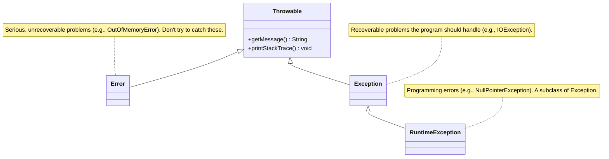
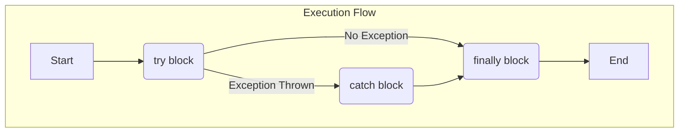

# 06 - Exception Handling: Dealing with the Unexpected

In a perfect world, programs would always run without errors. Files would always exist, networks would never fail, and users would never enter bad data. But we don't live in a perfect world. As language designers, we had to provide a robust mechanism to handle errors gracefully.

**What's in this chapter:**
*   [The `Throwable` Hierarchy: A Family of Problems](#1-the-throwable-hierarchy-a-family-of-problems)
*   [Mental Model: Playing Catch](#mental-model-playing-catch)
*   [Handling Exceptions: `try`, `catch`, `finally`](#2-handling-exceptions-try-catch-finally)
*   [The Modern Way: `try-with-resources`](#3-the-modern-way-try-with-resources)
*   [Checked vs. Unchecked: A Design Philosophy](#4-checked-vs-unchecked-a-design-philosophy)
*   [Check Your Understanding](#check-your-understanding)
*   [Your Mission: Handle the Errors](#5-your-mission-handle-the-errors)
*   [Interview Deep Dives](#interview-deep-dives)

---

## 1. The `Throwable` Hierarchy: A Family of Problems

In Java, all "problem" events are objects that inherit from the `Throwable` class. Understanding this hierarchy is key to understanding how errors and exceptions are organized.



*   **`Error`:** Represents critical, abnormal conditions that are external to the application and usually unrecoverable (e.g., the JVM running out of memory). Your program should not try to `catch` these.
*   **`Exception`:** Represents conditions that a well-written application should anticipate and can often recover from.

---

### Mental Model: Playing Catch

Think of exception handling like a game of catch.

*   **The `throw` keyword is the Pitcher:** The pitcher throws a baseball. This is like a method throwing an exception when something goes wrong.
*   **The `try` block is the Catcher:** The catcher puts their mitt up and *tries* to catch the ball. This is the code that might fail.
*   **The `catch` block is the Recovery:** If the catcher misses the ball (an exception is caught), they have a plan to recover—they run and pick up the ball. This is your error-handling code. You can have different `catch` blocks for different types of throws (a fastball vs. a curveball).
*   **The `finally` block is "Game Over":** No matter what happens—whether the ball was caught or missed—the game eventually ends, and the players walk off the field. The `finally` block *always* executes, making it perfect for cleanup actions like putting the equipment away.

---

## 2. Handling Exceptions: `try`, `catch`, `finally`

This is the classic mechanism for handling exceptions.
*   **`try`:** You place the code that might throw an exception in the `try` block.
*   **`catch`:** You use a `catch` block to define the "recovery" code that runs if a specific exception is thrown.
*   **`finally`:** The `finally` block is our guarantee that a piece of code will *always* run, whether an exception was thrown or not. This is essential for cleanup tasks like closing files.



```java
public void oldSchoolFileReader(String path) {
    FileReader reader = null;
    try {
        reader = new FileReader(path);
        // ... read from the file ...
    } catch (FileNotFoundException e) {
        System.err.println("Error: File not found at " + path);
    } finally {
        if (reader != null) {
            try {
                reader.close(); // Closing the resource
            } catch (IOException e) {
                // Handle the exception from closing the resource
                e.printStackTrace();
            }
        }
    }
}
```
As you can see, the `finally` block can become quite verbose and is itself prone to errors. This led us to design a better way.

---

## 3. The Modern Way: `try-with-resources`

Introduced in Java 7, the `try-with-resources` statement is the preferred way to handle resources that need to be closed (like files, database connections, etc.). It's safer and much more concise.

Any object that implements the `java.lang.AutoCloseable` interface can be used in a `try-with-resources` statement.

```java
public void modernFileReader(String path) {
    // The FileReader is declared inside the parentheses.
    try (FileReader reader = new FileReader(path)) {
        // ... read from the file ...
    } catch (FileNotFoundException e) {
        System.err.println("Error: File not found at " + path);
    } catch (IOException e) {
        // The .close() method can also throw an IOException
        System.err.println("Error closing the file: " + e.getMessage());
    }
    // No 'finally' block needed! The 'reader' is automatically closed.
}
```

---

## 4. Checked vs. Unchecked: A Design Philosophy

This was one of our most controversial design decisions. We divided the `Exception` family into two categories to guide developers on what they should handle.

*   **Checked Exceptions:** These are for predictable, recoverable error conditions. The compiler *checks* that you have handled them.
    *   **Examples:** `IOException`, `SQLException`, `FileNotFoundException`.
    *   **Rule:** You must either `catch` the exception or declare that your method `throws` it.
    *   **Why?** We wanted to force developers to build more robust applications by thinking about error conditions upfront.

*   **Unchecked (Runtime) Exceptions:** These represent programming errors (bugs) that are generally not recoverable.
    *   **Examples:** `NullPointerException`, `ArrayIndexOutOfBoundsException`, `IllegalArgumentException`.
    *   **Rule:** You are not required to handle them, though you can if you want.
    *   **Why?** Forcing checks for these everywhere would severely clutter the code. The best "fix" is to write correct code in the first place.

| Type      | When to Use                                       | Example                      | How to Handle                               |
|-----------|---------------------------------------------------|------------------------------|---------------------------------------------|
| **Checked** | For predictable, recoverable, external conditions. | `FileNotFoundException`      | Must `try-catch` or `throws`.               |
| **Unchecked** | For bugs and programming errors.                  | `NullPointerException`       | Don't catch. Fix your code.                 |
| **`Error`**   | For critical, unrecoverable JVM errors.           | `OutOfMemoryError`           | Don't catch. The program is likely to crash. |

---

### Check Your Understanding

**Question 1:** You are writing a method that parses a user's birthday from a string (`"YYYY-MM-DD"`). The user might enter a badly formatted string (e.g., `"yesterday"`). Should your `parseBirthday` method throw a `checked` or `unchecked` exception if the format is invalid?
<details>
  <summary>Answer</summary>
  This is a classic case for an **unchecked** exception, specifically `IllegalArgumentException`. A malformed date string is a *programming error* on the part of the caller—they should have validated the input before calling your method. Forcing every caller to `try-catch` this would be cumbersome.
</details>

**Question 2:** Your method connects to a remote server to download a file. The network could fail, or the server could be down. Should the exception for this case be `checked` or `unchecked`?
<details>
  <summary>Answer</summary>
  This should be a **checked** exception (like `IOException`). A network failure is an external, unpredictable, but potentially recoverable condition. It's not a bug in your code. The compiler forces you to handle this to build a more robust application that can gracefully handle network issues.
</details>

---

## 5. Your Mission: Handle the Errors

The code in the `code/` directory is designed to process a file, but it's incomplete. The `processFile` method is declared to `throw` checked exceptions, but the `main` method doesn't handle them yet. Your mission is to write the `try-catch` block to handle these potential errors gracefully.

**Your Mission:**

1.  **Find the Code:** Open the `code/src/main/java/com/example/FileProcessor.java` file.
2.  **Analyze the `main` method:** You'll see a commented-out section with instructions.
3.  **Accept the Challenge:**
    *   Uncomment the code.
    *   Wrap the call to `processFile("sample.txt")` in a `try` block.
    *   Add a `catch` block for `InvalidFileException`. In this block, print the exception's message to `System.err`.
    *   Add a second `catch` block for the more general `IOException` and do the same.
4.  **Test Your Code:**
    *   Run `mvn compile exec:java` from the `code/` directory *without* creating the `sample.txt` file. You should see your `InvalidFileException` message.
    *   Create an empty `sample.txt` file in the `code/` directory and run the command again. You should see the message "File is empty."
    *   Add some text to `sample.txt` and run it again to see the success message.

<details>
<summary>Stuck? Here's the solution</summary>

```java
// Inside the main method

try {
    // The method we call is declared with 'throws', so we must handle it.
    processFile("sample.txt");
    System.out.println("File processing completed successfully.");
} catch (InvalidFileException e) {
    // Handling our custom checked exception
    System.err.println("Error processing file: " + e.getMessage());
} catch (IOException e) {
    // Handling the general IO exception from file reading
    System.err.println("A critical IO error occurred: " + e.getMessage());
}
```
</details>

---

### Key Takeaways

*   **Errors are Objects:** In Java, errors and exceptions are objects that inherit from `Throwable`.
*   **`try-catch-finally`:** The fundamental way to handle exceptions. `try` the risky code, `catch` the exceptions you can handle, and use `finally` for cleanup code that must always run.
*   **`try-with-resources` is King:** For any resource that needs to be closed (files, streams, database connections), always prefer the modern `try-with-resources` statement. It's safer and more readable.
*   **Checked vs. Unchecked is a Philosophy:**
    *   **Checked:** For predictable, recoverable errors (e.g., network failure). The compiler forces you to handle them.
    *   **Unchecked (Runtime):** For programming bugs (e.g., `NullPointerException`). The compiler doesn't force you to handle them because you should fix the bug instead.

---

## Interview Deep Dives

(Content from the original `README.md` for Q22-Q25 would be included here, with minor formatting improvements.)
