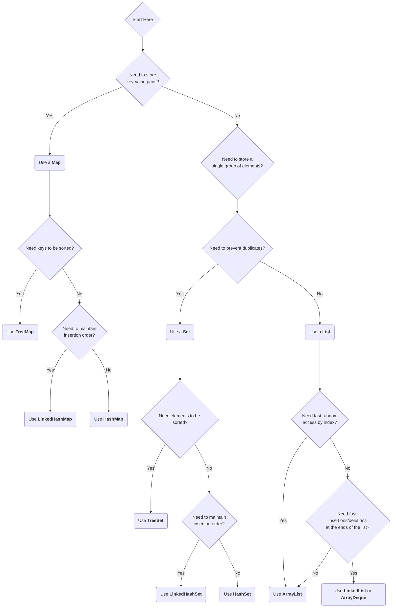
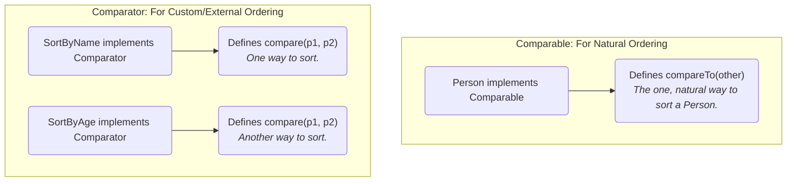

# 07 - The Java Collections Framework: A Deeper Look

We've already touched on some data structures. Now, let's look at the design philosophy behind the entire **Java Collections Framework (JCF)**. We designed it to be a unified architecture for representing and manipulating collections, enabling them to be manipulated independently of the details of their representation.

**What's in this chapter:**
*   [Mental Models for Collections](#mental-models-for-collections)
*   [The JCF Hierarchy: A Map of the Tools](#1-the-jcf-hierarchy-a-map-of-the-tools)
*   [How to Choose the Right Collection](#2-how-to-choose-the-right-collection)
*   [Sorting: `Comparable` vs. `Comparator`](#3-sorting-comparable-vs-comparator)
*   [Check Your Understanding](#check-your-understanding)
*   [Your Mission: Custom Sorting](#4-your-mission-custom-sorting)
*   [Interview Deep Dives](#interview-deep-dives)

---

### Mental Models for Collections

*   **The Framework is a Toolbox:** The Java Collections Framework is like a toolbox full of different kinds of containers. You wouldn't use a bucket to carry screws or a small pouch to carry a hammer. Choosing the right collection is about picking the right container for the job.
*   **`List` is a Shopping List:** It's a sequence of items in the order you wrote them down. You can have duplicates (e.g., "eggs" can be on the list twice).
*   **`Set` is a Party Guest List:** You can't have the same person on the list twice. It's a collection of unique items.
*   **`Map` is a Coat Check:** You hand over your coat (a **value**) and get a ticket (a **key**). To get your coat back, you must present the ticket. It's a collection of key-value pairs.
*   **`Comparable` is Natural Sorting:** Think of sorting people by age. Age is an intrinsic, natural property. A `Person` class would implement `Comparable` to define its "natural" order.
*   **`Comparator` is a Custom Sorting Lens:** Now imagine you want to sort those same people by the length of their last name. This is a custom, external way of looking at them. A `Comparator` is like a special lens you apply to sort objects in a way that isn't their natural order.

---

## 1. The JCF Hierarchy: A Map of the Tools

The cornerstone of the JCF is a set of core interfaces. Understanding this hierarchy helps you understand the capabilities of each part of the framework.

```mermaid
graph TD
    Iterable --> Collection
    Collection --> List
    Collection --> Set
    Collection --> Queue

    subgraph Interfaces
        Iterable
        Collection
        List
        Set
        Queue
        Map
    end

    subgraph Common Implementations
        List --> ArrayList
        List --> LinkedList

        Set --> HashSet
        Set --> LinkedHashSet
        Set --> TreeSet

        Queue --> PriorityQueue
        Queue --> ArrayDeque

        Map --> HashMap
        Map --> LinkedHashMap
        Map --> TreeMap
    end

    note for Map "Map is conceptually part of the JCF but does not extend Collection."
```
**The Core Interfaces:**
*   **`Collection`:** The root of the hierarchy. Represents a group of objects.
*   **`List`:** An **ordered** collection (a sequence) that allows duplicates. You can access elements by their integer index.
*   **`Set`:** A collection that contains **no duplicate** elements.
*   **`Queue`:** A collection used to hold elements prior to processing. Typically orders elements in a **FIFO** (first-in, first-out) manner.
*   **`Map`:** An object that maps **keys to values**. It cannot contain duplicate keys.

---

## 2. How to Choose the Right Collection

This is a critical skill for a Java developer. Use this decision guide to help you choose.



---

## 3. Sorting: `Comparable` vs. `Comparator`

We provided two mechanisms for defining how objects are ordered.



*   **`Comparable`:** For defining the **natural order** of an object. A class implements `Comparable` itself. There can be only one natural order.
    *   **Example:** A `Person` class might be naturally ordered by their unique ID.
    *   **Method:** `public int compareTo(Person other)`

*   **`Comparator`:** For defining **custom or external orderings**. A `Comparator` is implemented in a separate class. You can have many different `Comparator`s for the same object.
    *   **Example:** You might want to sort `Person` objects by name, or by age, or by city.
    *   **Method:** `public int compare(Person p1, Person p2)`

**Key Takeaway:** If a class has a clear, single, obvious order, implement `Comparable`. For all other sorting needs, create `Comparator`s. With Java 8 lambdas, creating custom comparators on the fly is extremely common and powerful.

---

### Check Your Understanding

**Question 1:** You are writing a program to keep track of the courses a student is enrolled in for a semester. Each course has a unique course ID (e.g., "CS101"). Can a student be enrolled in the same course twice? Which collection type would be most appropriate?
<details>
  <summary>Answer</summary>
  A student cannot be enrolled in the same course twice, so you need to prevent duplicates. A **`Set`** (like `HashSet`) is the perfect choice to store the course IDs.
</details>

**Question 2:** You want to sort a list of `Product` objects. The "natural order" should be by price, from lowest to highest. However, in one specific place in your application, you need to sort them alphabetically by name. Which sorting interface should the `Product` class implement, and which one would you create separately for the special case?
<details>
  <summary>Answer</summary>
  The `Product` class should implement **`Comparable<Product>`** to define the natural order by price. For the special case, you would create a separate **`Comparator<Product>`** that compares products by name.
</details>

---

## 4. Your Mission: Custom Sorting

The code in the `code/` directory demonstrates many of the collections we've discussed. It also includes a `Person` class that is naturally sorted by ID. Your mission is to add a new custom sorting behavior.

**Your Mission:**

1.  **Find the Code:** Open the `code/src/main/java/com/example/CollectionDemo.java` file.
2.  **Locate the Mission:** Find the `// Your Mission:` comment inside the `main` method.
3.  **Accept the Challenge:** The code already sorts the list of `Person` objects by their natural order (ID) and by name. Your task is to write the code to sort the list by age, from youngest to oldest.
4.  **Use a Lambda:** You should use a lambda expression to create the `Comparator` inline, directly inside the `people.sort()` method call.
5.  **Run and Verify:** Run the code (`mvn compile exec:java`) and check that the final output shows the list of people sorted by age.

<details>
<summary>Stuck? Here's the solution</summary>

```java
// Your Mission:
// 1. Sort the 'people' list by age, from youngest to oldest.
// 2. Use a lambda expression to create a Comparator inline.
//    Hint: The sort method is people.sort(...);
//    Hint: Integer.compare(p1.getAge(), p2.getAge()) is the logic you need.

// --- Your code goes here ---
people.sort((p1, p2) -> Integer.compare(p1.getAge(), p2.getAge()));
// --- End of your code ---
```
</details>

---

### Key Takeaways

*   **It's All About Interfaces:** The power of the JCF comes from its core interfaces (`List`, `Set`, `Map`, `Queue`). Always code to the interface, not the implementation (e.g., `List<String> names = new ArrayList<>();`).
*   **Use the Right Tool:** Use the flowchart in this chapter to guide your choice. `List` for ordered sequences, `Set` for uniqueness, `Map` for key-value lookups.
*   **`Comparable` vs. `Comparator`:** `Comparable` defines the single, natural order of an object. `Comparator` defines any number of custom, external orderings.
*   **Lambdas Make Sorting Easy:** Since Java 8, using lambda expressions to create `Comparator`s on the fly is the standard, most concise way to perform custom sorts.

---

## Interview Deep Dives

(Content from the original `README.md` for Q26-Q30 would be included here.)
