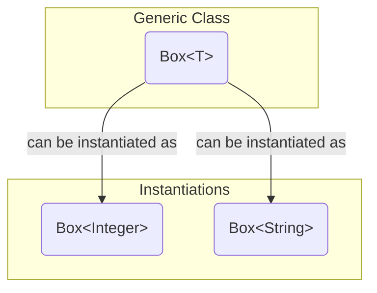
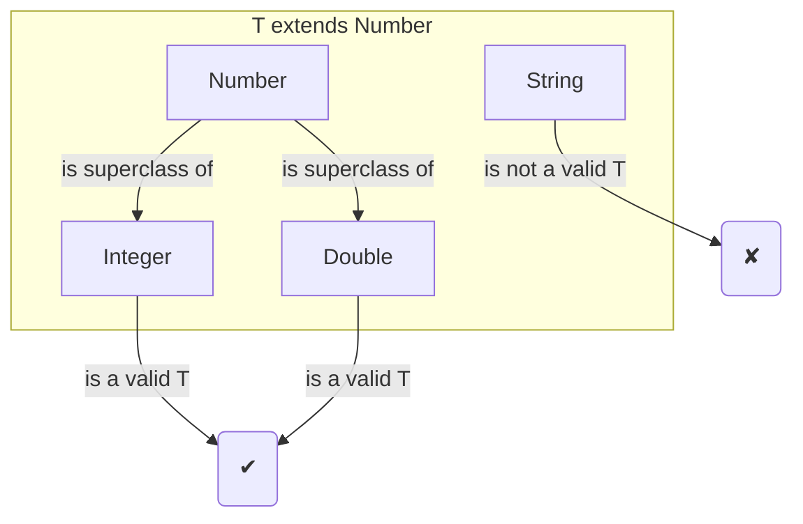
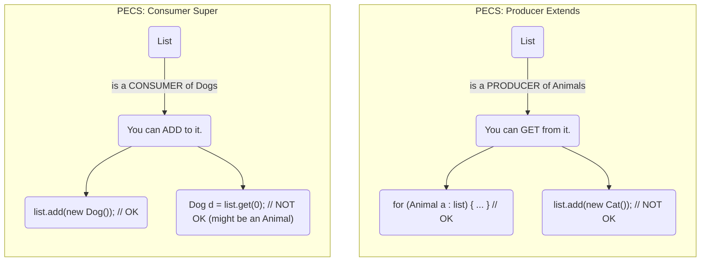

# 08 - Generics: Writing Flexible, Type-Safe Code

For the first few years of Java's life, we had a problem. Collections stored everything as a generic `Object`. When you retrieved an item, you had to cast it back to its original type. This was clumsy and, worse, it was not type-safe. A `ClassCastException` at runtime was a common bug.

We introduced **Generics** in Java 5 to solve this. Generics add "type parameters" to classes and methods, allowing the compiler to enforce type safety at compile-time, not runtime.

**What's in this chapter:**
*   [Mental Models for Generics](#mental-models-for-generics)
*   [Generic Classes: The `Box<T>` Example](#1-generic-classes-the-boxt-example)
*   [Generic Methods](#2-generic-methods)
*   [Bounded Generics: Limiting Your Types](#3-bounded-generics-limiting-your-types)
*   [Wildcards and The PECS Principle](#4-wildcards-and-the-pecs-principle)
*   [JVM Deep Dive: Type Erasure](#5-jvm-deep-dive-type-erasure)
*   [Check Your Understanding](#check-your-understanding)
*   [Your Mission: Implement a Generic Method](#6-your-mission-implement-a-generic-method)
*   [Interview Deep Dives](#interview-deep-dives)

---

### Mental Models for Generics

Generics can be abstract, so let's use some analogies.

*   **Generics as a Label Maker:** Think of a generic class like `Box<T>` as a plain, unlabeled cardboard box. Before you use it, you use a "label maker" (the angle brackets `<>`) to put a specific label on it, like `Box<Integer>`. Now, the compiler acts as your helpful but strict warehouse manager. It will *only* let you put integers in the box with the "Integer" label, preventing you from accidentally mixing up your items. This is compile-time type safety.

*   **The PECS Fruit Bowl Principle:** This is the key to understanding wildcards.
    *   **Producer Extends (`List<? extends Fruit>`)**: Imagine a method that gives you a bowl of fruit. You don't know if it's a bowl of `Apple`s or a bowl of `Orange`s, but you know that whatever you take *out* of it will be, at a minimum, a `Fruit`. It's a **producer** of fruit. You can't put an `Apple` *into* the bowl, because what if it was a bowl of only `Orange`s? That would violate its type safety.
    *   **Consumer Super (`List<? super Apple>`)**: Now imagine a method that takes a bowl from you so it can add an apple to it. The bowl must be able to hold `Apple`s. It could be a bowl of `Apple`s, a bowl of `Fruit`, or even a bowl of `Object`. It is a **consumer** of apples. You can safely put an `Apple` *into* this bowl. However, you can't be sure what you'll get *out* of it (it might be an `Apple`, or it might just be a generic `Fruit` or `Object`).

---

## 1. Generic Classes: The `Box<T>` Example

You can create your own classes that work with generic types. The classic example is a `Box`. A `Box` can hold anything, but we want to know *what* it holds when we create it.

```java
// T is a "type parameter" that will be replaced by a real type.
public class Box<T> {
    private T item;

    public void put(T item) {
        this.item = item;
    }

    public T get() {
        return item;
    }
}
```

Now, we can create `Box` objects that are guaranteed to hold a specific type:

```java
// A box specifically for Integers
Box<Integer> integerBox = new Box<>();
integerBox.put(10);
Integer myInt = integerBox.get(); // No cast needed!

// A box specifically for Strings
Box<String> stringBox = new Box<>();
stringBox.put("Hello");
String myString = stringBox.get(); // No cast needed!

// The compiler will prevent this error:
// integerBox.put("Some String"); // COMPILE ERROR!
```



---

## 2. Generic Methods

You can also create a single method that is generic, without its containing class being generic.

```java
public <T> void printArray(T[] inputArray) {
    for(T element : inputArray) {
        System.out.printf("%s ", element);
    }
    System.out.println();
}
```
You can call this with any type of array: `printArray(integerArray);` or `printArray(stringArray);`.

---

## 3. Bounded Generics: Limiting Your Types

Sometimes you want to restrict the types that can be used as a type parameter. For this, we use the `extends` keyword to set an **upper bound**.

For example, a method that works with any kind of `Number`:
```java
// T can be Integer, Double, Float, etc., but not String.
public <T extends Number> double doubleValue(T number) {
    return number.doubleValue();
}
```



---

## 4. Wildcards and The PECS Principle

Wildcards (`?`) are used to create flexible APIs that can accept generics of "unknown" type.

*   `List<?>`: A list of unknown type. You can't add anything to it (except `null`).
*   `List<? extends T>`: An **upper-bounded** wildcard. The list holds `T` or a subclass of `T`.
*   `List<? super T>`: A **lower-bounded** wildcard. The list holds `T` or a superclass of `T`.

This leads to a famous mnemonic: **PECS (Producer Extends, Consumer Super)**.



*   **Producer Extends:** If a generic structure is a **producer** (you only get values *out* of it), use `extends`.
    ```java
    // This method can print a list of any kind of Animal.
    public void printAnimals(List<? extends Animal> animals) {
        for (Animal a : animals) { // We are GETTING animals out.
            System.out.println(a);
        }
    }
    ```
*   **Consumer Super:** If a generic structure is a **consumer** (you only put values *into* it), use `super`.
    ```java
    // This method can add a Dog to a list of Dogs, a list of Animals, or a list of Objects.
    public void addDog(List<? super Dog> dogs) {
        dogs.add(new Dog()); // We are PUTTING a dog in.
    }
    ```

---

## 5. JVM Deep Dive: Type Erasure

This might surprise you, but the JVM doesn't actually know about generics. We implemented generics using a technique called **type erasure**. The compiler uses the generic type information to check for type errors, but then it **erases** that information.

*   `Box<T>` becomes `Box`.
*   `T` becomes `Object` (or the upper bound, like `Number`, if one was specified).
*   The compiler secretly inserts casts for you when you retrieve an item.

We chose this approach for **backward compatibility**. It allowed new generic code to work with old, pre-Java 5 code.

**Consequences of Type Erasure:**
*   You cannot do `new T()`. The compiler doesn't know what `T` is.
*   You cannot do `T.class`.
*   You cannot create an array of a generic type, like `new T[10]`.

---

### Check Your Understanding

You are writing a utility method `copyNumbers` that copies numbers from a source list to a destination list.
`public void copyNumbers(List<Number> dest, List<Number> src)`

You want to make it more flexible using wildcards.

**Question 1:** The `src` list is a **producer** (you only read from it). To allow it to accept a `List<Integer>` or a `List<Double>`, what wildcard should you use?
<details>
  <summary>Answer</summary>
  **Producer Extends**. The signature should be `List<? extends Number> src`. This allows you to copy *from* a list of any type that is a subclass of `Number`.
</details>

**Question 2:** The `dest` list is a **consumer** (you only write to it). You want to be able to copy a list of `Integer`s *into* a `List<Number>` or a `List<Object>`. What wildcard should you use for `dest`?
<details>
  <summary>Answer</summary>
  **Consumer Super**. The signature should be `List<? super Number> dest`. This allows you to copy `Number`s *into* a list that is typed as `Number` or any of its super-types.
</details>

---

## 6. Your Mission: Implement a Generic Method

The code in the `code/` directory contains a utility class with a `copy` method. This method is the perfect example of the PECS principle, but its implementation is missing. Your mission is to fill it in.

**Your Mission:**

1.  **Find the Code:** Open the `code/src/main/java/com/example/UtilsDemo.java` file.
2.  **Locate the Mission:** Find the `copy` method and the `// Your Mission:` comment inside it.
3.  **Accept the Challenge:** Write the code to loop through the `src` list and add each element to the `dest` list.
4.  **Think About It:** Why does the compiler allow this? The signature `(List<? extends T> src, List<? super T> dest)` is key. You can *get* a `T` from the producer (`src`) and you can *put* a `T` into the consumer (`dest`).
5.  **Run and Verify:** Run the `main` method (`mvn compile exec:java`). The code is already set up to call your `copy` method. If it works, you'll see the list of numbers successfully copied.

<details>
<summary>Stuck? Here's the solution</summary>

```java
public static <T> void copy(List<? extends T> src, List<? super T> dest) {
    // Your Mission:
    // Implement the body of this method.
    // 1. Loop through each element in the 'src' list.
    // 2. Add each element to the 'dest' list.
    // Why does this work? Because you can get a 'T' from 'src' (Producer Extends)
    // and you can put a 'T' into 'dest' (Consumer Super).

    // --- Your code goes here ---
    for (T element : src) {
        dest.add(element);
    }
    // --- End of your code ---
}
```
</details>

---

### Key Takeaways

*   **Generics Provide Type Safety:** Their primary purpose is to move type errors from runtime (a `ClassCastException`) to compile-time, making your code more robust.
*   **Use `<>` for Compile-Time Labels:** Think of generics as a label maker for your classes and methods, telling the compiler what types are allowed.
*   **Remember PECS for Wildcards:** This is the most important rule for designing flexible generic APIs. **P**roducer **E**xtends, **C**onsumer **S**uper.
*   **Type Erasure is How it Works:** The JVM itself doesn't know about generics. The compiler enforces the rules and then *erases* the type information, inserting casts automatically to maintain backward compatibility. This has important limitations (e.g., you can't do `new T()`).

---

## Interview Deep Dives

(Content from the original `README.md` for Q31 would be included and expanded here.)
