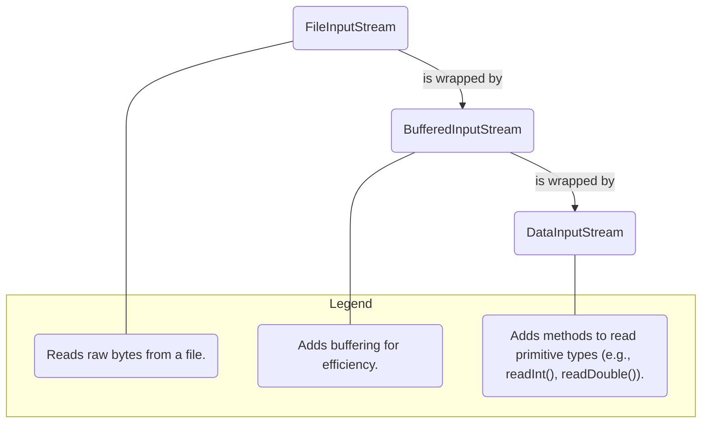

# 09 - IO: Talking to the Outside World

A program isn't useful if it can't interact with the outside world. We needed a powerful and flexible way for your programs to read and write data. This is the purpose of Java's I/O (Input/Output) libraries, which have evolved significantly over the years.

**What's in this chapter:**
*   [Mental Models for I/O](#mental-models-for-io)
*   [Classic I/O: The Decorator Pattern](#1-classic-io-the-decorator-pattern)
*   [Modern I/O: `java.nio.file`](#2-modern-io-javaniofile)
*   [High-Performance I/O: `java.nio` Buffers and Channels](#3-high-performance-io-javanio-buffers-and-channels)
*   [Check Your Understanding](#check-your-understanding)
*   [Your Mission: Process a File](#4-your-mission-process-a-file)
*   [Interview Deep Dives](#interview-deep-dives)

---

### Mental Models for I/O

*   **`java.io` Decorators are like Layering Clothes:** You start with a basic `FileInputStream` (the person). This only lets you read raw bytes, which isn't very useful. So, you "decorate" it by wrapping it in a `BufferedInputStream` (a t-shirt for warmth/efficiency). Then you might wrap that in a `DataInputStream` (a jacket with special pockets for reading `int`s and `double`s). Each layer adds a new capability.

*   **`java.nio` Buffers and Channels are a High-Speed Railway:**
    *   The **Channel** is the train track—a direct, high-speed connection between your program and the file system or network.
    *   The **Buffer** is the train car. Instead of sending data one byte at a time (like a person walking down the track), you fill an entire train car with data and send it all at once. This is much more efficient for large amounts of data.

---

## 1. Classic I/O: The Decorator Pattern

The original I/O library (`java.io`) was designed around the **Decorator Pattern**. You start with a basic stream and "wrap" or "decorate" it with others to add functionality.

**Key Abstractions:**
*   **Byte Streams (`InputStream`/`OutputStream`):** For reading/writing raw binary data (e.g., an image file).
*   **Character Streams (`Reader`/`Writer`):** For reading/writing text data. These correctly handle character encodings (like UTF-8).

**Visualizing the Decorator Pattern:**
Imagine you want to read binary data from a file efficiently. You can combine classes:


This design is flexible, but can lead to verbose code. For handling files, there is now a better way.

---

## 2. Modern I/O: `java.nio.file`

In Java 7, we introduced a new, modern API for file handling. It's more powerful, intuitive, and consistent across operating systems.

**Key Classes:**
*   **`Path`:** Represents a path in the file system. Replaces the old `java.io.File` class.
*   **`Paths`:** A factory class for creating `Path` objects (e.g., `Paths.get("my/file.txt")`).
*   **`Files`:** A utility class with a rich set of static methods for operating on files (e.g., read, write, copy, delete, check existence).

**Modern File Reading:**
```java
// Old way with Readers
try (BufferedReader reader = new BufferedReader(new FileReader("file.txt"))) {
    // ...
}

// Modern, simpler way
Path path = Paths.get("file.txt");
List<String> lines = Files.readAllLines(path); // Reads the whole file into a list
```
**Key Takeaway:** For file operations, always prefer the `java.nio.file` API.

---

## 3. High-Performance I/O: `java.nio` Buffers and Channels

The `java.nio` (New I/O) package also introduced a lower-level, more performant API for I/O based on **channels** and **buffers**.

*   **Channels:** A channel represents a connection to an entity capable of performing I/O operations, such as a file or a socket.
*   **Buffers:** A buffer is a fixed-size block of memory into which data is read or from which data is written. Data is transferred from the file system to a buffer, and then your program reads from the buffer.

This **buffer-oriented** approach can be significantly faster than the stream-oriented approach of `java.io` for large data transfers, as it reduces the number of system calls and memory copies.

---

### Check Your Understanding

**Question 1:** You need to read a simple text configuration file that is only a few lines long. Which class would be the most convenient and modern way to read all the lines into a `List<String>`?
<details>
  <summary>Answer</summary>
  The `java.nio.file.Files` utility class, specifically the `Files.readAllLines(path)` method. It's a single, simple line of code for this common task.
</details>

**Question 2:** You are writing a high-performance network application that needs to transfer a large 1GB video file from one place to another. To maximize speed and minimize memory overhead, should you use the stream-based `java.io` API or the buffer/channel-based `java.nio` API?
<details>
  <summary>Answer</summary>
  For high-performance, large data transfers, the **`java.nio`** API with `Channel`s and `Buffer`s is the superior choice. It is designed for this kind of efficient, block-based I/O.
</details>

---

## 4. Your Mission: Process a File

Your mission is to use the modern `java.nio.file` API to read a file, process its contents, and write the results to a new file. This is a very common real-world task.

We have created a new `DataProcessor.java` file and an `input.txt` for you in the `code/` directory.

**Your Mission:**

1.  **Find the Code:** Open `code/src/main/java/com/example/DataProcessor.java`.
2.  **Locate the Mission:** Find the `// Your Mission:` comment inside the `main` method.
3.  **Accept the Challenge:** Write the code to perform these three steps inside the `try` block:
    a. Read all lines from `input.txt` into a `List<String>`.
    b. Create a new list where every line from the input is converted to uppercase, BUT only include lines that do not contain the letter 'E'. (Hint: a `stream()` pipeline with `map()` and `filter()` is great for this).
    c. Write the lines from your new list to `output.txt`.
4.  **Run and Verify:** Run the code (`mvn compile exec:java`). A new `output.txt` file should be created. Check its contents to see if your processing was successful. It should contain "ALPHA" and "BRAVO".

<details>
<summary>Stuck? Here's the solution</summary>

```java
// --- Your code goes here ---
List<String> lines = Files.readAllLines(inputFile);

List<String> processedLines = lines.stream()
    .map(String::toUpperCase)
    .filter(line -> !line.contains("E"))
    .collect(Collectors.toList());

Files.write(outputFile, processedLines);
// --- End of your code ---
```
</details>

---

### Key Takeaways

*   **Prefer Modern I/O:** For file operations, always prefer the `java.nio.file` package (`Path`, `Paths`, `Files`). It is more powerful and consistent than the old `java.io.File` class.
*   **Use the Right Tool for the Job:**
    *   For reading/writing small text files, `Files.readAllLines()` and `Files.write()` are extremely convenient.
    *   For large files or binary data, use streams (`InputStream`/`OutputStream`) or channels (`FileChannel`).
*   **`try-with-resources` is Essential:** I/O operations often involve resources that must be closed. Using `try-with-resources` is the safest and most reliable way to ensure they are always closed, even when errors occur.
*   **JSON over Serialization:** For saving objects or sending them over a network, prefer using a standard format like JSON with a library like Jackson or Gson over Java's built-in `Serializable` mechanism.

---

## Interview Deep Dives

### Q32: What is Serialization, and how do you prevent a field from being serialized?

*   **Simple Answer:** Serialization is converting a Java object into a stream of bytes. You use the `transient` keyword to prevent a field from being serialized.
*   **How it works:**
    1.  Your class must implement the `Serializable` marker interface.
    2.  You use an `ObjectOutputStream` to write the object.
    3.  You use an `ObjectInputStream` to read the object back.
*   **The `transient` keyword:** Marks a field to be ignored by the serialization process. Useful for sensitive data or data that can be re-calculated.
*   **Modern Best Practice:** Java's built-in serialization is often considered brittle and a security risk. For storing data or sending it between services, it's almost always better to use a standard, human-readable format like **JSON**, using libraries like Jackson or Gson.
