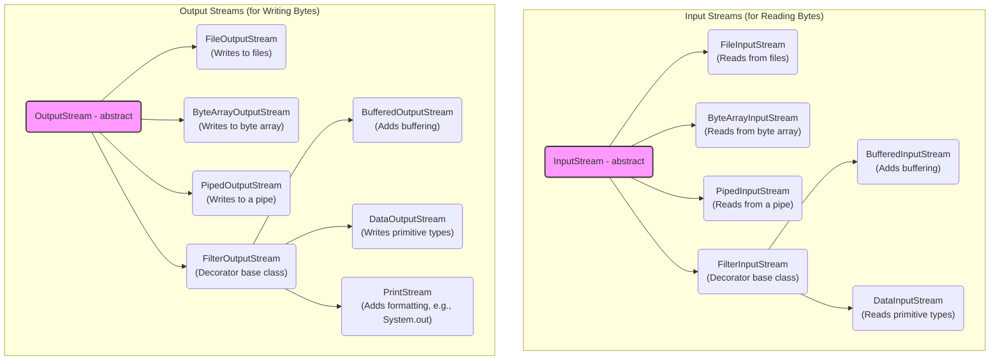
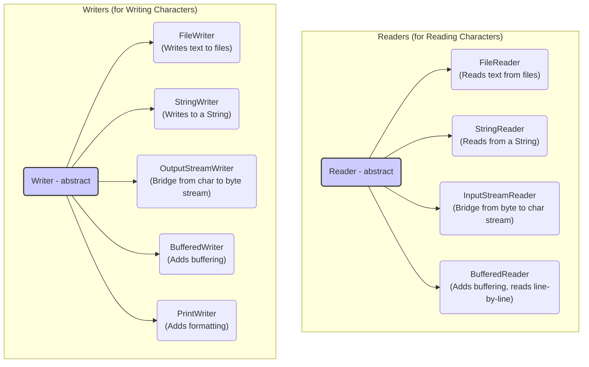

# 09 - IO: Talking to the Outside World

A program isn't useful if it can't interact with the outside world. We needed a powerful and flexible way for your programs to read and write data. This is the purpose of Java's I/O (Input/Output) libraries, which have evolved significantly over the years.

**What's in this chapter:**
*   [Classic I/O: The Decorator Pattern](#1-classic-io-the-decorator-pattern)
*   [Modern I/O: `java.nio.file`](#2-modern-io-javaniofile)
*   [High-Performance I/O: `java.nio` Buffers and Channels](#3-high-performance-io-javanio-buffers-and-channels)
*   [Hands-On Lab: Reading and Writing Files](#4-hands-on-lab-reading-and-writing-files)
*   [Interview Deep Dives](#interview-deep-dives)

---

## 1. Classic I/O: The Decorator Pattern

The original I/O library (`java.io`) was designed around the **Decorator Pattern**. You start with a basic stream and "wrap" or "decorate" it with others to add functionality.

**Key Abstractions:**
*   **Byte Streams (`InputStream`/`OutputStream`):** For reading/writing raw binary data (e.g., an image file).
*   **Character Streams (`Reader`/`Writer`):** For reading/writing text data. These correctly handle character encodings (like UTF-8).

### A Detailed Look at `java.io` Hierarchies

The `java.io` library is built on a set of abstract base classes. The two main hierarchies are for byte streams (`InputStream`/`OutputStream`) and character streams (`Reader`/`Writer`). The Decorator Pattern is used extensively to add functionality by wrapping base streams.

#### Byte Stream Hierarchy

Byte streams are used for reading and writing binary data (e.g., images, executable files). `InputStream` and `OutputStream` are the abstract base classes.



**Key `InputStream` Methods:**
| Method | Description |
| --- | --- |
| `int read()` | Reads the next byte of data. Returns -1 at the end of the stream. |
| `int read(byte[] b)` | Reads up to `b.length` bytes into an array. Returns the number of bytes read, or -1. |
| `void close()` | Closes the stream and releases system resources. |

**Key `OutputStream` Methods:**
| Method | Description |
| --- | --- |
| `void write(int b)` | Writes the specified byte to the output stream. |
| `void write(byte[] b)` | Writes `b.length` bytes from the specified byte array. |
| `void flush()` | Flushes the stream, forcing any buffered output bytes to be written out. |
| `void close()` | Closes the stream and releases system resources. |

#### Character Stream Hierarchy

Character streams are used for reading and writing text data, automatically handling character encodings (like UTF-8). `Reader` and `Writer` are the abstract base classes.



*   **Bridge Classes:** `InputStreamReader` and `OutputStreamWriter` are crucial "bridge" classes. An `InputStreamReader` wraps an `InputStream` and decodes the bytes into characters. An `OutputStreamWriter` wraps an `OutputStream` and encodes characters into bytes.

**Key `Reader` Methods:**
| Method | Description |
| --- | --- |
| `int read()` | Reads a single character. Returns -1 at the end of the stream. |
| `int read(char[] cbuf)` | Reads characters into an array. Returns the number of characters read, or -1. |
| `void close()` | Closes the stream. |

**Key `Writer` Methods:**
| Method | Description |
| --- | --- |
| `void write(int c)` | Writes a single character. |
| `void write(char[] cbuf)` | Writes an array of characters. |
| `void write(String str)` | Writes a string. |
| `void flush()` | Flushes the stream. |
| `void close()` | Closes the stream. |
This design is flexible, but can lead to verbose code. For handling files, there is now a better way.

---

## 2. Modern I/O: `java.nio.file`

In Java 7, we introduced a new, modern API for file handling. It's more powerful, intuitive, and consistent across operating systems.

**Key Classes:**
*   **`Path`:** Represents a path in the file system. Replaces the old `java.io.File` class.
*   **`Paths`:** A factory class for creating `Path` objects (e.g., `Paths.get("my/file.txt")`).
*   **`Files`:** A utility class with a rich set of static methods for operating on files (e.g., read, write, copy, delete, check existence).

**Modern File Reading:**
```java
// Old way with Readers
try (BufferedReader reader = new BufferedReader(new FileReader("file.txt"))) {
    // ...
}

// Modern, simpler way
Path path = Paths.get("file.txt");
List<String> lines = Files.readAllLines(path); // Reads the whole file into a list
```
**Key Takeaway:** For file operations, always prefer the `java.nio.file` API.

---

## 3. High-Performance I/O: `java.nio` Buffers and Channels

The `java.nio` (New I/O) package also introduced a lower-level, more performant API for I/O based on **channels** and **buffers**.

*   **Channels:** A channel represents a connection to an entity capable of performing I/O operations, such as a file or a socket.
*   **Buffers:** A buffer is a fixed-size block of memory into which data is read or from which data is written. Data is transferred from the file system to a buffer, and then your program reads from the buffer.

This **buffer-oriented** approach can be significantly faster than the stream-oriented approach of `java.io` for large data transfers, as it reduces the number of system calls and memory copies.

---

## 4. Hands-On Lab: Reading and Writing Files

We've created a runnable project in the `code/` directory that demonstrates:
1.  Writing a list of strings to a file using the modern `Files.write()`.
2.  Reading a file line-by-line using `Files.newBufferedReader()`.
3.  Copying a file efficiently using `java.nio` Channels and Buffers.

**To run it:**
1.  Navigate to the `code/` directory.
2.  Run `mvn compile exec:java`.
3.  Explore the source code to see the modern I/O APIs in action.

---

## Interview Deep Dives

### Q32: What is Serialization, and how do you prevent a field from being serialized?

*   **Simple Answer:** Serialization is converting a Java object into a stream of bytes. You use the `transient` keyword to prevent a field from being serialized.
*   **How it works:**
    1.  Your class must implement the `Serializable` marker interface.
    2.  You use an `ObjectOutputStream` to write the object.
    3.  You use an `ObjectInputStream` to read the object back.
*   **The `transient` keyword:** Marks a field to be ignored by the serialization process. Useful for sensitive data or data that can be re-calculated.
*   **Modern Best Practice:** Java's built-in serialization is often considered brittle and a security risk. For storing data or sending it between services, it's almost always better to use a standard, human-readable format like **JSON**, using libraries like Jackson or Gson.
