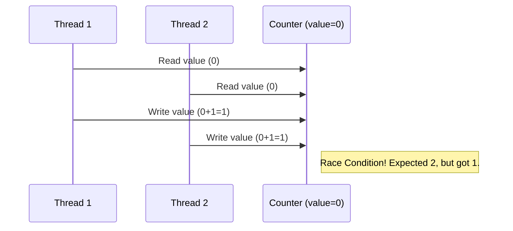
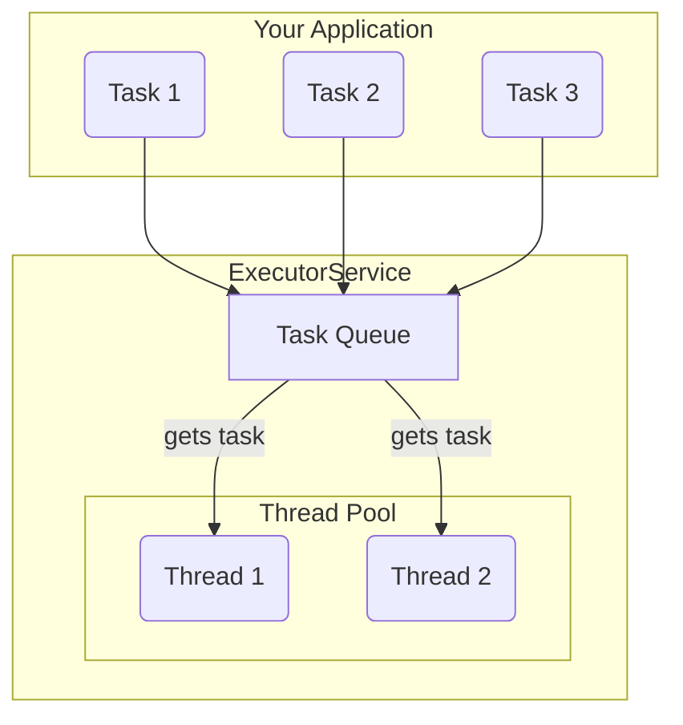

# 10 - Modern Concurrency in Java

From its inception, Java was designed for a concurrent world. Concurrency allows a program to do multiple things at once, leading to more responsive and scalable applications. While the original tools like `synchronized` were powerful, modern Java provides a much more sophisticated and efficient toolkit.

**What's in this chapter:**
*   [Mental Models for Concurrency](#mental-models-for-concurrency)
*   [The Problem: Why Concurrency is Hard](#1-the-problem-why-concurrency-is-hard)
*   [The Modern Solution: The Executor Framework](#2-the-modern-solution-the-executor-framework)
*   [The Future of Concurrency: Virtual Threads](#3-the-future-of-concurrency-virtual-threads-project-loom)
*   [Check Your Understanding](#check-your-understanding)
*   [Your Mission: Fix the Race Condition](#4-your-mission-fix-the-race-condition)
*   [Interview Deep Dives](#interview-deep-dives)

---

### Mental Models for Concurrency

Concurrency is like running a busy kitchen.

*   **A Thread is a Chef:** A single-threaded application has one chef trying to do everything: chop vegetables, cook the main course, and wash dishes. It's slow. A multi-threaded application has multiple chefs working in parallel, which is much more efficient.

*   **An `ExecutorService` is the Kitchen Manager:** Instead of hiring and firing chefs yourself (creating and managing `Thread`s), you give a list of tasks (e.g., "chop 10 onions", "grill 5 steaks") to the kitchen manager. The manager uses a team of chefs (a **thread pool**) to get the work done efficiently without you having to worry about the details.

*   **A `synchronized` block is the Key to the Spice Cabinet:** The spice cabinet is a shared resource. If two chefs try to grab the salt at the same time, they might spill it (a race condition). To prevent this, you put a lock on the cabinet. A chef must get the one and only key before they can open the cabinet. Any other chef who needs a spice has to wait until the first chef is done and returns the key. This ensures safety but can create a bottleneck if everyone needs the salt at once.

*   **An `AtomicInteger` is a Self-Managing Ticket Counter:** Imagine a counter that automatically increments a number for each person who takes a ticket. The internal mechanism is built to be "atomic"—it can't be interrupted halfway through. You don't need a lock. The counter manages its own state safely, making it much faster than locking the whole counter every time someone needs a number.

---

## 1. The Problem: Why Concurrency is Hard

When multiple threads access and modify shared data, you can run into serious problems.

*   **Race Conditions:** The final result depends on the unpredictable timing of thread execution. This can lead to lost updates and corrupted data.
*   **Deadlocks:** Two or more threads are blocked forever, each waiting for a resource that the other holds.


The original solution to this was the `synchronized` keyword, which provides a low-level locking mechanism. While it works, it's coarse and can lead to performance bottlenecks. Modern Java offers better tools.

---

## 2. The Modern Solution: The Executor Framework

Manually creating and managing threads is error-prone and inefficient. The **Executor Framework**, introduced in Java 5, is the cornerstone of modern Java concurrency. It decouples task submission from task execution.

**You submit tasks, and the framework manages the threads.**


**Key Components:**
*   **`ExecutorService`:** The main interface for the framework. You submit `Runnable` or `Callable` tasks to it.
*   **`ThreadPoolExecutor`:** The most common implementation, which manages a pool of reusable threads and a queue for pending tasks.
*   **`Executors`:** A factory class with helpful methods like `Executors.newFixedThreadPool(10)`.
*   **`Future<V>`:** When you submit a `Callable` (a task that returns a result), you get back a `Future`. It's a placeholder for a result that will be available later. You can call `future.get()` to wait for and retrieve the result.

---

## 3. The Future of Concurrency: Virtual Threads (Project Loom)

Introduced as a final feature in **Java 21**, Virtual Threads are a revolutionary change to Java concurrency.

*   **Platform Threads:** These are the traditional Java threads, which are thin wrappers around expensive OS threads. You can only have a few thousand of them.
*   **Virtual Threads:** These are extremely lightweight threads managed by the JVM, not the OS. You can have *millions* of them.

This makes it possible to write simple, synchronous-looking code (e.g., "read from network, then write to database") where each request is handled by its own thread, without worrying about running out of threads.

**Creating a Virtual Thread is easy:**
```java
// Old way
Thread platformThread = new Thread(() -> { ... });
platformThread.start();

// New way with Virtual Threads
Thread virtualThread = Thread.startVirtualThread(() -> { ... });

// Or using an ExecutorService
try (var executor = Executors.newVirtualThreadPerTaskExecutor()) {
    executor.submit(() -> { ... });
}
```
**Key Takeaway:** Virtual threads are the future for most high-throughput server applications in Java.

---

### Check Your Understanding

**Question 1:** You are building a web server. For each incoming request, you need to perform a network call and a database query. To handle many users at once, should you use one thread for the whole server, or dispatch each request to a worker thread? What is the best modern tool for this?
<details>
  <summary>Answer</summary>
  You should dispatch each request to a worker thread. The best modern tool for this is an **`ExecutorService`**, which manages a pool of threads for you. With Java 21+, `Executors.newVirtualThreadPerTaskExecutor()` is an even better choice, as it creates extremely lightweight virtual threads for each task.
</details>

**Question 2:** You have multiple threads incrementing a shared `int count`. You see that the final value is often wrong due to race conditions. What is a simple, efficient, and lock-free way to fix this?
<details>
  <summary>Answer</summary>
  Use a `java.util.concurrent.atomic.AtomicInteger`. Its `incrementAndGet()` method is an atomic operation, guaranteeing that the read-increment-write sequence happens as a single, uninterruptible step, thus avoiding race conditions without the overhead of a `synchronized` block.
</details>

---

## 4. Your Mission: Fix the Race Condition

The code in the `code/` directory demonstrates a classic race condition. A simple counter is incremented by multiple threads, but because the `++` operation is not atomic, the final result is almost always wrong. Your mission is to fix it.

**Your Mission:**

1.  **Find the Code:** Open `code/src/main/java/com/example/ConcurrentCounterDemo.java`.
2.  **Locate the `UnsafeCounter` class:** This is the class with the bug.
3.  **Accept the Challenge:** Modify the `UnsafeCounter` to make it thread-safe.
    *   Change the `count` field from a primitive `int` to a `java.util.concurrent.atomic.AtomicInteger`.
    *   Update the `increment()` and `getCount()` methods to use the appropriate methods from `AtomicInteger`.
4.  **Run and Verify:**
    *   Run the code before your changes (`mvn compile exec:java`) and note the incorrect result.
    *   After making your changes, run the code again. The actual result should now consistently match the expected result.

<details>
<summary>Stuck? Here's the solution</summary>

```java
// The fixed counter class
static class SafeCounter {
    // 1. Use AtomicInteger
    private AtomicInteger count = new AtomicInteger(0);

    public void increment() {
        // 3. Use the atomic incrementAndGet() method
        count.incrementAndGet();
    }

    public int getCount() {
        // 4. Use the get() method
        return count.get();
    }
}
```
</details>

---

### Key Takeaways

*   **Concurrency is Hard:** Race conditions and deadlocks are subtle and difficult to debug. Always use the modern concurrency utilities.
*   **Use the Executor Framework:** Don't manage threads manually. Decouple task submission from execution using an `ExecutorService`.
*   **Prefer Atomic Classes over Locks:** For simple atomic operations like incrementing a counter, `AtomicInteger` and `AtomicLong` are much more efficient than using `synchronized` blocks.
*   **Virtual Threads are the Future:** For I/O-bound tasks, `Executors.newVirtualThreadPerTaskExecutor()` (Java 21+) is a game-changer, allowing you to write simple, scalable code.

---

## Interview Deep Dives

(Content from the original `README.md` for Q33-Q37 would be included here, updated to emphasize the modern `java.util.concurrent` utilities and virtual threads as best practices.)
