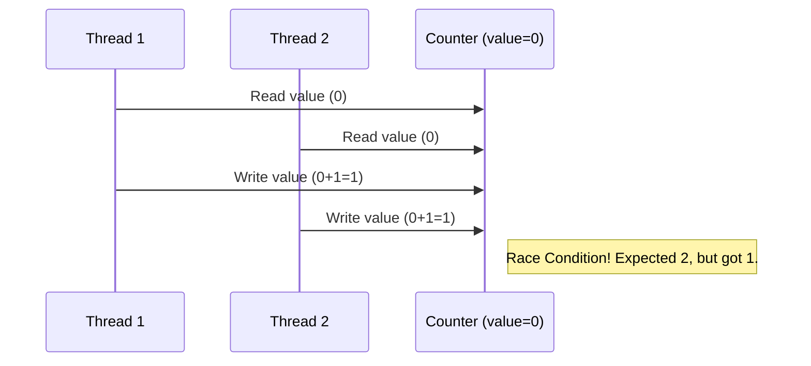
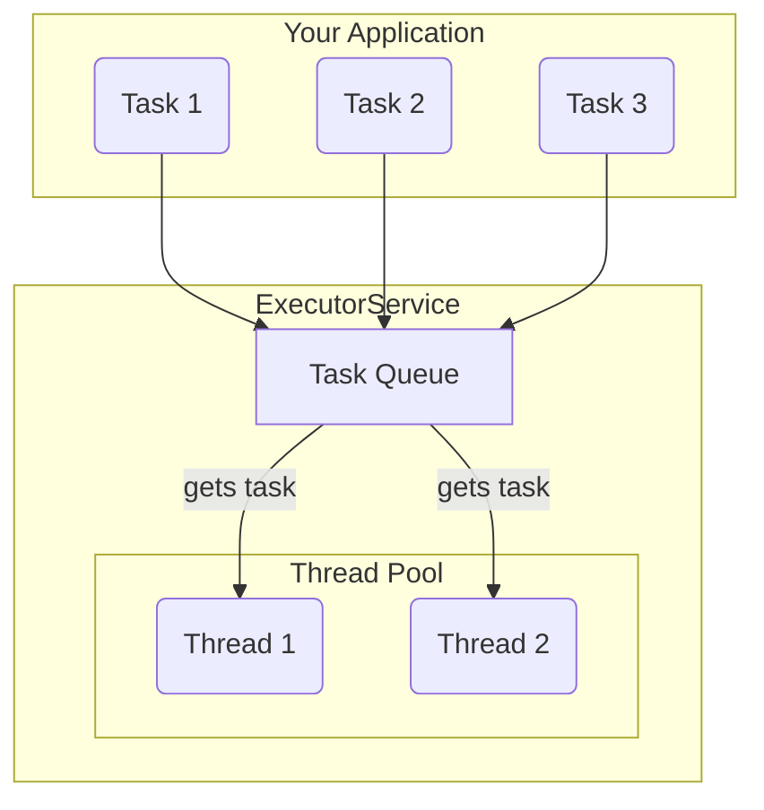
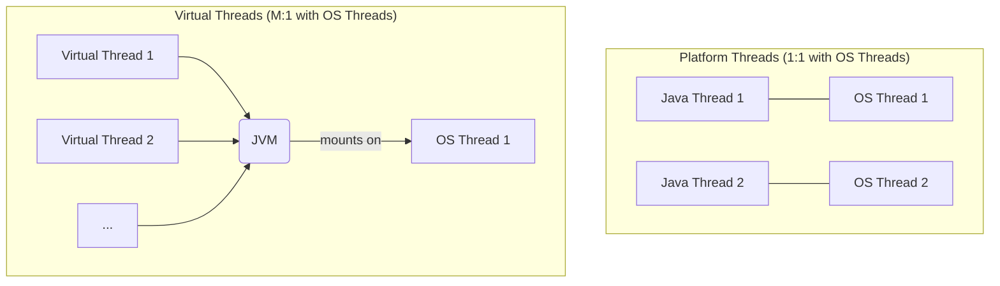

# 10 - Modern Concurrency in Java

From its inception, Java was designed for a concurrent world. Concurrency allows a program to do multiple things at once, leading to more responsive and scalable applications. While the original tools like `synchronized` were powerful, modern Java provides a much more sophisticated and efficient toolkit.

**What's in this chapter:**
*   [The Problem: Why Concurrency is Hard](#1-the-problem-why-concurrency-is-hard)
*   [The Modern Solution: The Executor Framework](#2-the-modern-solution-the-executor-framework)
*   [The Future of Concurrency: Virtual Threads](#3-the-future-of-concurrency-virtual-threads-project-loom)
*   [Hands-On Lab: A Concurrent Counter](#4-hands-on-lab-a-concurrent-counter)
*   [Interview Deep Dives](#interview-deep-dives)

---

## 1. The Problem: Why Concurrency is Hard

When multiple threads access and modify shared data, you can run into serious problems.

*   **Race Conditions:** The final result depends on the unpredictable timing of thread execution. This can lead to lost updates and corrupted data.
*   **Deadlocks:** Two or more threads are blocked forever, each waiting for a resource that the other holds.


The original solution to this was the `synchronized` keyword, which provides a low-level locking mechanism. While it works, it's coarse and can lead to performance bottlenecks. Modern Java offers better tools.

---

## 2. The Modern Solution: The Executor Framework

Manually creating and managing threads is error-prone and inefficient. The **Executor Framework**, introduced in Java 5, is the cornerstone of modern Java concurrency. It decouples task submission from task execution.

**You submit tasks, and the framework manages the threads.**


**Key Components:**
*   **`ExecutorService`:** The main interface for the framework. You submit `Runnable` or `Callable` tasks to it.
*   **`ThreadPoolExecutor`:** The most common implementation, which manages a pool of reusable threads and a queue for pending tasks.
*   **`Executors`:** A factory class with helpful methods like `Executors.newFixedThreadPool(10)`.
*   **`Future<V>`:** When you submit a `Callable` (a task that returns a result), you get back a `Future`. It's a placeholder for a result that will be available later. You can call `future.get()` to wait for and retrieve the result.

---

## 3. The Future of Concurrency: Virtual Threads (Project Loom)

Introduced as a final feature in **Java 21**, Virtual Threads are a revolutionary change to Java concurrency.

*   **Platform Threads:** These are the traditional Java threads, which are thin wrappers around expensive OS threads. You can only have a few thousand of them.
*   **Virtual Threads:** These are extremely lightweight threads managed by the JVM, not the OS. You can have *millions* of them.



This makes it possible to write simple, synchronous-looking code (e.g., "read from network, then write to database") where each request is handled by its own thread, without worrying about running out of threads.

**Creating a Virtual Thread is easy:**
```java
// Old way
Thread platformThread = new Thread(() -> { ... });
platformThread.start();

// New way with Virtual Threads
Thread virtualThread = Thread.startVirtualThread(() -> { ... });

// Or using an ExecutorService
try (var executor = Executors.newVirtualThreadPerTaskExecutor()) {
    executor.submit(() -> { ... });
}
```
**Key Takeaway:** Virtual threads are the future for most high-throughput server applications in Java.

---

## 4. Hands-On Lab: A Concurrent Counter

We've created a runnable project in the `code/` directory that demonstrates:
1.  The **race condition** problem when multiple threads increment a simple counter.
2.  How to solve this problem correctly and efficiently using `java.util.concurrent.atomic.AtomicInteger`.
3.  How to use an `ExecutorService` to manage the threads.

**To run it:**
1.  Navigate to the `code/` directory.
2.  Run `mvn compile exec:java`.
3.  Observe the incorrect result from the naive counter and the correct result from the atomic counter.

---

## Interview Deep Dives

(Content from the original `README.md` for Q33-Q37 would be included here, updated to emphasize the modern `java.util.concurrent` utilities and virtual threads as best practices.)
