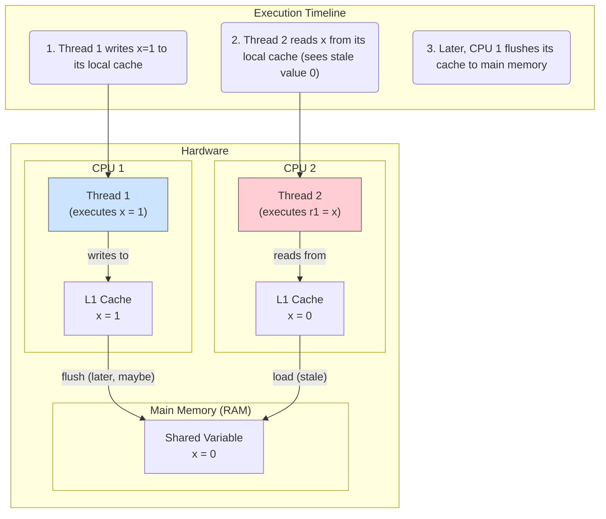
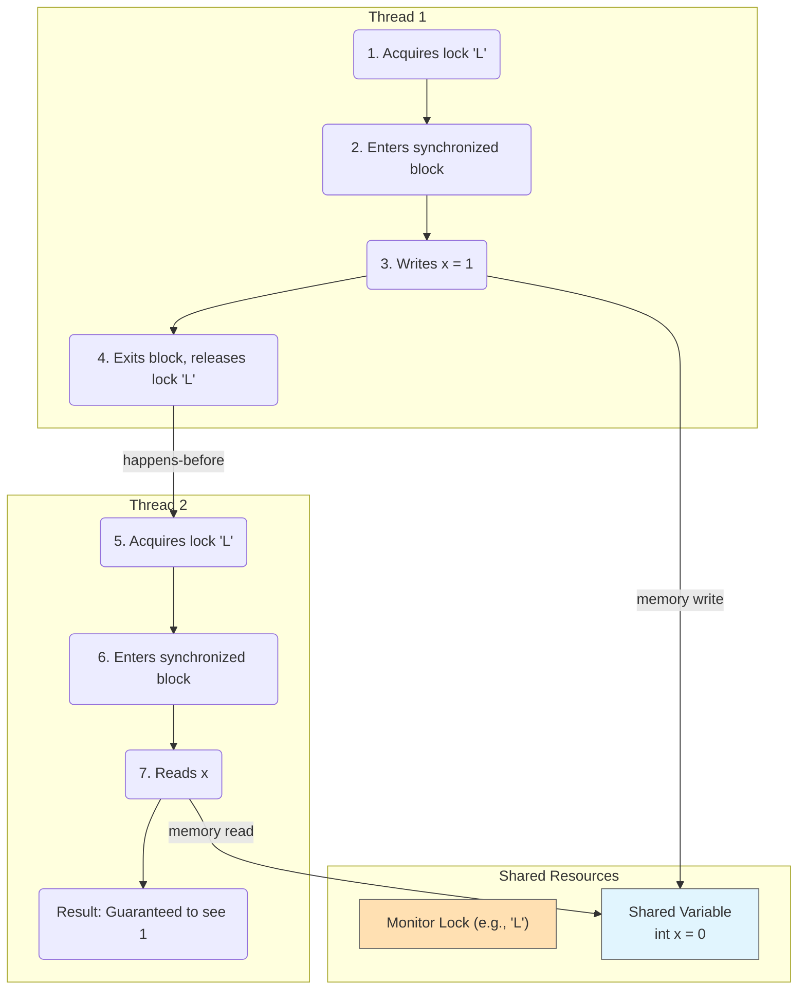

# 11 - The Java Memory Model: The Rules of Concurrency

The Java Memory Model (JMM) is one of the most advanced and critical parts of the Java platform. It is the specification that defines the rules for how threads interact with memory. Understanding the JMM is essential for writing correct, high-performance concurrent code.

**What's in this chapter:**
*   [Mental Models for the Memory Model](#mental-models-for-the-memory-model)
*   [The Problem: Caches, Reordering, and a Lack of Guarantees](#1-the-problem-caches-reordering-and-a-lack-of-guarantees)
*   [The Solution: The "Happens-Before" Guarantee](#2-the-solution-the-happens-before-guarantee)
*   [The `volatile` Keyword: A Lightweight Guarantee](#3-the-volatile-keyword-a-lightweight-guarantee)
*   [Memory Model vs. Memory Structure](#4-memory-model-vs-memory-structure)
*   [Your Mission: Guarantee Visibility](#your-mission-guarantee-visibility)
*   [Check Your Understanding](#check-your-understanding)
*   [Interview Deep Dives](#interview-deep-dives)

---

### Mental Models for the Memory Model

This is a deeply technical topic, so let's use analogies to build intuition.

*   **The Visibility Problem is Chefs with Personal Refrigerators:** Imagine a kitchen with a large central pantry (Main Memory) and several chefs (CPU Cores), each with their own small, super-fast personal fridge (CPU Cache).
    *   A chef goes to the pantry and gets some butter, putting it in their personal fridge.
    *   They use some of the butter (modify the variable). The butter in their personal fridge is now different from the butter in the pantry.
    *   Another chef goes to the pantry to get butter. They will get the old, unchanged butter because the first chef hasn't put their updated butter back yet.
    *   This is the **visibility** problem. A change made in one thread's "personal fridge" isn't visible to other threads.

*   **The `happens-before` relationship is a Relay Race Baton Pass:** In a relay race, there's a strict rule: Runner B cannot start until Runner A has finished their leg *and* passed the baton. That baton pass is a synchronization point. It guarantees that all of Runner A's work is complete and its results are safely transferred before Runner B begins. A `synchronized` block or a `volatile` write acts like this baton pass, creating a "happens-before" guarantee.

*   **`volatile` is a Megaphone Announcement:** When a variable is declared `volatile`, any thread that changes it is forced to immediately grab a megaphone and announce the new value to the entire kitchen. And any thread that needs to know the value of that variable is forced to listen for the latest announcement instead of just checking their personal fridge. It ensures everyone has the latest value for that *one specific ingredient*, but it doesn't stop two chefs from trying to grab it at the same time (it's not a lock).

---

## 1. The Problem: Caches, Reordering, and a Lack of Guarantees

In a modern computer, code doesn't just run on a single CPU. There are multiple levels of caches, and both the compiler and the CPU can reorder instructions to optimize performance. In a single-threaded world, you never notice this. In a multi-threaded world, it can lead to two major problems:

1.  **Visibility:** A change made by one thread to a shared variable might not be visible to other threads immediately (or ever!). Each CPU core might have its own cached copy of the data.
2.  **Reordering:** Instructions can be executed in a different order than you wrote them in your code, leading to unexpected behavior.



Without the JMM, there would be no guarantee that the `x=1` write from Thread 1 would ever become visible to Thread 2.

---

## 2. The Solution: The "Happens-Before" Guarantee

The JMM provides a formal guarantee called **happens-before**. It's a simple rule:
> If action A *happens-before* action B, then the results of A are guaranteed to be visible to and ordered before B.

Several things create a happens-before relationship:
*   **A `synchronized` lock release on a monitor *happens-before* every subsequent acquire of that same monitor.** This is why `synchronized` works for both mutual exclusion and visibility.
*   **A write to a `volatile` variable *happens-before* every subsequent read of that same variable.**
*   Calling `thread.start()` *happens-before* any action in the started thread.
*   A thread finishing its work *happens-before* another thread successfully returns from a `thread.join()` call.



---

## 3. The `volatile` Keyword: A Lightweight Guarantee

The `volatile` keyword is a weaker form of synchronization. It does **not** provide mutual exclusion (locking), but it **does** provide a visibility guarantee.

When you declare a variable `volatile`, you are telling the JVM:
1.  Every write to this variable must be flushed directly to main memory.
2.  Every read of this variable must come directly from main memory, not a CPU cache.
3.  The compiler and CPU are forbidden from reordering instructions around reads and writes of this variable.

**When to use it:**
Use `volatile` when one thread writes to a variable, and other threads only read it. It's perfect for things like a status flag.

```java
class Worker {
    private volatile boolean stopped = false;

    public void run() {
        while (!stopped) {
            // do work
        }
        System.out.println("Worker thread stopped.");
    }

    public void stop() {
        // This write is guaranteed to be visible to the reading thread.
        this.stopped = true;
    }
}
```
Without `volatile`, the `run()` method's loop might never see the change to `stopped` and could loop forever.

---

## 4. Memory Model vs. Memory Structure

It's important not to confuse the Java Memory Model with Java's memory structure.
*   **Memory Structure:** This is *what* memory looks like. It's the division of memory into the **Stack**, **Heap**, and **Metaspace**. This is about where data is stored.
*   **Java Memory Model (JMM):** This is the set of *rules* that govern how threads interact with that memory structure. It's about visibility, ordering, and the guarantees the JVM provides.

---

### Your Mission: Guarantee Visibility

The Java Memory Model is not just theoretical. A missing `volatile` keyword can cause a program to fail in subtle ways. Your mission is to fix a visibility problem.

We have created a project in the `code/` directory with a `Worker` thread that runs in a loop, controlled by a `stopped` flag. The main thread will set this flag to `true` after one second, but without the correct memory visibility guarantees, the worker may never see the change and loop forever.

**Your Mission:**

1.  **Find the Code:** Open `code/src/main/java/com/example/VisibilityDemo.java`.
2.  **Analyze the Problem:** Notice the `stopped` boolean field in the `Worker` class. It's a classic status flag.
3.  **Run the Code:** Run the `main` method (`mvn compile exec:java`). The program may appear to hang and never print "Worker thread has stopped." (This depends on your specific hardware and JVM, but the *guarantee* of it stopping is missing). You may need to manually stop the program.
4.  **Accept the Challenge:** Add the `volatile` keyword to the declaration of the `stopped` field.
5.  **Run and Verify:** Run the code again. It should now reliably terminate and print all messages within about a second. You have just used `volatile` to enforce a *happens-before* relationship, guaranteeing the write from the main thread is visible to the worker thread.

<details>
<summary>Stuck? Here's the solution</summary>

```java
// Add the volatile keyword to the field declaration
private volatile boolean stopped = false;
```
</details>

---

### Check Your Understanding

**Question 1:** You have a `sharedCounter` variable that is incremented by multiple threads (`sharedCounter++`). Does making the `sharedCounter` `volatile` solve the race condition?
<details>
  <summary>Answer</summary>
  No. This is a critical point. `volatile` only guarantees **visibility**, not **atomicity**. The `++` operation is actually three steps (read, modify, write). `volatile` ensures other threads see the latest value, but it doesn't stop two threads from reading the same value, both incrementing it, and then one overwriting the other's work. For an atomic increment, you need an `AtomicInteger` or a `synchronized` block.
</details>

**Question 2:** A main thread starts a worker thread and then calls `workerThread.join()`. Does the Java Memory Model guarantee that all the work done by the worker thread is visible to the main thread after `join()` returns?
<details>
  <summary>Answer</summary>
  Yes. The JMM specifies a **happens-before** relationship between a thread terminating and another thread successfully returning from `join()` on it. This guarantees that all memory writes from the worker thread are visible to the main thread.
</details>

---

### Key Takeaways

*   **Concurrency has "Hidden" Problems:** In a multi-threaded world, you can't assume that a write in one thread will be seen by another, or that code will execute in the exact order you wrote it.
*   **The JMM Provides Guarantees:** The Java Memory Model is the formal specification that gives you predictable rules. The most important rule is the **happens-before** guarantee.
*   **Use Synchronization for Guarantees:** Actions like locking/unlocking a `synchronized` block, writing to/reading from a `volatile` variable, or joining a thread create `happens-before` relationships.
*   **`volatile` is for Visibility, Not Atomicity:** `volatile` is a powerful, lightweight tool for ensuring one thread sees the changes made by another. It is perfect for status flags but does **not** protect against race conditions like `i++`.

---

## Interview Deep Dives

(Content from the original `README.md` for Q38-Q43 would be included here.)
