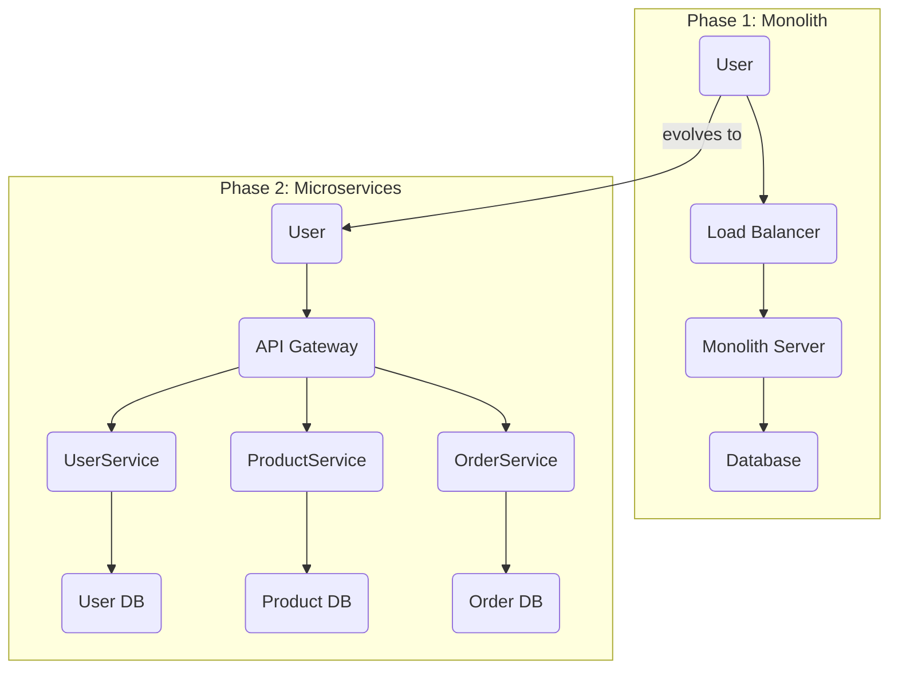
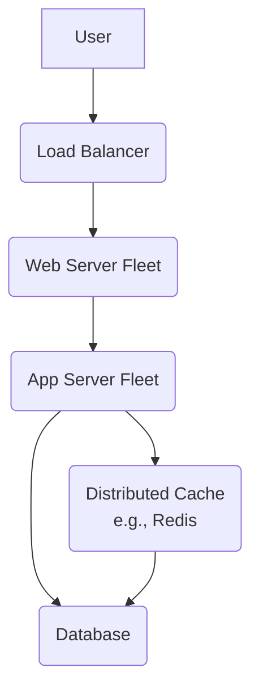
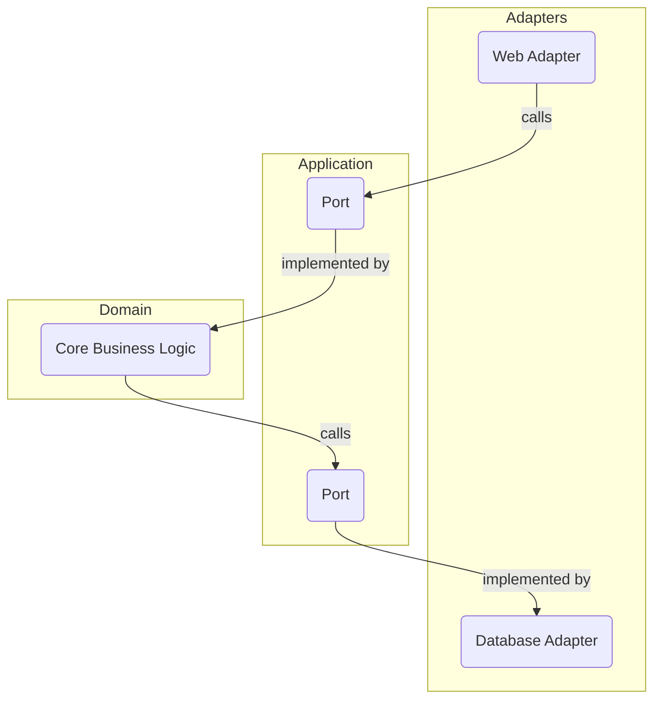
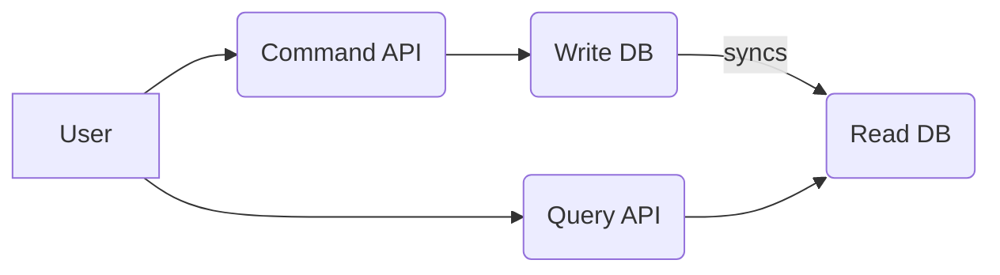
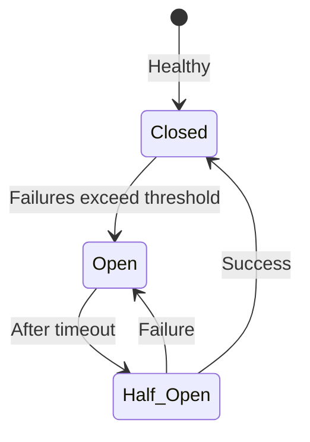

# 12 - System Design with Java: Building Large-Scale Systems

We designed Java to build robust, large-scale systems. This chapter explores *why* Java is an excellent choice for system design and provides a framework for thinking about architectural problems, particularly in the context of a technical interview.

**What's in this chapter:**
*   [Why Java for System Design?](#1-why-java-for-system-design)
*   [Architectural Evolution: Monolith to Microservices](#2-architectural-evolution-monolith-to-microservices)
*   [A Framework for System Design Interviews](#3-a-framework-for-system-design-interviews)
*   [Mental Models for System Design](#mental-models-for-system-design)
*   [Key Architectural Patterns](#4-key-architectural-patterns)
*   [Check Your Understanding](#check-your-understanding)
*   [Your Mission: Design a URL Shortener](#your-mission-design-a-url-shortener)

---

## 1. Why Java for System Design?
*   **The JVM:** A high-performance, observable, and portable runtime. Advanced GCs and JIT compilers provide a solid foundation.
*   **Strong Typing:** Catches entire classes of errors at compile-time, leading to more reliable systems.
*   **Concurrency:** Mature and powerful concurrency features are essential for scalable applications.
*   **The Ecosystem:** The vast ecosystem of open-source libraries and frameworks (Spring, Hibernate, etc.) is arguably Java's greatest strength.

---

## 2. Architectural Evolution: Monolith to Microservices

A common path for a successful system is to evolve from a simple monolith to a more complex but scalable microservice architecture.

Java is well-suited for both styles. The Spring Framework, for example, can be used to build both large monoliths and distributed microservices.

---

## 3. A Framework for System Design Interviews

System design interviews test your ability to handle ambiguity and make reasoned trade-offs. Following a structured approach is key.

#### Step 1: Clarify Requirements (Functional & Non-Functional)
This is the most important step.
*   **Functional:** What must the system do? (e.g., "Design a URL shortener.")
*   **Non-Functional:** What are the constraints? Ask about **scale**.
    *   How many users? How many requests per second (RPS)?
    *   Read vs. Write ratio? (e.g., 100:1 read-to-write)
    *   Latency requirements? (e.g., p99 < 200ms)
    *   Availability requirements? (e.g., 99.99%)

#### Step 2: High-Level Design (The Whiteboard Sketch)
Draw the main components. Start simple and add complexity as needed.

#### Step 3: Deep Dive into a Component
The interviewer will guide you. Be prepared to discuss:
*   **Database Choice:** SQL vs. NoSQL? Why? (e.g., "I'll use PostgreSQL because we need ACID transactions, but I'll use read replicas to scale reads.")
*   **Data Schema:** How would you design the tables/documents?
*   **API Design:** What would the REST or gRPC endpoints look like?
*   **Scaling Strategy:** How will you handle more load? (e.g., "We can shard the database by `user_id` to distribute the write load.")

#### Step 4: Articulate Trade-offs
Always explain the "why" behind your decisions and acknowledge the downsides.
*   "I'm adding a cache to reduce latency, but the trade-off is that we now have to handle potential data inconsistency and cache invalidation."
*   "I'm choosing microservices for scalability and team autonomy, but the trade-off is a massive increase in operational complexity."

---

### Check Your Understanding

**Question 1:** You are asked to design a system for a brand new startup with a team of 5 engineers. The product idea is new and likely to change frequently. Which architecture would you likely choose to start with: a Monolith or Microservices? Why?

  
Answer

  A **Monolith** is almost always the right answer for a new project with a small team. It is much simpler to develop, deploy, and test. This allows the team to move quickly and iterate on the product idea without the high operational overhead of a microservices architecture.

**Question 2:** You are designing a social media site. You expect a massive number of users reading posts, but a much smaller number of users writing posts (a 1000:1 read-to-write ratio). Which architectural pattern might be useful for optimizing this system?

  
Answer

  **CQRS (Command Query Responsibility Segregation)** would be an excellent pattern to consider. You could have a simple, fast "write" path for posting content and a highly optimized, heavily cached "read" path for displaying content to users.

---

### Your Mission: Design a URL Shortener

This is a classic system design interview question. Your mission is to apply the 4-step framework to this problem. You don't need to write code; the goal is to think through the problem and articulate your design.

**The Task:** Design a service like TinyURL that takes a long URL and returns a short, unique alias.

**Your Mission:**

1.  **Step 1: Clarify Requirements.**
    *   What are the functional requirements? (e.g., shorten a URL, redirect an alias to the original URL).
    *   What are the non-functional requirements? Think about scale. How many new URLs per month? How many redirects per second? Should the links be customizable? How long should they last? Write down your assumptions.

2.  **Step 2: High-Level Design.**
    *   Draw a simple diagram with the main components. What are the key APIs? (e.g., `POST /api/v1/shorten` and `GET /{alias}`). What database will you use?

3.  **Step 3: Deep Dive.**
    *   How will you generate the short alias? (e.g., a hash of the long URL, a random string, a counter). What are the pros and cons of each approach?
    *   How would you design the database schema? What would be the main table(s) and columns?

4.  **Step 4: Articulate Trade-offs.**
    *   What is the biggest bottleneck in your system? (Hint: for a URL shortener, it's usually the write path for generating a unique alias).
    *   How could you scale the database if the number of reads becomes massive?

Example Thought Process

*   **Requirements:** Functional: Shorten URL, redirect. Non-functional: High availability for reads, low latency on redirect, alias should be short (e.g., 7 characters). Assume 100 million new URLs/month, 100:1 read/write ratio.
*   **High-Level:** User -> API Gateway -> Shortening Service (for writes) / Redirect Service (for reads) -> Database. Maybe a cache in front of the DB for the Redirect Service.
*   **Deep Dive:** Generating the alias is key. A simple counter converted to base62 (`[a-zA-Z0-9]`) is a good start. This guarantees no collisions. The database could be a simple SQL table `(alias VARCHAR(7) PRIMARY KEY, long_url TEXT)`.
*   **Trade-offs:** The single counter for generating aliases is a single point of failure and a write bottleneck. We could use multiple counters with offsets to distribute the load. Adding a Redis cache for popular links would reduce database read load but introduces potential inconsistency if a URL is updated.

---

## 4. Key Architectural Patterns

Mentioning these patterns shows you are familiar with established solutions.

#### Hexagonal / Clean Architecture
Protect your core business logic from external details. The core defines "ports" (interfaces), and external tech (web frameworks, databases) are "adapters".

#### CQRS (Command Query Responsibility Segregation)
Separate the "write" model (Commands) from the "read" model (Queries). Useful for systems with very different read/write patterns.

#### Circuit Breaker
A proxy that protects your application from cascading failures when calling a dependency.

Use a library like **Resilience4j**.

---

### Key Takeaways

*   **System Design is a Process:** Don't jump to solutions. Follow a structured approach: Clarify requirements, create a high-level design, deep-dive into components, and articulate trade-offs.
*   **Start Simple:** For new systems, a **Monolith** is often the best starting point. You can always evolve to **Microservices** later if and when the complexity is justified.
*   **Ask About Scale:** The non-functional requirements, especially requests per second (RPS) and data size, will determine your architecture.
*   **Know Your Patterns:** Be familiar with core architectural patterns like CQRS and Circuit Breaker so you can apply them to solve specific problems.
*   **Trade-offs are Everything:** There is no single "right" answer in system design. The goal is to choose a solution and clearly explain why it's appropriate for the given requirements, while acknowledging its downsides.
