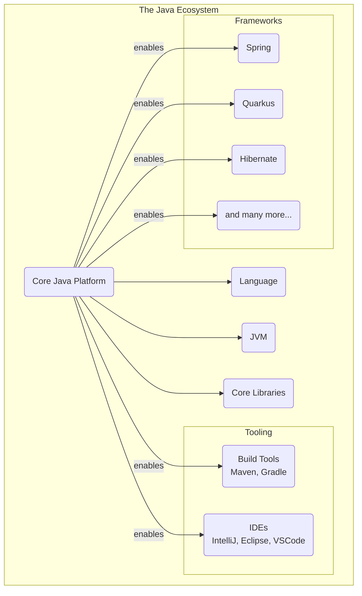
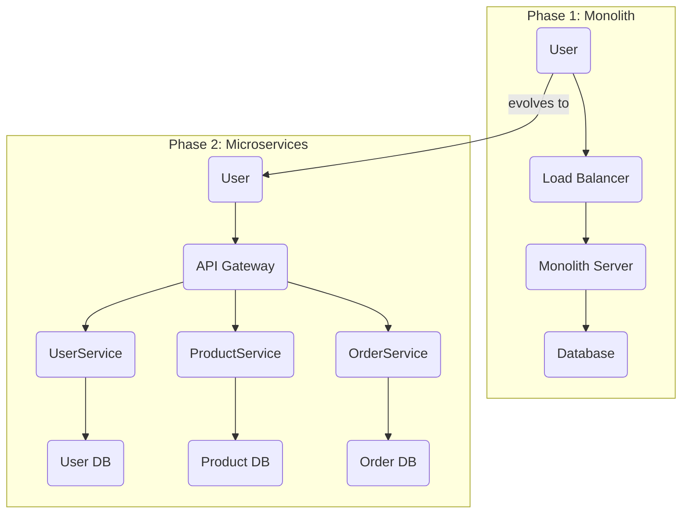
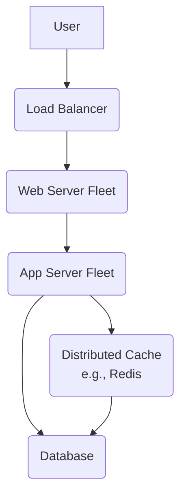
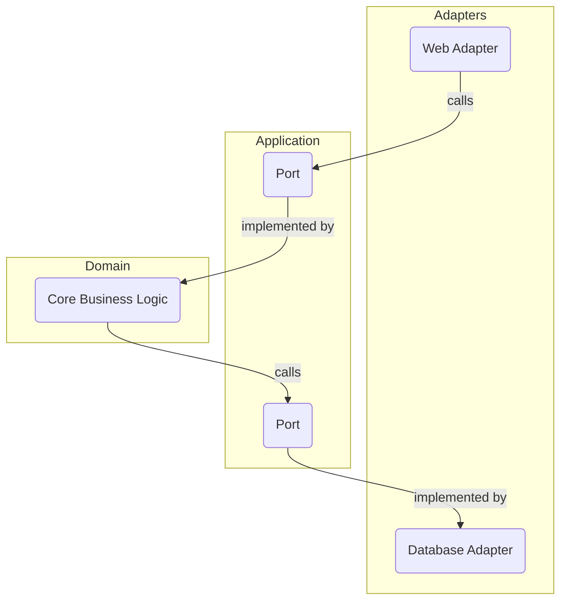
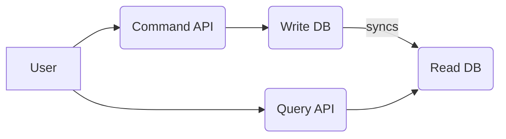
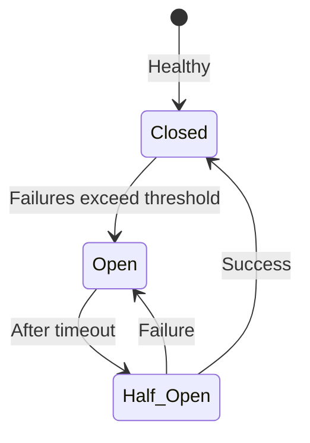

# 12 - System Design with Java: Building Large-Scale Systems

We designed Java to build robust, large-scale systems. This chapter explores *why* Java is an excellent choice for system design and provides a framework for thinking about architectural problems, particularly in the context of a technical interview.

**What's in this chapter:**
*   [Why Java for System Design?](#1-why-java-for-system-design)
*   [Architectural Evolution: Monolith to Microservices](#2-architectural-evolution-monolith-to-microservices)
*   [A Framework for System Design Interviews](#3-a-framework-for-system-design-interviews)
*   [Key Architectural Patterns](#4-key-architectural-patterns)

---

## 1. Why Java for System Design?
*   **The JVM:** A high-performance, observable, and portable runtime. Advanced GCs and JIT compilers provide a solid foundation.
*   **Strong Typing:** Catches entire classes of errors at compile-time, leading to more reliable systems.
*   **Concurrency:** Mature and powerful concurrency features are essential for scalable applications.
*   **The Ecosystem:** The vast ecosystem of open-source libraries and frameworks (Spring, Hibernate, etc.) is arguably Java's greatest strength.

---

## 2. Architectural Evolution: Monolith to Microservices

A common path for a successful system is to evolve from a simple monolith to a more complex but scalable microservice architecture.

Java is well-suited for both styles. The Spring Framework, for example, can be used to build both large monoliths and distributed microservices.

---

## 3. A Framework for System Design Interviews

System design interviews test your ability to handle ambiguity and make reasoned trade-offs. Following a structured approach is key.

#### Step 1: Clarify Requirements (Functional & Non-Functional)
This is the most important step.
*   **Functional:** What must the system do? (e.g., "Design a URL shortener.")
*   **Non-Functional:** What are the constraints? Ask about **scale**.
    *   How many users? How many requests per second (RPS)?
    *   Read vs. Write ratio? (e.g., 100:1 read-to-write)
    *   Latency requirements? (e.g., p99 < 200ms)
    *   Availability requirements? (e.g., 99.99%)

#### Step 2: High-Level Design (The Whiteboard Sketch)
Draw the main components. Start simple and add complexity as needed.

#### Step 3: Deep Dive into a Component
The interviewer will guide you. Be prepared to discuss:
*   **Database Choice:** SQL vs. NoSQL? Why? (e.g., "I'll use PostgreSQL because we need ACID transactions, but I'll use read replicas to scale reads.")
*   **Data Schema:** How would you design the tables/documents?
*   **API Design:** What would the REST or gRPC endpoints look like?
*   **Scaling Strategy:** How will you handle more load? (e.g., "We can shard the database by `user_id` to distribute the write load.")

#### Step 4: Articulate Trade-offs
Always explain the "why" behind your decisions and acknowledge the downsides.
*   "I'm adding a cache to reduce latency, but the trade-off is that we now have to handle potential data inconsistency and cache invalidation."
*   "I'm choosing microservices for scalability and team autonomy, but the trade-off is a massive increase in operational complexity."

---

## 4. Key Architectural Patterns

Mentioning these patterns shows you are familiar with established solutions.

#### Hexagonal / Clean Architecture
Protect your core business logic from external details. The core defines "ports" (interfaces), and external tech (web frameworks, databases) are "adapters".

#### CQRS (Command Query Responsibility Segregation)
Separate the "write" model (Commands) from the "read" model (Queries). Useful for systems with very different read/write patterns.

#### Circuit Breaker
A proxy that protects your application from cascading failures when calling a dependency.

Use a library like **Resilience4j**.
