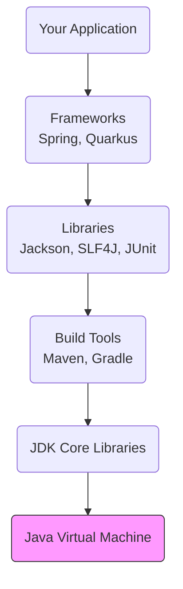
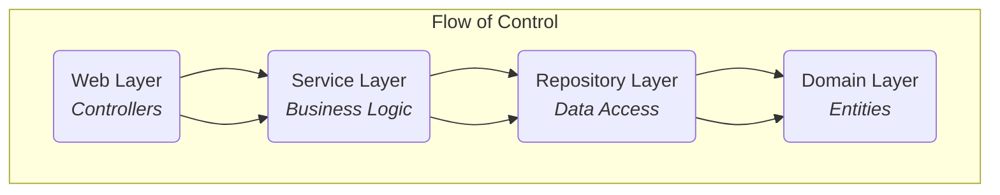
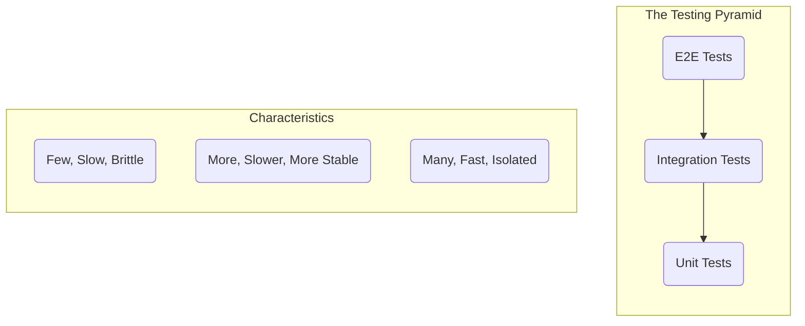

# 13 - The Java Ecosystem: Tools of the Trade

The Java language and the JVM are only the foundation. Java's true power and longevity come from its **ecosystem**: the vast collection of open-source tools, libraries, and frameworks built by the community. A professional Java developer must know how to navigate and leverage this ecosystem.

## The Java Ecosystem at a Glance

Think of the ecosystem as layers built upon the JVM.

**What's in this chapter:**
*   [A Mental Model: The Professional Chef's Kitchen](#a-mental-model-the-professional-chefs-kitchen)
*   [Build & Dependency Management](#1-build--dependency-management)
*   [Frameworks: Your Application's Skeleton](#2-frameworks-your-applications-skeleton)
*   [Key Libraries: Your Toolkit](#3-key-libraries-your-toolkit)
*   [A Principal's Production Playbook for Spring Boot](#a-principals-production-playbook-for-spring-boot)
*   [Check Your Understanding](#check-your-understanding)
*   [Your Mission: Explore a Real Project](#your-mission-explore-a-real-project)



---

### A Mental Model: The Professional Chef's Kitchen

*   **The JVM** is your stove. It's the essential, high-performance heat source.
*   **The Java Core Libraries** are the basic pots, pans, and knives that come with the stove. You can cook a meal with them.
*   **Maven or Gradle** is your detailed recipe book. It lists every single ingredient (dependency) you need and the exact steps to assemble and cook the final dish (build process).
*   **Libraries (Jackson, SLF4J, JUnit)** are specialized, high-quality tools you buy. You could make your own mayonnaise, but Heinz (Jackson) is probably better. You could use any old knife, but a Wüsthof (JUnit) is a professional tool for a specific job.
*   **Frameworks (Spring Boot)** are a full-service meal-kit subscription. It provides the recipe, the pre-portioned ingredients, and the structure for how to make a complex dish. It saves you a massive amount of prep work and lets you focus on the creative parts of cooking.

---

## 1. Build & Dependency Management

These tools automate how you build your code and manage its dependencies.
*   **Maven:** The long-standing standard. Uses XML for configuration (`pom.xml`). It's reliable and well-understood.
*   **Gradle:** A more modern tool. Uses Groovy or Kotlin for build scripts, making it more flexible and often faster than Maven. **Recommended for new projects.**

---

## 2. Frameworks: Your Application's Skeleton

Frameworks provide the structure for your application, saving you from writing tons of boilerplate code.
*   **Spring Framework (and Spring Boot):** The de facto standard for building everything from REST APIs to complex enterprise systems. Spring Boot, in particular, makes it incredibly easy to create stand-alone, production-grade applications.
*   **Quarkus & Micronaut:** Modern, cloud-native frameworks designed for fast startup times and low memory consumption, making them excellent for serverless functions and microservices.

---

## 3. Key Libraries: Your Toolkit

You should rarely have to build common functionality from scratch. There is almost always a high-quality library for it.
*   **Web:** `spring-boot-starter-web` (includes Tomcat and Spring MVC by default).
*   **Data Access:** `spring-boot-starter-data-jpa` (provides Hibernate), or `jOOQ` for type-safe SQL.
*   **Testing:** `JUnit 5` (the standard for tests), `Mockito` (for mocking dependencies), `Testcontainers` (for integration tests with real databases, etc.), `AssertJ` (for fluent, readable assertions).
*   **JSON Handling:** `Jackson` (the default in Spring) or `Gson`.
*   **Logging:** `SLF4J` (a logging abstraction) with `Logback` (a powerful logging implementation).
*   **HTTP Clients:** Java 11's built-in `HttpClient` or `OkHttp`.

---

## A Principal's Production Playbook for Spring Boot

Spring Boot is the dominant platform for building Java applications. Here is an opinionated guide to using it effectively.

#### a. Core Dependencies
A typical REST API should start with these dependencies in your `pom.xml` or `build.gradle`:
*   `spring-boot-starter-web`
*   `spring-boot-starter-actuator` (for production monitoring: health checks, metrics)
*   `spring-boot-starter-data-jpa` (for database access)
*   `spring-boot-starter-test` (includes JUnit, Mockito, AssertJ)

#### b. Application Structure
Separate your code by feature or by layer. A common layered approach is:



*   `com.example.web`: REST Controllers.
*   `com.example.service`: Business logic.
*   `com.example.repository`: Data access interfaces (e.g., Spring Data JPA repositories).
*   `com.example.domain`: Your core entities (e.g., `User`, `Product`).

#### c. Type-Safe Configuration
Externalize configuration in `application.yml` and use `@ConfigurationProperties` for type-safe access.

*   **`application.yml`:**
    ```yaml
    app:
      jwt:
        secret-key: "your-secret"
        expiration-ms: 3600000
    ```
*   **Java Class:**
    ```java
    @ConfigurationProperties(prefix = "app.jwt")
    public record JwtProperties(String secretKey, long expirationMs) {}
    ```

#### d. A Balanced Testing Strategy
A healthy and sustainable testing strategy can be visualized as a pyramid. You should have a large base of fast unit tests, a smaller number of slower integration tests, and very few end-to-end tests.



*   **Unit Tests:** Use `@Test` and `@ExtendWith(MockitoExtension.class)` to test a single class in isolation. Mock all dependencies.
*   **Integration Tests:** Use `@SpringBootTest` to test the interaction between several components (e.g., service and repository). Use **Testcontainers** to spin up a real Docker container for your database.
    ```java
    @SpringBootTest
    @Testcontainers
    class UserRepositoryIntegrationTest {
        @Container
        static PostgreSQLContainer<?> postgres = new PostgreSQLContainer<>("postgres:14-alpine");
    }
    ```
*   **API / End-to-End Tests:** Test the full flow from the web layer to the database.
    ```java
    @SpringBootTest(webEnvironment = SpringBootTest.WebEnvironment.RANDOM_PORT)
    class UserApiEndToEndTest {
        @Autowired
        private TestRestTemplate restTemplate;
    }
    ```

---

### Check Your Understanding

**Question 1:** What is the primary role of a build tool like Maven or Gradle?
<details>
  <summary>Answer</summary>
  Its two primary roles are **dependency management** (downloading the correct versions of libraries your project needs) and **build automation** (compiling your code, running tests, and packaging it into a JAR or WAR file).
</details>

**Question 2:** What is the difference between a library and a framework?
<details>
  <summary>Answer</summary>
  **You call a library, but a framework calls you.** A library (like Jackson) is a tool you use to perform a specific task. A framework (like Spring) provides the overall structure and lifecycle of your application, and you write code that plugs into the framework's lifecycle. This is often called "Inversion of Control".
</details>

---

### Your Mission: Explore a Real Project

This chapter is conceptual, but you can see the ecosystem in action in a real project. The `spring-boot-sample-app` in the root of this repository is a simple but realistic Spring Boot application.

**Your Mission:**

1.  **Find the Build Script:** Open the `pom.xml` file in the `spring-boot-sample-app` directory.
2.  **Identify the Dependencies:** Look inside the `<dependencies>` section. Can you find the dependencies that match the "Core Dependencies" mentioned in the "Production Playbook"?
    *   Find the dependency for **Web**.
    *   Find the dependency for **Data Access**.
    *   Find the dependency for **Testing**.
    *   Find the dependency for **Actuator**.
3.  **Explore the Code:** Look at the directory structure under `src/main/java`. Does it follow the layered architecture described in the playbook?

---

### Key Takeaways

*   **Don't Reinvent the Wheel:** The Java ecosystem is vast. Before writing a complex piece of functionality from scratch, always look for a well-maintained library that already solves the problem.
*   **Use a Build Tool:** Modern Java development is impossible without a build tool like Maven or Gradle. They manage your dependencies and automate your build process.
*   **Spring Boot is the Standard:** For most new applications, Spring Boot provides a world-class, production-ready foundation that saves you an enormous amount of time and effort.
*   **Have a Testing Strategy:** A balanced testing pyramid (many fast unit tests, fewer slower integration tests, and very few E2E tests) is a proven strategy for maintaining a high-quality, sustainable codebase.
