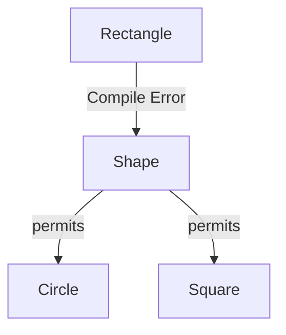

# 14 - Modern Java in Action: A Tour of Recent Features

Java is constantly evolving. Since Java 9, a new version is released every six months, with a **Long-Term Support (LTS)** version released every two years. This chapter highlights the most impactful features from recent LTS releases that you will use in modern, professional Java development.

**What's in this chapter:**
*   [Mental Models for Modern Features](#mental-models-for-modern-features)
*   [Java 11 (LTS): Convenience and a New HTTP Client](#1-java-11-lts)
*   [Java 17 (LTS): Data Modeling and Pattern Matching](#2-java-17-lts)
*   [Java 21 (LTS): The Concurrency Revolution](#3-java-21-lts)
*   [Check Your Understanding](#check-your-understanding)
*   [Your Mission: Refactor to Modern Java](#your-mission-refactor-to-modern-java)
*   [Key Takeaways](#key-takeaways)

---

### Mental Models for Modern Features

*   **`var` is a Smart Shopping List:** Instead of writing "a carton of 12 grade-A large eggs," you just write "eggs." You and the cashier (the compiler) both know exactly what you mean from the context of what you're buying. `var` lets the compiler infer the type, saving you from writing it out explicitly.

*   **A `record` is an ID Card:** An ID card is a simple, immutable carrier for data: your name, date of birth, ID number. You don't have to write a separate "getter" method for your name; it's just your name. A `record` is a formal, concise, and immutable way to declare a class that is just a plain data carrier.

*   **`sealed` Classes are a VIP Guest List:** The host of a party (the `sealed` class) has a strict list of who is allowed in (`permits Circle, Square`). The bouncer (the compiler) will not let anyone else in (`Rectangle` is rejected). It gives you explicit, compile-time control over who can extend or implement your types.

---

## 1. Java 11 (LTS)

#### `var` for Local Variable Type Inference
The `var` keyword lets you declare a local variable without explicitly writing its type. The compiler *infers* the type from the right-hand side of the expression. This reduces boilerplate and improves readability.

*   **Before:** `Map<String, List<User>> userMap = new HashMap<>();`
*   **After:** `var userMap = new HashMap<String, List<User>>();`

#### New `String` and `Files` Methods
A number of quality-of-life methods were added.
*   `" ".isBlank()`: Checks if a string is empty or contains only white space.
*   `" line1 \n line2 ".lines()`: Returns a stream of lines.
*   `Files.writeString(path, content)` and `Files.readString(path)`: Simplified file I/O.

#### Standard `HttpClient`
Java 11 introduced a new, modern, and fluent API for making HTTP requests, replacing the old `HttpURLConnection`. It supports HTTP/2 and asynchronous operations.

---

## 2. Java 17 (LTS)

#### `records`: Immutable Data Carriers
Records provide a concise syntax for creating immutable data classes. The compiler automatically generates the constructor, getters, `equals()`, `hashCode()`, and `toString()`.

*   **Before:** A 50-line class with fields, a constructor, getters, etc.
*   **After:** `public record User(String id, String name) {}`

#### `sealed` Classes and Interfaces
Sealed classes give you fine-grained control over which other classes can extend or implement them. This is powerful when you want to model a closed set of possibilities (e.g., in a domain model).

```java
// Only Circle and Square are allowed to implement Shape.
public sealed interface Shape permits Circle, Square { ... }
```



#### Pattern Matching for `instanceof`
Reduces boilerplate by combining a type check and a cast.

*   **Before:**
    ```java
    if (obj instanceof String) {
        String s = (String) obj;
        // ... use s
    }
    ```
*   **After:**
    ```java
    if (obj instanceof String s) {
        // ... use s directly
    }
    ```

#### Switch Expressions
Modernized `switch` to be a concise, safe expression that returns a value.

*   **Before:**
    ```java
    switch(day) {
        case MONDAY: result = 1; break;
        // ...
    }
    ```
*   **After:**
    ```java
    int result = switch(day) {
        case MONDAY -> 1;
        // ...
    };
    ```

---

## 3. Java 21 (LTS)

#### Virtual Threads (Project Loom)
This is a game-changing feature that dramatically simplifies writing high-throughput concurrent applications. Virtual threads are extremely lightweight threads managed by the JVM, allowing you to have millions of them.

*   **Before:** Use a complex, asynchronous, callback-based style to handle many concurrent I/O operations.
*   **After:** Write simple, synchronous, "thread-per-request" style code, and let virtual threads handle the scalability.

```mermaid
graph TD
    subgraph "Traditional Model: Platform Threads"
        direction LR
        R1(Request 1) --> PT1(Platform Thread 1)
        PT1 -- "Blocks on I/O" --> Idle1(Thread is Idle)
        R2(Request 2) --> PT2(Platform Thread 2)
        PT2 -- "Blocks on I/O" --> Idle2(Thread is Idle)
        R3(Request 3) --> Blocked(No available thread)
    end

    subgraph "Modern Model: Virtual Threads"
        direction LR
        subgraph "JVM"
            VT1(VT 1)
            VT2(VT 2)
            VT3(VT 3)
            VT1 & VT2 & VT3 --> Carrier(Carrier Thread)
        end
        Carrier --> OS(OS Thread)

        Req1(Request 1) --> VT1
        Req2(Request 2) --> VT2
        Req3(Request 3) --> VT3

        note for Carrier "JVM maps many Virtual Threads onto a few OS threads."
    end
```

#### Sequenced Collections
New interfaces (`SequencedCollection`, `SequencedSet`, `SequencedMap`) were added to provide a unified API for accessing the first and last elements of a collection and for reversing the collection's order.

---

### Check Your Understanding

**Question 1:** You have a class that is a simple data carrier for an `(x, y)` coordinate. It needs a constructor, getters for `x` and `y`, `equals()`, `hashCode()`, and `toString()`. Which modern Java feature is the perfect fit for this?
<details>
  <summary>Answer</summary>
  A **`record`**. You can declare `public record Point(int x, int y) {}` and the compiler will generate all of that boilerplate code for you.
</details>

**Question 2:** You have a variable `obj` that could be a `String` or an `Integer`. You want to print its value if it's a `String`. Which new feature makes the code for this check less verbose?
<details>
  <summary>Answer</summary>
  **Pattern Matching for `instanceof`**. You can write `if (obj instanceof String s)` and then use the variable `s` directly inside the `if` block without needing a separate cast.
</details>

---

### Your Mission: Refactor to Modern Java

The best way to appreciate the new features is to see how they simplify old code. The code in the `code/` directory has been intentionally written in an older style. Your mission is to refactor it.

**Your Mission:**

1.  **Find the Code:** Open `code/src/main/java/com/example/ModernJavaDemo.java`.
2.  **Part 1: Refactor to a `record`**
    *   Find the `User` class. It's a classic, verbose Plain Old Java Object (POJO).
    *   Your challenge is to delete the entire class and replace it with a single line of code using a `record`.
3.  **Part 2: Refactor to a `switch` expression**
    *   Find the `getArea` method. It uses a chain of `if-else` statements with `instanceof` and manual casting.
    *   Your challenge is to refactor this method to use a modern `switch` expression with pattern matching, which is much more concise and safe.
4.  **Run and Verify:** Run the `main` method (`mvn compile exec:java`). If your refactoring is correct, the program should run exactly as it did before, but your code will be much cleaner.

<details>
<summary>Stuck? Here's the solution</summary>

**Part 1 Solution:**
```java
// Replace the entire User class with this line:
public record User(String id, String name) {}
```

**Part 2 Solution:**
```java
public static double getArea(Shape shape) {
    return switch (shape) {
        case Circle c -> Math.PI * c.radius() * c.radius();
        case Square s -> s.side() * s.side();
    };
}
```
</details>

---

### Key Takeaways

*   **Java is Always Improving:** The six-month release cadence means that new, useful features are constantly being added to the language and platform.
*   **Embrace Modern Syntax:** Features like `var`, `records`, `switch` expressions, and pattern matching are not just syntactic sugar; they reduce boilerplate, improve readability, and eliminate entire classes of bugs. Use them.
*   **`records` are for Immutable Data:** Use a `record` any time you need a simple, immutable data carrier class.
*   **Virtual Threads are a Big Deal:** For server-side applications, Virtual Threads (Project Loom) are one of the most significant improvements to the Java platform in years, enabling massive scalability with simple, traditional code.
