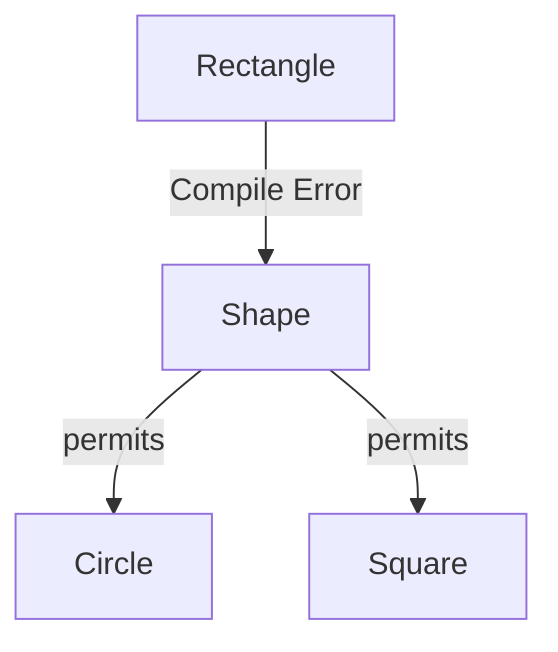
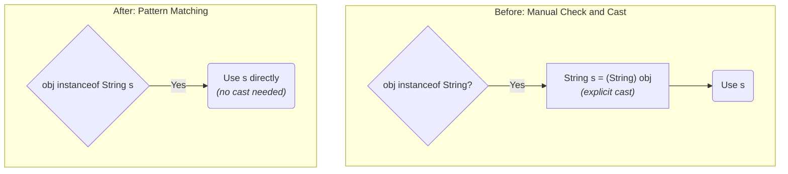

# 14 - Modern Java in Action: A Tour of Recent Features

Java is constantly evolving. Since Java 9, a new version is released every six months, with a **Long-Term Support (LTS)** version released every two years. This chapter highlights the most impactful features from recent LTS releases that you will use in modern, professional Java development.

**What's in this chapter:**
*   [Java 11 (LTS): Convenience and a New HTTP Client](#1-java-11-lts)
*   [Java 17 (LTS): Data Modeling and Pattern Matching](#2-java-17-lts)
*   [Java 21 (LTS): The Concurrency Revolution](#3-java-21-lts)
*   [Hands-On Lab: A Modern Features Showcase](#4-hands-on-lab-a-modern-features-showcase)

---

## 1. Java 11 (LTS)

#### `var` for Local Variable Type Inference
The `var` keyword lets you declare a local variable without explicitly writing its type. The compiler *infers* the type from the right-hand side of the expression. This reduces boilerplate and improves readability.

*   **Before:** `Map<String, List<User>> userMap = new HashMap<>();`
*   **After:** `var userMap = new HashMap<String, List<User>>();`

#### New `String` and `Files` Methods
A number of quality-of-life methods were added.
*   `" ".isBlank()`: Checks if a string is empty or contains only white space.
*   `" line1 \n line2 ".lines()`: Returns a stream of lines.
*   `Files.writeString(path, content)` and `Files.readString(path)`: Simplified file I/O.

#### Standard `HttpClient`
Java 11 introduced a new, modern, and fluent API for making HTTP requests, replacing the old `HttpURLConnection`. It supports HTTP/2 and asynchronous operations.

---

## 2. Java 17 (LTS)

#### `records`: Immutable Data Carriers
Records provide a concise syntax for creating immutable data classes. The compiler automatically generates the constructor, getters, `equals()`, `hashCode()`, and `toString()`.

*   **Before:** A 50-line class with fields, a constructor, getters, etc.
*   **After:** `public record User(String id, String name) {}`

#### `sealed` Classes and Interfaces
Sealed classes give you fine-grained control over which other classes can extend or implement them. This is powerful when you want to model a closed set of possibilities (e.g., in a domain model).

```java
// Only Circle and Square are allowed to implement Shape.
public sealed interface Shape permits Circle, Square { ... }
```



#### Pattern Matching for `instanceof`
Reduces boilerplate by combining a type check and a cast.



*   **Before:**
    ```java
    if (obj instanceof String) {
        String s = (String) obj;
        // ... use s
    }
    ```
*   **After:**
    ```java
    if (obj instanceof String s) {
        // ... use s directly
    }
    ```

#### Switch Expressions
Modernized `switch` to be a concise, safe expression that returns a value.

*   **Before:**
    ```java
    switch(day) {
        case MONDAY: result = 1; break;
        // ...
    }
    ```
*   **After:**
    ```java
    int result = switch(day) {
        case MONDAY -> 1;
        // ...
    };
    ```

---

## 3. Java 21 (LTS)

#### Virtual Threads (Project Loom)
This is a game-changing feature that dramatically simplifies writing high-throughput concurrent applications. Virtual threads are extremely lightweight threads managed by the JVM, allowing you to have millions of them.

*   **Before:** Use a complex, asynchronous, callback-based style to handle many concurrent I/O operations.
*   **After:** Write simple, synchronous, "thread-per-request" style code, and let virtual threads handle the scalability.

```mermaid
graph TD
    subgraph "Traditional Model: Platform Threads"
        direction LR
        R1(Request 1) --> PT1(Platform Thread 1)
        PT1 -- "Blocks on I/O" --> Idle1(Thread is Idle)
        R2(Request 2) --> PT2(Platform Thread 2)
        PT2 -- "Blocks on I/O" --> Idle2(Thread is Idle)
        R3(Request 3) --> Blocked(No available thread)
    end

    subgraph "Modern Model: Virtual Threads"
        direction LR
        subgraph "JVM"
            VT1(VT 1)
            VT2(VT 2)
            VT3(VT 3)
            VT1 & VT2 & VT3 --> Carrier(Carrier Thread)
        end
        Carrier --> OS(OS Thread)

        Req1(Request 1) --> VT1
        Req2(Request 2) --> VT2
        Req3(Request 3) --> VT3

        note for Carrier "JVM maps many Virtual Threads onto a few OS threads."
    end
```

#### Sequenced Collections
New interfaces (`SequencedCollection`, `SequencedSet`, `SequencedMap`) were added to provide a unified API for accessing the first and last elements of a collection and for reversing the collection's order.

---

## 4. Hands-On Lab: A Modern Features Showcase

We've created a runnable project in the `code/` directory that demonstrates some of these key features in action, including:
1.  Using `var` for local variables.
2.  Defining and using a `record`.
3.  Using a `switch` expression with pattern matching.

**To run it:**
1.  Navigate to the `code/` directory.
2.  Run `mvn compile exec:java`.
3.  Explore the source code to see how these features make Java code more concise and readable.
