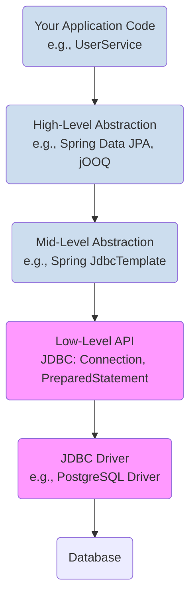

# 15 - Modern Database Connectivity in Java

Interacting with a database is a core requirement for most applications. Java Database Connectivity (JDBC) is the standard API that defines how Java applications talk to databases. While the low-level JDBC API is the foundation, modern applications use powerful abstractions built on top of it.

**What's in this chapter:**
*   [The Layers of Data Access](#1-the-layers-of-data-access)
*   [Modern JDBC Essentials](#2-modern-jdbc-essentials)
*   [High-Level Abstractions: Spring `JdbcTemplate` and JPA](#3-high-level-abstractions-spring-jdbctemplate-and-jpa)
*   [Hands-On Lab: A Self-Contained Database Test](#4-hands-on-lab-a-self-contained-database-test)

---

## 1. The Layers of Data Access

In a modern application, you rarely work with the lowest levels directly. Think of data access as a stack of abstractions.


The goal of the upper layers is to reduce boilerplate, improve safety, and let you focus on your business logic.

---

## 2. Modern JDBC Essentials

While you may not use raw JDBC daily, you must understand its core concepts.

#### `DataSource` and Connection Pooling
Modern applications **do not** use `DriverManager.getConnection()` directly. Creating database connections is expensive. Instead, we use a **Connection Pool**.
*   A **Connection Pool** (like HikariCP, the default in Spring Boot) maintains a cache of open database connections.
*   Your application gets connections from the pool and returns them when done.
*   You configure a `DataSource` object in your application, which points to the connection pool.

#### `PreparedStatement` > `Statement`
Always use `PreparedStatement` to protect against **SQL Injection** attacks. It separates the SQL command from the user-provided data.

*   **Don't do this (Vulnerable!):**
    ```java
    String sql = "SELECT * FROM users WHERE name = '" + userName + "'";
    Statement statement = connection.createStatement();
    ResultSet rs = statement.executeQuery(sql);
    ```
    *If a user enters ` ' OR '1'='1 ` as their name, the query becomes `SELECT * FROM users WHERE name = '' OR '1'='1'`, returning all users!*

*   **Do this (Safe):**
    ```java
    String sql = "SELECT * FROM users WHERE name = ?";
    PreparedStatement ps = connection.prepareStatement(sql);
    ps.setString(1, userName); // The user input is treated as data, not a command.
    ResultSet rs = ps.executeQuery();
    ```

#### `try-with-resources` is Mandatory
Database resources (`Connection`, `PreparedStatement`, `ResultSet`) *must* be closed. The `try-with-resources` statement guarantees they are closed, even if exceptions occur.

---

## 3. High-Level Abstractions: Spring `JdbcTemplate` and JPA

#### Spring `JdbcTemplate`
`JdbcTemplate` is a utility class from the Spring Framework that eliminates nearly all the boilerplate of raw JDBC (opening/closing connections, exception handling, iterating result sets).

*   **Raw JDBC:** ~15 lines of `try-catch-finally` to run a query.
*   **With `JdbcTemplate`:**
    ```java
    String sql = "SELECT name FROM users WHERE id = ?";
    String name = jdbcTemplate.queryForObject(sql, new Object[]{id}, String.class);
    ```

#### JPA / Hibernate
**JPA (Jakarta Persistence API)** is a standard specification for **Object-Relational Mapping (ORM)**. ORM is a technique that maps Java objects to database tables. **Hibernate** is the most popular implementation of JPA.

This is the highest level of abstraction and the most common approach in enterprise Java. You work with Java objects, and the framework generates the SQL for you.

```java
// You define a repository interface
public interface UserRepository extends JpaRepository<User, Long> {
    Optional<User> findByName(String name);
}

// Spring Data JPA provides the implementation automatically!
User user = userRepository.findByName("Alice").orElse(null);
```

---

## 4. Hands-On Lab: A Self-Contained Database Test
Testing database logic is hard. You shouldn't rely on a real, external database for your automated tests. The modern solution is **Testcontainers**.

We've created a runnable project in the `code/` directory that:
1.  Uses **Testcontainers** to start a real PostgreSQL database in a Docker container just for the test.
2.  Runs a simple query using raw JDBC to show the process.
3.  Runs the same query using Spring's `JdbcTemplate` to show the improvement.

**To run it:**
1.  You must have Docker installed and running on your machine.
2.  Navigate to the `code/` directory.
3.  Run `mvn test`.
4.  Explore the source code to see modern database testing in action.
