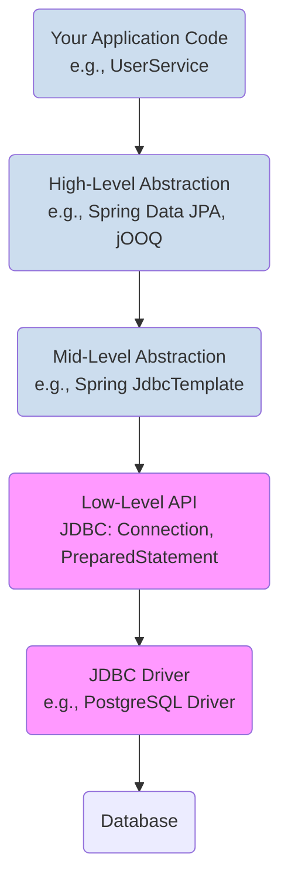

# 15 - Modern Database Connectivity in Java

Interacting with a database is a core requirement for most applications. Java Database Connectivity (JDBC) is the standard API that defines how Java applications talk to databases. While the low-level JDBC API is the foundation, modern applications use powerful abstractions built on top of it.

**What's in this chapter:**
*   [Mental Models for Data Access](#mental-models-for-data-access)
*   [The Layers of Data Access](#1-the-layers-of-data-access)
*   [Modern JDBC Essentials](#2-modern-jdbc-essentials)
*   [High-Level Abstractions: Spring `JdbcTemplate` and JPA](#3-high-level-abstractions-spring-jdbctemplate-and-jpa)
*   [Check Your Understanding](#check-your-understanding)
*   [Your Mission: Simplify with `JdbcTemplate`](#4-your-mission-simplify-with-jdbctemplate)
*   [Key Takeaways](#key-takeaways)
*   [Interview Deep Dives](#interview-deep-dives)

---

### Mental Models for Data Access

*   **A Connection Pool is a Fleet of Rental Cars:** Creating a new database connection is slow and expensive, just like building a new car for every customer. A connection pool is like a rental car agency at the airport. It keeps a fleet of ready-to-go cars (connections). Your application "borrows" a car when it needs one and "returns" it when it's done, so someone else can use it. This is much more efficient.

*   **An ORM (like JPA/Hibernate) is a Diplomatic Translator:** You, the Java developer, speak Java. The database speaks SQL. An ORM is a professional translator who handles the communication between you. You speak to the translator in your language ("Please get me the `User` object with ID 5"), and the translator converts it to the other language ("`SELECT * FROM users WHERE id = 5`") and gives you back the results in a format you understand (a `User` object). It saves you from having to be fluent in SQL for every single interaction.

---

## 1. The Layers of Data Access

In a modern application, you rarely work with the lowest levels directly. Think of data access as a stack of abstractions.


The goal of the upper layers is to reduce boilerplate, improve safety, and let you focus on your business logic.

---

## 2. Modern JDBC Essentials

While you may not use raw JDBC daily, you must understand its core concepts.

#### `DataSource` and Connection Pooling
Modern applications **do not** use `DriverManager.getConnection()` directly. Creating database connections is expensive. Instead, we use a **Connection Pool**.
*   A **Connection Pool** (like HikariCP, the default in Spring Boot) maintains a cache of open database connections.
*   Your application gets connections from the pool and returns them when done.
*   You configure a `DataSource` object in your application, which points to the connection pool.

#### `PreparedStatement` > `Statement`
Always use `PreparedStatement` to protect against **SQL Injection** attacks. It separates the SQL command from the user-provided data.

*   **Don't do this (Vulnerable!):**
    ```java
    String sql = "SELECT * FROM users WHERE name = '" + userName + "'";
    Statement statement = connection.createStatement();
    ResultSet rs = statement.executeQuery(sql);
    ```
    *If a user enters ` ' OR '1'='1 ` as their name, the query becomes `SELECT * FROM users WHERE name = '' OR '1'='1'`, returning all users!*

```mermaid
graph TD
    subgraph "Vulnerable Statement"
        direction LR
        A["`SELECT...WHERE name = '` + "] --> B["`' OR '1'='1`"];
        B --> C["`'`"];
        C -- forms --> D("`SELECT...WHERE name = '' OR '1'='1'`<br><b>Malicious query!</b>");
    end

    subgraph "Safe PreparedStatement"
        direction LR
        E("`SELECT...WHERE name = ?`") -- binds parameter --> F("`' OR '1'='1`");
        F -- result --> G("The database looks for a user<br>with the literal name `' OR '1'='1'`<br><b>No injection!</b>");
    end
```

*   **Do this (Safe):**
    ```java
    String sql = "SELECT * FROM users WHERE name = ?";
    PreparedStatement ps = connection.prepareStatement(sql);
    ps.setString(1, userName); // The user input is treated as data, not a command.
    ResultSet rs = ps.executeQuery();
    ```

#### `try-with-resources` is Mandatory
Database resources (`Connection`, `PreparedStatement`, `ResultSet`) *must* be closed. The `try-with-resources` statement guarantees they are closed, even if exceptions occur.

---

## 3. High-Level Abstractions: Spring `JdbcTemplate` and JPA

#### Spring `JdbcTemplate`
`JdbcTemplate` is a utility class from the Spring Framework that eliminates nearly all the boilerplate of raw JDBC (opening/closing connections, exception handling, iterating result sets).

*   **Raw JDBC:** ~15 lines of `try-catch-finally` to run a query.
*   **With `JdbcTemplate`:**
    ```java
    String sql = "SELECT name FROM users WHERE id = ?";
    String name = jdbcTemplate.queryForObject(sql, new Object[]{id}, String.class);
    ```

#### JPA / Hibernate
**JPA (Jakarta Persistence API)** is a standard specification for **Object-Relational Mapping (ORM)**. ORM is a technique that maps Java objects to database tables. **Hibernate** is the most popular implementation of JPA.

This is the highest level of abstraction and the most common approach in enterprise Java. You work with Java objects, and the framework generates the SQL for you.

```java
// You define a repository interface
public interface UserRepository extends JpaRepository<User, Long> {
    Optional<User> findByName(String name);
}

// Spring Data JPA provides the implementation automatically!
User user = userRepository.findByName("Alice").orElse(null);
```

---

### Check Your Understanding

**Question 1:** You are building a simple utility that needs to run a few complex, hand-optimized SQL queries. You don't need to map the results to complex objects. Which data access layer would be the best fit: raw JDBC, `JdbcTemplate`, or a full ORM like JPA/Hibernate?
<details>
  <summary>Answer</summary>
  **`JdbcTemplate`** is the perfect choice here. It removes all the boilerplate and risk of raw JDBC (like forgetting to close a connection) but still gives you full control over the exact SQL you want to run. A full ORM would be overkill.
</details>

**Question 2:** Why should you always use `PreparedStatement` instead of concatenating user input into a `Statement`?
<details>
  <summary>Answer</summary>
  To prevent **SQL Injection** attacks. `PreparedStatement` treats user input strictly as data, while string concatenation allows a malicious user to inject SQL commands into your query, potentially leading to data theft or destruction.
</details>

---

### Your Mission: Simplify with `JdbcTemplate`

The code in the `code/` directory contains a test class that fetches data from a database in two ways: once with raw, verbose JDBC, and once with Spring's `JdbcTemplate`. Your mission is to complete the `JdbcTemplate` example to see how much simpler it is.

**Your Mission:**

1.  **Find the Code:** Open `code/src/test/java/com/example/JdbcDemoTest.java`.
2.  **Locate the Mission:** Find the `jdbcTemplateExample` test method and the `// Your Mission:` comment inside it.
3.  **Accept the Challenge:** The code to query the database using `JdbcTemplate` has been removed. You need to write a single line of code to perform the query and get the user's name.
4.  **Run and Verify:** Run the tests from your IDE or by navigating to the `code/` directory and running `mvn test`. If your implementation is correct, the test should pass.

<details>
<summary>Stuck? Here's the solution</summary>

```java
// Replace 'String userName = null;' with this line:
String userName = jdbcTemplate.queryForObject(sql, String.class, 1);
```
</details>

---

### Key Takeaways

*   **Work at a High Level of Abstraction:** For most applications, you should use a high-level abstraction like Spring Data JPA. You should only drop down to a lower level like `JdbcTemplate` or raw JDBC when you have a specific need that the higher level can't meet.
*   **Always Use a Connection Pool:** Directly creating database connections is slow and inefficient. A connection pool (like HikariCP, the default in Spring Boot) is essential for any production application.
*   **`PreparedStatement` is Non-Negotiable:** Always use `PreparedStatement` to prevent SQL injection vulnerabilities.
*   **Test with Real Databases:** Use Testcontainers to spin up a real database in a Docker container for your integration tests. This provides a much higher degree of confidence than testing against an in-memory database like H2.

---

## Interview Deep Dives
