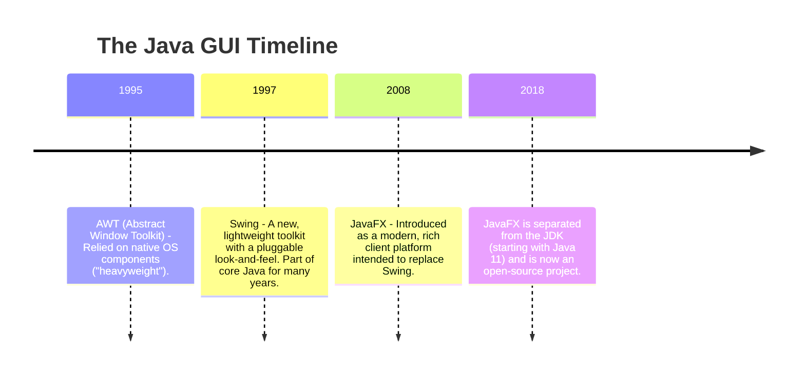
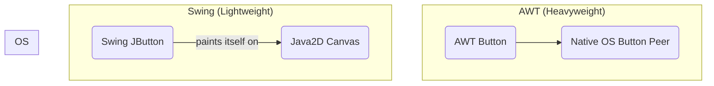

# 16 - GUI Development in Java: A Historical Perspective

Java has a long and rich history of providing tools for building Graphical User Interfaces (GUIs) for desktop applications. The landscape has evolved significantly over the years, from the original platform-dependent AWT to the modern JavaFX framework.

**What's in this chapter:**
*   [The Evolution of Java GUI Frameworks](#1-the-evolution-of-java-gui-frameworks)
*   [A Mental Model: Furnished vs. Unfurnished Apartments](#a-mental-model-furnished-vs-unfurnished-apartments)
*   [AWT: The Original (and Heavyweight) Toolkit](#2-awt-the-original-and-heavyweight-toolkit)
*   [Swing: The Pluggable Look-and-Feel](#3-swing-the-pluggable-look-and-feel)
*   [JavaFX: The Modern Successor](#4-javafx-the-modern-successor)
*   [The Modern Landscape: A Note on Web and Cross-Platform UIs](#5-the-modern-landscape)
*   [Check Your Understanding](#check-your-understanding)
*   [Your Mission: Choose the Right UI Strategy](#your-mission-choose-the-right-ui-strategy)
*   [Key Takeaways](#key-takeaways)

---

## 1. The Evolution of Java GUI Frameworks

The journey of Java's GUI toolkits reflects the changing philosophies of software development.

---

### A Mental Model: Furnished vs. Unfurnished Apartments

*   **AWT (Heavyweight) is a Furnished Apartment:** When you rent a furnished apartment in a new city, you use the furniture the landlord (the Operating System) provides. It feels "native" to that city, but you can't change the style, and the furniture might be different and weird in the next city you move to. This is AWT—it uses the native OS components, so it looks native but can be inconsistent across platforms.

*   **Swing (Lightweight) is an Unfurnished Apartment:** When you rent an unfurnished apartment, you bring all your own Ikea furniture (the Java components). It looks and feels the same no matter which city (OS) you're in, giving you consistency and more options, but it might not perfectly match the local style. This is Swing—it draws its own components, giving you cross-platform consistency.

---

## 2. AWT: The Original (and Heavyweight) Toolkit
AWT was our first attempt at a cross-platform GUI library.
*   **How it worked:** AWT components were "heavyweight," meaning each component was a wrapper around a native OS component (a peer).
*   **The Trade-off:** This meant AWT applications tended to look and feel like native applications on each platform, but it also led to inconsistencies—the "write once, test everywhere" problem. It was also limited to the lowest common denominator of UI components across all platforms.

---

## 3. Swing: The Pluggable Look-and-Feel
Swing was created to solve the problems of AWT.
*   **How it worked:** Swing components are "lightweight," meaning they are written entirely in Java and paint themselves onto the screen. They don't rely on native OS peers.
*   **The Benefit:** This allowed for a consistent look-and-feel across all platforms. It also provided a much richer set of components.
*   **The Downside:** Swing applications could sometimes feel "sluggish" or "not quite native." Over time, its API became complex and dated compared to modern UI toolkits.

**Key Swing Concept: The Event Dispatch Thread (EDT)**
Swing is **not thread-safe**. All interactions with Swing components (creating them, updating them) must happen on a single thread called the Event Dispatch Thread (EDT). Forgetting this rule is a common source of bugs in Swing applications.

---

## 4. JavaFX: The Modern Successor
JavaFX was designed from the ground up to be a modern replacement for Swing.
*   **Key Features:**
    *   A clean, modern API.
    *   Support for **FXML**, an XML-based markup language for defining user interfaces. This separates the UI layout from the application logic.
    *   **CSS** for styling components.
    *   Built-in support for properties, data binding, animation, and multimedia.
*   **Current Status:** While JavaFX is no longer bundled with the JDK, it is actively developed as an open-source project (OpenJFX) and is the recommended official toolkit for new Java desktop applications.

---

## 5. The Modern Landscape: A Note on Web and Cross-Platform UIs
While JavaFX is powerful, it's important to understand the broader context of modern application development. For many new projects, a desktop application is not the default choice.
*   **Web Applications:** The most common approach today is to build a web front-end (using frameworks like React, Angular, or Vue) that communicates with a Java back-end via a REST API.
*   **Cross-Platform Mobile/Desktop:** For applications that need to run on desktop and mobile, developers often look to cross-platform toolkits like **Flutter** or **React Native**.

**Conclusion:** While you may encounter Swing or JavaFX in existing applications, a modern Java developer is more likely to be building the back-end for a web or mobile front-end.

---

### Check Your Understanding

**Question 1:** What is the key difference between a "heavyweight" component (like in AWT) and a "lightweight" component (like in Swing)?

  
Answer

  A **heavyweight** component relies on a native Operating System "peer" to draw it. A **lightweight** component is drawn entirely in Java code, without a native peer.

**Question 2:** You are working on a Swing application and need to update the text of a `JLabel` after a long background task completes. Which thread must you perform this update on?

  
Answer

  The **Event Dispatch Thread (EDT)**. All UI updates in Swing must happen on the EDT to avoid concurrency issues. You would typically use `SwingUtilities.invokeLater()` to schedule the update on the correct thread.

---

### Your Mission: Choose the Right UI Strategy

This is a thought exercise. There is no code to write.

**The Scenario:** A small accounting firm asks you to build a new application for them to manage their clients. The application needs to run on the Windows and macOS desktops in their office. They have about 10 employees.

**Your Mission:**

1.  **Option 1: The Desktop-Only Approach.** If you had to build a traditional desktop application, which modern Java GUI framework mentioned in this chapter would you choose? Why?
2.  **Option 2: The Modern Web-Based Approach.** What alternative architecture would you propose to the client that might be more flexible and future-proof than a desktop-only application? What would be the pros and cons of your proposed architecture?

Example Thought Process

1.  **Desktop-Only:** I would choose **JavaFX**. It is the modern, officially recommended toolkit for Java desktop apps. It has a cleaner API, better support for modern features like CSS and data binding, and is more actively developed than Swing.

2.  **Alternative Architecture:** I would propose building a **web application**. The back-end would be a standard Java/Spring Boot REST API, and the front-end would be a simple web UI built with a modern framework like React or Vue.
    *   **Pros:** This is much more flexible. The employees could access it from any computer in the office (or at home, with a VPN) without installing any software. It's easier to update. It's easier to hire web developers. It could potentially be exposed to clients in the future.
    *   **Cons:** It requires a server to host the back-end application. It involves two technology stacks (Java and JavaScript), which can be more complex to develop and deploy initially.

---

### Key Takeaways

*   **Java's GUI Story is One of Evolution:** The frameworks have evolved from the platform-dependent AWT to the pure-Java Swing, and finally to the modern JavaFX.
*   **JavaFX is the Modern Choice for Desktop:** If you are building a new, pure-Java desktop application today, JavaFX is the recommended framework.
*   **Swing is Not Thread-Safe:** All Swing UI work must be done on the Event Dispatch Thread (EDT).
*   **The World is Mostly Web:** For most business applications today, a web-based architecture (Java back-end, web front-end) is the default choice over a traditional desktop application due to its flexibility and accessibility.
