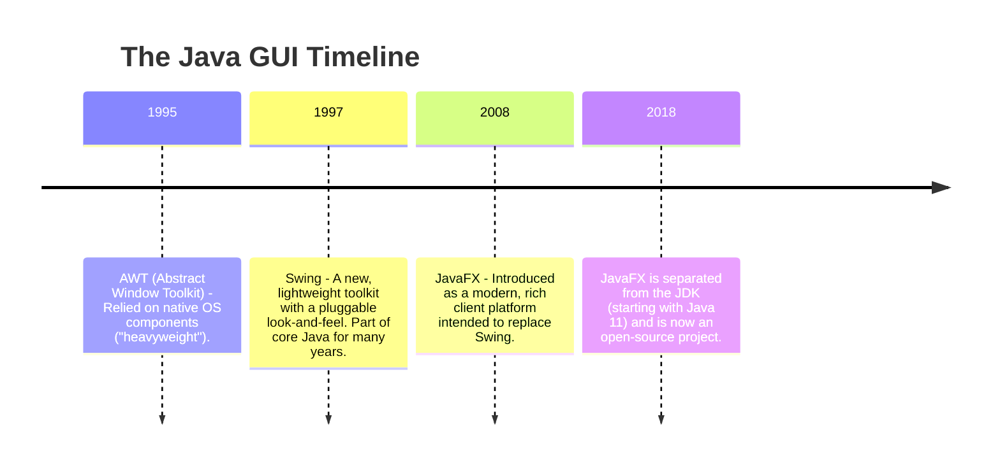
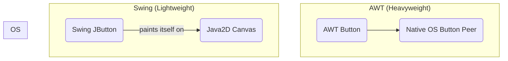

# 16 - GUI Development in Java: A Historical Perspective

Java has a long and rich history of providing tools for building Graphical User Interfaces (GUIs) for desktop applications. The landscape has evolved significantly over the years, from the original platform-dependent AWT to the modern JavaFX framework.

**What's in this chapter:**
*   [The Evolution of Java GUI Frameworks](#1-the-evolution-of-java-gui-frameworks)
*   [AWT: The Original (and Heavyweight) Toolkit](#2-awt-the-original-and-heavyweight-toolkit)
*   [Swing: The Pluggable Look-and-Feel](#3-swing-the-pluggable-look-and-feel)
*   [JavaFX: The Modern Successor](#4-javafx-the-modern-successor)
*   [The Modern Landscape: A Note on Web and Cross-Platform UIs](#5-the-modern-landscape)

---

## 1. The Evolution of Java GUI Frameworks

The journey of Java's GUI toolkits reflects the changing philosophies of software development.

---

## 2. AWT: The Original (and Heavyweight) Toolkit
AWT was our first attempt at a cross-platform GUI library.
*   **How it worked:** AWT components were "heavyweight," meaning each component was a wrapper around a native OS component (a peer).
*   **The Trade-off:** This meant AWT applications tended to look and feel like native applications on each platform, but it also led to inconsistencies—the "write once, test everywhere" problem. It was also limited to the lowest common denominator of UI components across all platforms.

---

## 3. Swing: The Pluggable Look-and-Feel
Swing was created to solve the problems of AWT.
*   **How it worked:** Swing components are "lightweight," meaning they are written entirely in Java and paint themselves onto the screen. They don't rely on native OS peers.
*   **The Benefit:** This allowed for a consistent look-and-feel across all platforms. It also provided a much richer set of components.
*   **The Downside:** Swing applications could sometimes feel "sluggish" or "not quite native." Over time, its API became complex and dated compared to modern UI toolkits.

**Key Swing Concept: The Event Dispatch Thread (EDT)**
Swing is **not thread-safe**. All interactions with Swing components (creating them, updating them) must happen on a single thread called the Event Dispatch Thread (EDT). Forgetting this rule is a common source of bugs in Swing applications.

---

## 4. JavaFX: The Modern Successor
JavaFX was designed from the ground up to be a modern replacement for Swing.
*   **Key Features:**
    *   A clean, modern API.
    *   Support for **FXML**, an XML-based markup language for defining user interfaces. This separates the UI layout from the application logic.
    *   **CSS** for styling components.
    *   Built-in support for properties, data binding, animation, and multimedia.
*   **Current Status:** While JavaFX is no longer bundled with the JDK, it is actively developed as an open-source project (OpenJFX) and is the recommended official toolkit for new Java desktop applications.

---

## 5. The Modern Landscape: A Note on Web and Cross-Platform UIs
While JavaFX is powerful, it's important to understand the broader context of modern application development. For many new projects, a desktop application is not the default choice.
*   **Web Applications:** The most common approach today is to build a web front-end (using frameworks like React, Angular, or Vue) that communicates with a Java back-end via a REST API.
*   **Cross-Platform Mobile/Desktop:** For applications that need to run on desktop and mobile, developers often look to cross-platform toolkits like **Flutter** or **React Native**.

**Conclusion:** While you may encounter Swing or JavaFX in existing applications, a modern Java developer is more likely to be building the back-end for a web or mobile front-end.
