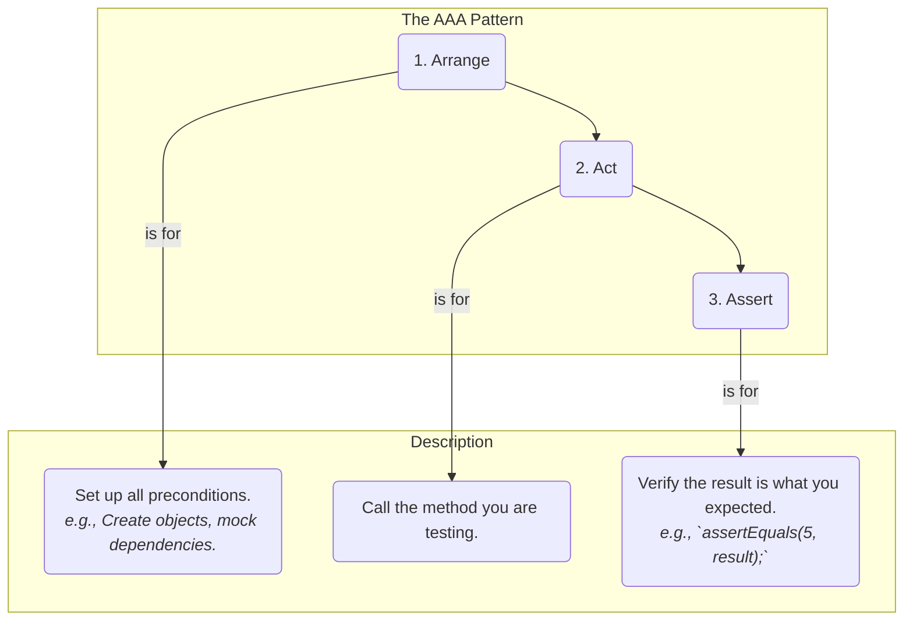
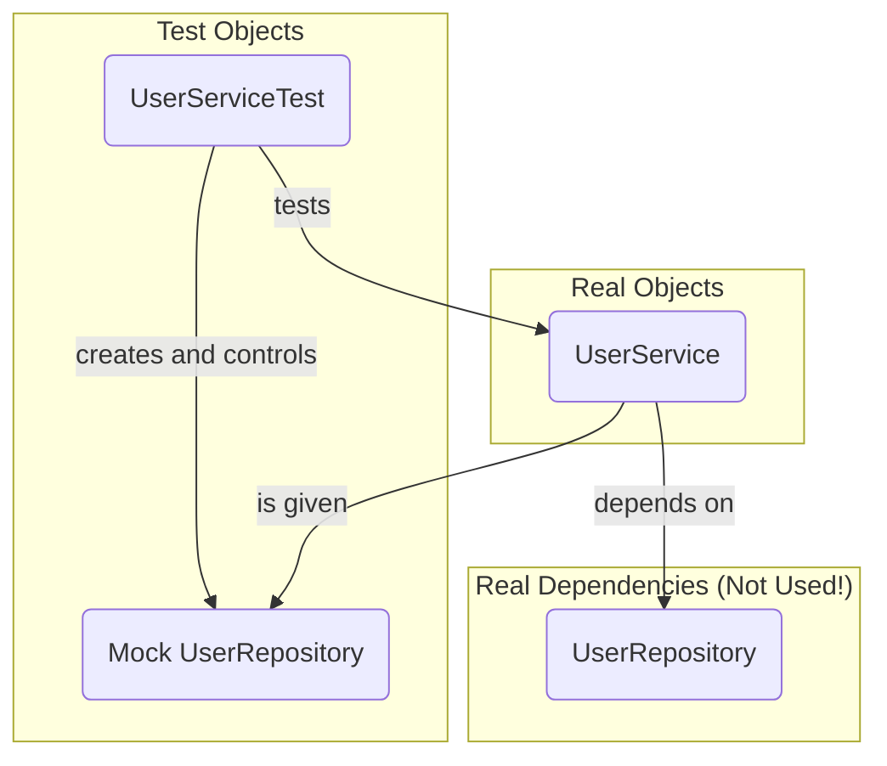

# 17 - Unit Testing: Building a Safety Net for Your Code

Writing code is only half the battle. How do you ensure it works correctly today, and more importantly, that it *keeps* working correctly after you or someone else makes changes a year from now? The answer is **unit testing**.

Unit testing is the practice of testing individual units of code (a method or a class) in isolation to verify they behave as expected. It is a cornerstone of modern, professional software development.

**What's in this chapter:**
*   [Why Unit Test? The Pillars of Quality](#1-why-unit-test-the-pillars-of-quality)
*   [The AAA Pattern: Structuring Your Tests](#2-the-aaa-pattern-structuring-your-tests)
*   [JUnit 5: The Standard Java Testing Framework](#3-junit-5-the-standard-java-testing-framework)
*   [Mocking: Isolating Your Unit Under Test](#4-mocking-isolating-your-unit-under-test)
*   [Hands-On Lab: Testing a User Service](#5-hands-on-lab-testing-a-user-service)

---

## 1. Why Unit Test? The Pillars of Quality
*   **Find Bugs Early:** Catch issues during development, when they are cheapest and easiest to fix.
*   **Act as a Safety Net:** Refactor your code with confidence. If you break something, a well-written test will fail, alerting you immediately.
*   **Serve as Documentation:** Tests are a form of executable documentation. They show exactly how a piece of code is intended to be used.
*   **Improve Design:** The act of writing a test often forces you to write more modular, decoupled, and easier-to-maintain code.

---

## 2. The AAA Pattern: Structuring Your Tests

A clean test should be easy to read and understand. The **Arrange-Act-Assert (AAA)** pattern is a standard way to structure your test methods to achieve this clarity.



*   **Arrange:** Set up the test. This is where you create objects, prepare inputs, and set up any mocks or dependencies.
*   **Act:** Execute the method you are actually testing.
*   **Assert:** Verify the outcome. Check if the method produced the expected result.

```java
@Test
void testAdd() {
    // Arrange: Create the object to test
    Calculator calculator = new Calculator();

    // Act: Call the method under test
    int result = calculator.add(2, 3);

    // Assert: Check the result
    assertEquals(5, result);
}
```

---

## 3. JUnit 5: The Standard Java Testing Framework

JUnit is the de-facto standard for testing in Java. JUnit 5 is the latest generation, with a modular architecture and rich features.

**Common Annotations:**
*   `@Test`: Marks a method as a test.
*   `@DisplayName("A custom test name")`: Provides a more readable name for your test that will appear in reports.
*   `@BeforeEach`: A method with this annotation will run *before* each `@Test` method in the class. Used for common setup code.
*   `@AfterEach`: Runs *after* each test. Used for cleanup.
*   `@Disabled`: Temporarily disables a test method.

**Common Assertions:**
*   `assertEquals(expected, actual)`
*   `assertTrue(condition)` / `assertFalse(condition)`
*   `assertNotNull(object)`
*   `assertThrows(ExpectedException.class, () -> { ... })`: Asserts that a specific exception is thrown by a piece of code.

---

## 4. Mocking: Isolating Your Unit Under Test

A unit test should test a single unit *in isolation*. But what if your `UserService` depends on a `UserRepository` that talks to a real database? You don't want your unit test to depend on a database being available.

This is where **mocking** comes in. A mock is a "fake" object that you control. You can tell the mock exactly what to do when its methods are called. **Mockito** is the most popular mocking framework for Java.



By using a mock, your `UserServiceTest` can verify the behavior of `UserService` without ever touching the real `UserRepository` or the database.

---

## 5. Hands-On Lab: Testing a User Service

We've created a runnable Maven project in the `code/` directory that is correctly configured for JUnit 5 and Mockito. It demonstrates:
1.  A `UserService` class that has a dependency on a `UserRepository` interface.
2.  A unit test for the `UserService`.
3.  How to use Mockito to create a mock `UserRepository`.
4.  How to use the AAA pattern and JUnit 5 assertions to write clean, effective tests.

**To run it:**
1.  Navigate to the `code/` directory.
2.  Run the tests using Maven: `mvn test`.
3.  Explore the source code in `src/main/java` and the tests in `src/test/java`.
