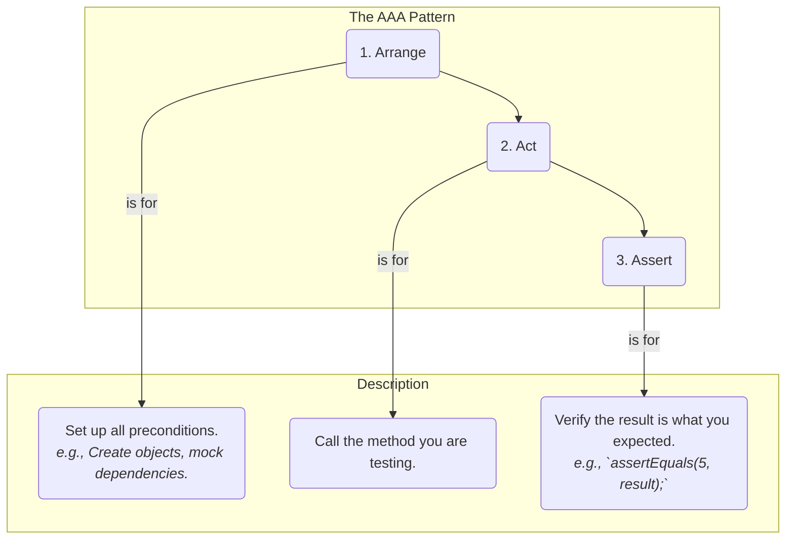
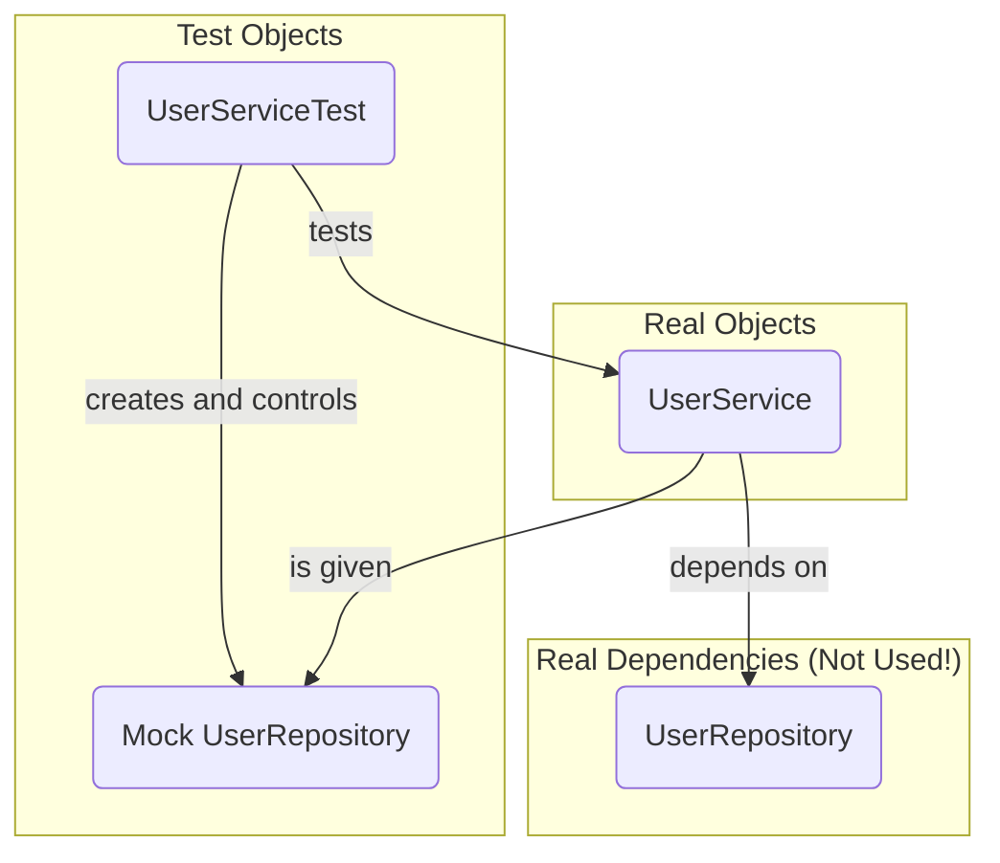

# 17 - Unit Testing: Building a Safety Net for Your Code

Writing code is only half the battle. How do you ensure it works correctly today, and more importantly, that it *keeps* working correctly after you or someone else makes changes a year from now? The answer is **unit testing**.

Unit testing is the practice of testing individual units of code (a method or a class) in isolation to verify they behave as expected. It is a cornerstone of modern, professional software development.

**What's in this chapter:**
*   [Why Unit Test? The Pillars of Quality](#1-why-unit-test-the-pillars-of-quality)
*   [Mental Models for Unit Testing](#mental-models-for-unit-testing)
*   [The AAA Pattern: Structuring Your Tests](#2-the-aaa-pattern-structuring-your-tests)
*   [JUnit 5: The Standard Java Testing Framework](#3-junit-5-the-standard-java-testing-framework)
*   [Mocking: Isolating Your Unit Under Test](#4-mocking-isolating-your-unit-under-test)
*   [Check Your Understanding](#check-your-understanding)
*   [Your Mission: Test the New Feature](#your-mission-test-the-new-feature)
*   [Key Takeaways](#key-takeaways)

---

## 1. Why Unit Test? The Pillars of Quality
*   **Find Bugs Early:** Catch issues during development, when they are cheapest and easiest to fix.
*   **Act as a Safety Net:** Refactor your code with confidence. If you break something, a well-written test will fail, alerting you immediately.
*   **Serve as Documentation:** Tests are a form of executable documentation. They show exactly how a piece of code is intended to be used.
*   **Improve Design:** The act of writing a test often forces you to write more modular, decoupled, and easier-to-maintain code.

---

### Mental Models for Unit Testing

*   **A Unit Test is a Science Experiment:** Think back to high school chemistry. To test a hypothesis, you create a controlled, isolated environment. You don't want the temperature of the room or the air pressure to affect your experiment. A unit test is the same: it tests one specific piece of code (a method) in a controlled, isolated way, so you can be sure about what caused the result.

*   **Mocking is Using a Stunt Double:** You are directing a movie and need to film a scene where your star actor (`UserService`) has a fight with the villain (`UserRepository`). You don't want your expensive star actor to actually get punched and sent to the hospital (your test fails because the database is down). So, you hire a **stunt double** (a **mock** object). You can tell the stunt double, "When you get punched, I need you to stumble backwards and fall over." This allows you to test your actor's performance perfectly without relying on the dangerous, unpredictable villain.

---

## 2. The AAA Pattern: Structuring Your Tests

A clean test should be easy to read and understand. The **Arrange-Act-Assert (AAA)** pattern is a standard way to structure your test methods to achieve this clarity.



*   **Arrange:** Set up the test. This is where you create objects, prepare inputs, and set up any mocks or dependencies.
*   **Act:** Execute the method you are actually testing.
*   **Assert:** Verify the outcome. Check if the method produced the expected result.

```java
@Test
void testAdd() {
    // Arrange: Create the object to test
    Calculator calculator = new Calculator();

    // Act: Call the method under test
    int result = calculator.add(2, 3);

    // Assert: Check the result
    assertEquals(5, result);
}
```

---

## 3. JUnit 5: The Standard Java Testing Framework

JUnit is the de-facto standard for testing in Java. JUnit 5 is the latest generation, with a modular architecture and rich features.

**Common Annotations:**
*   `@Test`: Marks a method as a test.
*   `@DisplayName("A custom test name")`: Provides a more readable name for your test that will appear in reports.
*   `@BeforeEach`: A method with this annotation will run *before* each `@Test` method in the class. Used for common setup code.
*   `@AfterEach`: Runs *after* each test. Used for cleanup.
*   `@Disabled`: Temporarily disables a test method.

**Common Assertions:**
*   `assertEquals(expected, actual)`
*   `assertTrue(condition)` / `assertFalse(condition)`
*   `assertNotNull(object)`
*   `assertThrows(ExpectedException.class, () -> { ... })`: Asserts that a specific exception is thrown by a piece of code.

---

## 4. Mocking: Isolating Your Unit Under Test

A unit test should test a single unit *in isolation*. But what if your `UserService` depends on a `UserRepository` that talks to a real database? You don't want your unit test to depend on a database being available.

This is where **mocking** comes in. A mock is a "fake" object that you control. You can tell the mock exactly what to do when its methods are called. **Mockito** is the most popular mocking framework for Java.



By using a mock, your `UserServiceTest` can verify the behavior of `UserService` without ever touching the real `UserRepository` or the database.

---

### Check Your Understanding

**Question 1:** What are the three steps of the AAA pattern for structuring tests?
<details>
  <summary>Answer</summary>
  **Arrange** (set up the test), **Act** (execute the code under test), and **Assert** (verify the outcome).
</details>

**Question 2:** When testing a `UserService` that depends on a `UserRepository`, why is it better to mock the `UserRepository` rather than use the real one that connects to a database?
<details>
  <summary>Answer</summary>
  There are several reasons:
  *   **Isolation:** To ensure you are only testing the `UserService`'s logic, not the repository's logic or the database connection.
  *   **Speed:** Mocking is instant, while a database call is slow. This keeps your test suite fast.
  *   **Reliability:** The test won't fail if the database is down or the network is slow. It removes external dependencies.
</details>

---

### Your Mission: Test the New Feature

The `UserService` class has a new, untested method: `updateUserName`. Your mission is to write the unit tests for this method to ensure it is working correctly and to protect it from future regressions.

**Your Mission:**

1.  **Find the Code:** Open `code/src/main/java/com/example/UserService.java` and review the new `updateUserName` method to understand its logic.
2.  **Find the Test Class:** Open `code/src/test/java/com/example/UserServiceTest.java`.
3.  **Locate the Mission:** Scroll to the bottom of the test class to find the `// --- Your Mission ---` comment and two empty test methods.
4.  **Accept the Challenge (Part 1):** Implement the `updateUserName_whenUserExists_shouldUpdateAndReturnUser` test. Follow the AAA pattern and the instructions in the comments to test the "happy path".
5.  **Accept the Challenge (Part 2):** Implement the `updateUserName_whenUserDoesNotExist_shouldThrowException` test. Follow the instructions to test that the correct exception is thrown when a user is not found.
6.  **Run and Verify:** Run the tests (`mvn test`). If your implementations are correct, all tests in the class should pass.

<details>
<summary>Stuck? Here's the solution</summary>

**Part 1 Solution:**
```java
@Test
@DisplayName("should update user name when user exists")
void updateUserName_whenUserExists_shouldUpdateAndReturnUser() {
    // Arrange
    when(mockUserRepository.findById("1")).thenReturn(Optional.of(sampleUser));

    // Act
    User updatedUser = userService.updateUserName("1", "Johnathan Doe");

    // Assert
    assertEquals("Johnathan Doe", updatedUser.getName());
    verify(mockUserRepository).save(updatedUser); // Verify save was called
}
```

**Part 2 Solution:**
```java
@Test
@DisplayName("should throw exception when updating a non-existent user")
void updateUserName_whenUserDoesNotExist_shouldThrowException() {
    // Arrange
    when(mockUserRepository.findById(anyString())).thenReturn(Optional.empty());

    // Act & Assert
    assertThrows(UserNotFoundException.class, () -> {
        userService.updateUserName("2", "Non Existent");
    });
}
```
</details>

---

### Key Takeaways

*   **Unit Tests are a Safety Net:** Their primary goal is to give you the confidence to make changes to your code without fear of breaking existing functionality.
*   **Follow the AAA Pattern:** **A**rrange, **A**ct, **A**ssert. This simple structure makes your tests clean, readable, and easy to understand.
*   **Test in Isolation with Mocks:** Use a mocking framework like Mockito to create "fake" versions of your dependencies. This ensures your unit test is fast, reliable, and only tests one thing.
*   **Test Both the "Happy Path" and the "Sad Path":** A good test suite verifies not only that your code works when everything is perfect, but also that it behaves correctly (e.g., throws the right exception) when things go wrong.
