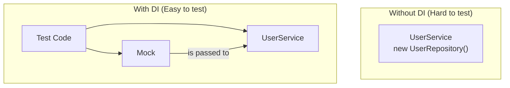

# 18 - Effective Java: Best Practices for High-Quality Code

Writing code that *works* is the first step. Writing code that is clean, readable, maintainable, and robust is the mark of a professional software engineer. This chapter consolidates key best practices, many inspired by Joshua Bloch's definitive book, "Effective Java".

## The Four Pillars of Code Quality

We can think about code quality in four key areas:

1.  **Readability:** Code is read far more often than it is written. It should be as clear as possible to the next person who has to work on it (which might be you in six months).
2.  **Maintainability:** How easy is it to change or extend the code?
3.  **Robustness:** How well does the code handle errors and unexpected inputs?
4.  **Testability:** How easy is it to write reliable tests for the code?

---

### 1. Readability

#### Use Standard Naming Conventions
This is the most basic rule. Follow the standard Java conventions for packages, classes, methods, and constants.

#### Name Variables for Clarity
A variable's name should clearly state its purpose.

*   **Don't do this:** `int d; // elapsed time in days`
*   **Do this:** `int elapsedTimeInDays;`

#### Keep Methods Small and Focused
Each method should do exactly one thing. This makes them easier to understand, test, and reuse. A good rule of thumb is that a method should fit on one screen.

---

### 2. Maintainability

#### Don't Repeat Yourself (DRY)
Avoid duplicate code. If you find yourself copying and pasting code, extract it into a shared, reusable method.

#### Favor Composition over Inheritance
Inheritance is a powerful tool, but it creates a very tight coupling between classes. Composition (having one class contain an instance of another) is often more flexible and leads to more modular designs.

```mermaid
graph TD
    subgraph "Inheritance (Less Flexible)"
        direction LR
        A(InstrumentedSet) -- extends --> B(HashSet)
        note for A "Tightly coupled to HashSet's implementation."
    end
    subgraph "Composition (More Flexible)"
        direction LR
        C(InstrumentedSet) o-- D(Set)
        note for C "Works with any Set implementation (HashSet, TreeSet, etc.)."
    end
```

#### Program to an Interface, Not an Implementation
This is a core tenet of good design. It decouples your code from specific implementations, making it easier to change and test.

*   **Don't do this:** `ArrayList<String> names = new ArrayList<>();`
*   **Do this:** `List<String> names = new ArrayList<>();`

---

### 3. Robustness

#### Use `Optional` to Avoid `NullPointerException`
`NullPointerException` is the most common bug in Java. The `Optional` type, introduced in Java 8, provides an explicit way to handle the case where a value may be absent.

*   **Don't do this (unsafe):**
    ```java
    User user = findUser(id);
    if (user != null) {
        System.out.println(user.getName());
    }
    ```
*   **Do this (safe and clear):**
    ```java
    Optional<User> userOpt = findUser(id);
    userOpt.ifPresent(user -> System.out.println(user.getName()));
    ```

#### Favor Immutability
An immutable object is one whose state cannot be changed after it is created. Immutable objects are simple, safe, and easy to reason about, especially in concurrent environments.

*   Declare fields `final`.
*   Don't provide "setter" methods.
*   Use modern `record` classes (Java 16+) for simple, immutable data carriers.
    *   **Do this:** `public record User(String id, String name) {}`

#### Handle Exceptions Properly
Don't swallow exceptions in an empty `catch` block. Either handle the exception meaningfully or let it propagate up to a layer that can handle it.

---

### 4. Testability

#### Use Dependency Injection
Don't let your classes create their own dependencies (e.g., `new UserRepository()`). Instead, pass dependencies in through the constructor. This is called **Dependency Injection**, and it's essential for writing testable code because it allows you to substitute a real dependency with a mock in your tests.

*   **Don't do this (hard to test):**
    ```java
    public class UserService {
        private UserRepository repository = new UserRepository(); // Hard-coded dependency
    }
    ```
*   **Do this (easy to test):**
    ```java
    public class UserService {
        private final UserRepository repository;
        public UserService(UserRepository repository) { // Dependency is injected
            this.repository = repository;
        }
    }
    ```



---

Finally, remember that these are guidelines, not absolute rules. The goal is always to write code that solves the problem in the clearest, most robust way possible.
