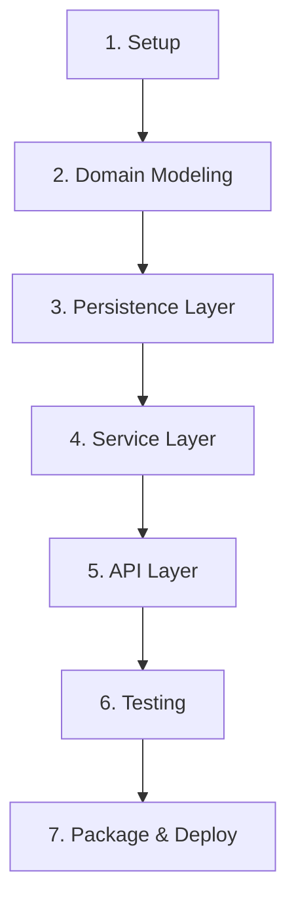

# 19 - Your First Project: A Step-by-Step Playbook

Theory is essential, but the goal is to build working software. This chapter is a playbook that walks you through the steps of creating a complete, real-world Java application from scratch, tying together all the concepts we've learned.

Our project will be a classic system design problem: a **URL Shortener API**.

---

## The Project Lifecycle: From Idea to Deployment

We will follow a standard development lifecycle:



1.  **Setup:** Initialize the project and its dependencies.
2.  **Domain Modeling:** Define the core data structures.
3.  **Persistence:** Define how to store and retrieve the data.
4.  **Business Logic:** Implement the core functionality.
5.  **API Layer:** Expose the functionality to the outside world.
6.  **Testing:** Write an integration test to verify the end-to-end flow.
7.  **Packaging & Deployment:** Package the application for production.

---

### Step 1: Setup with `start.spring.io`
The best way to start a new Spring Boot project is with the **Spring Initializr** (`start.spring.io`).

*   **Project:** Maven
*   **Language:** Java
*   **Spring Boot:** Latest stable version
*   **Packaging:** Jar
*   **Java:** Latest LTS version (e.g., 17 or 21)
*   **Dependencies:**
    *   `Spring Web`: For building REST APIs.
    *   `Spring Data JPA`: For database access.
    *   `H2 Database`: An in-memory database, great for local development.
    *   `Lombok`: Reduces boilerplate code (optional but very common).

---

### Step 2: The Domain Model (`UrlMapping.java`)
This is the core object of our application. We can use a JPA `@Entity` to map it to a database table.

```java
@Entity
public class UrlMapping {
    @Id
    private String id; // The short ID, e.g., "aBcDeF"
    private String originalUrl;
    private LocalDateTime createdAt;
    // Constructors, getters...
}
```

---

### Step 3: The Persistence Layer (`UrlMappingRepository.java`)
Thanks to Spring Data JPA, we don't need to write an implementation. We just define an interface, and Spring provides the implementation at runtime.

```java
public interface UrlMappingRepository extends JpaRepository<UrlMapping, String> {
}
```
This single line gives us `save()`, `findById()`, `delete()`, and more for free.

---

### Step 4: The Service Layer (`UrlShortenerService.java`)
This is where the core business logic lives. It uses the repository to interact with the database.

```java
@Service
public class UrlShortenerService {
    private final UrlMappingRepository repository;

    public UrlShortenerService(UrlMappingRepository repository) { // Dependency Injection!
        this.repository = repository;
    }

    public UrlMapping shortenUrl(String originalUrl) {
        String shortId = generateShortId();
        UrlMapping mapping = new UrlMapping(shortId, originalUrl, LocalDateTime.now());
        return repository.save(mapping);
    }

    public Optional<String> getOriginalUrl(String id) {
        return repository.findById(id)
                         .map(UrlMapping::getOriginalUrl);
    }
}
```

---

### Step 5: The API Layer (`UrlController.java`)
This exposes our service's functionality as a REST API using Spring Web's `@RestController`.

```java
@RestController
public class UrlController {
    private final UrlShortenerService service;

    public UrlController(UrlShortenerService service) { // Dependency Injection!
        this.service = service;
    }

    @PostMapping("/shorten")
    public UrlMapping createShortUrl(@RequestBody CreateShortUrlRequest request) {
        return service.shortenUrl(request.getOriginalUrl());
    }

    @GetMapping("/{id}")
    public ResponseEntity<Void> redirectToOriginalUrl(@PathVariable String id) {
        return service.getOriginalUrl(id)
                .map(url -> ResponseEntity.status(HttpStatus.FOUND)
                                          .location(URI.create(url))
                                          .build())
                .orElse(ResponseEntity.notFound().build());
    }
}
```

---

### Step 6: Testing (`UrlControllerIntegrationTest.java`)
A simple integration test can verify the entire flow. We use `@SpringBootTest` to load the full application context.

```java
@SpringBootTest(webEnvironment = SpringBootTest.WebEnvironment.RANDOM_PORT)
class UrlControllerIntegrationTest {
    @Autowired
    private TestRestTemplate restTemplate;

    @Test
    void shouldCreateAndRedirect() {
        // Act: Call the POST endpoint to create a short URL
        CreateShortUrlRequest request = new CreateShortUrlRequest("https://example.com");
        UrlMapping response = restTemplate.postForObject("/shorten", request, UrlMapping.class);

        assertNotNull(response.getId());

        // Act: Call the GET endpoint with the new short ID
        ResponseEntity<Void> redirectResponse = restTemplate.getForEntity("/" + response.getId(), Void.class);

        // Assert: Check that we get a 302 Found redirect to the correct location
        assertEquals(HttpStatus.FOUND, redirectResponse.getStatusCode());
        assertEquals("https://example.com", redirectResponse.getHeaders().getLocation().toString());
    }
}
```

---

### Step 7 & 8: Packaging and Deployment
1.  **Package:** Run `mvn clean package`. This will create a self-contained, executable "fat JAR" in the `target/` directory.
2.  **Run:** You can run this JAR anywhere Java is installed: `java -jar your-app.jar`.
3.  **Dockerize:** For modern deployments, you'd create a `Dockerfile` to package your app as a container image.
    ```dockerfile
    FROM openjdk:17-slim
    COPY target/*.jar app.jar
    ENTRYPOINT ["java","-jar","/app.jar"]
    ```
This playbook provides a template for building robust, production-ready applications with modern Java.
