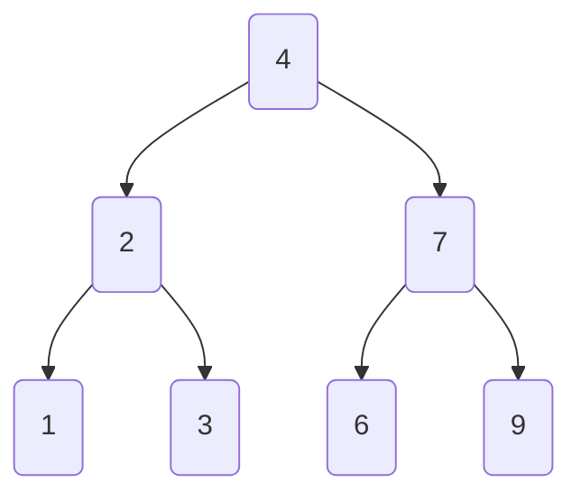

# 20 - Trees: Representing Hierarchical Data

Trees are a fundamental non-linear data structure used to represent hierarchical data. Think of a family tree, an organization chart, or the file system on your computer—these are all tree structures.

**What's in this chapter:**
*   [Tree Terminology](#1-tree-terminology)
*   [Binary Trees and Traversal Algorithms](#2-binary-trees-and-traversal-algorithms)
*   [Binary Search Trees (BST)](#3-binary-search-trees-bst)
*   [Hands-On Lab: Building and Traversing a Tree](#4-hands-on-lab-building-and-traversing-a-tree)
*   [Interview Deep Dives](#interview-deep-dives)

---

## 1. Tree Terminology
To talk about trees, we need a common vocabulary:
*   **Node:** An entity that contains a key or value and pointers to its child nodes.
*   **Edge:** The link between two nodes.
*   **Root:** The topmost node in a tree.
*   **Parent:** A node that has an edge to a child node.
*   **Child:** A node that has an edge from a parent node.
*   **Leaf:** A node that has no children.
*   **Height:** The length of the longest path from the root to a leaf.
*   **Depth:** The length of the path from the root to a given node.

---

## 2. Binary Trees and Traversal Algorithms

A **Binary Tree** is a tree in which each node has at most two children, referred to as the `left` child and the `right` child. This is the most common type of tree you'll encounter.

### Our Example Tree
Let's use this simple binary tree to demonstrate the traversal algorithms.



**Traversal** is the process of visiting every node in the tree exactly once. The order in which you visit them defines the traversal type.

### a. Depth-First Traversals (DFS)
These traversals explore as far as possible down one branch before backing up.

#### Pre-order Traversal (Root, Left, Right)
Visits the current node, then its left subtree, then its right subtree. Useful for creating a copy of a tree.
*   **Path:** 4 → 2 → 1 → 3 → 7 → 6 → 9

#### In-order Traversal (Left, Root, Right)
Visits the left subtree, then the current node, then the right subtree. For a Binary Search Tree, this visits the nodes in sorted order.
*   **Path:** 1 → 2 → 3 → 4 → 6 → 7 → 9

#### Post-order Traversal (Left, Right, Root)
Visits the left subtree, then the right subtree, then the current node. Useful for deleting nodes from a tree.
*   **Path:** 1 → 3 → 2 → 6 → 9 → 7 → 4

### b. Breadth-First Traversal (BFS)

#### Level-order Traversal
This traversal visits the nodes level by level, from left to right. It uses a `Queue` to keep track of the nodes to visit next.
*   **Path:** 4 → 2 → 7 → 1 → 3 → 6 → 9

---

## 3. Binary Search Trees (BST)

A **Binary Search Tree** is a special type of binary tree with a crucial property:
> For any given node, all values in its **left** subtree are **less than** the node's value, and all values in its **right** subtree are **greater than** the node's value.

This property makes searching for an element incredibly efficient, with an average time complexity of **O(log n)**, which is much faster than the O(n) required to search an unsorted list.

---

## 4. Hands-On Lab: Building and Traversing a Tree

We've created a runnable project in the `code/` directory that:
1.  Defines a `TreeNode` class.
2.  Builds the example tree shown in the diagrams.
3.  Implements all four traversal algorithms (both recursively and iteratively).
4.  Prints the results of each traversal so you can see the difference.

**To run it:**
1.  Navigate to the `code/` directory.
2.  Run `mvn compile exec:java`.
3.  Explore the source code to understand how the traversals are implemented.

---

## Interview Deep Dives

### Q: How do you find the height of a binary tree?
*   **Simple Answer:** The height of a tree is `1 + max(height of left subtree, height of right subtree)`. You can solve this with a simple recursive function.
*   **The Code:**
    ```java
    public int maxDepth(TreeNode root) {
        if (root == null) {
            return 0;
        } else {
            int leftDepth = maxDepth(root.left);
            int rightDepth = maxDepth(root.right);
            return Math.max(leftDepth, rightDepth) + 1;
        }
    }
    ```

### Q: How do you check if a binary tree is a valid Binary Search Tree (BST)?
*   **Simple Answer:** You can't just check the immediate children. Each node has to be within a valid range (min and max). You can perform a recursive check, passing down the valid range for each node.
*   **The Logic:**
    *   For the root, the range is (negative infinity, positive infinity).
    *   When you go to the left child, the new valid range is (min, root.val).
    *   When you go to the right child, the new valid range is (root.val, max).
    *   If any node's value is outside its valid range, it's not a BST.

### Q: What is the difference between a balanced and an unbalanced tree?
*   **Simple Answer:** A balanced tree has a height of O(log n). An unbalanced tree can be as bad as O(n), effectively becoming a linked list.
*   **Detailed Explanation:** Operations on a BST (like search, insert, delete) are fast because you can discard half the tree at each step. This only works if the tree is **balanced**, meaning the left and right subtrees have roughly the same height. If you insert sorted elements into a BST, it becomes a completely unbalanced tree (a linked list), and performance degrades to O(n).
*   **Self-Balancing Trees:** Special types of BSTs, like **AVL trees** and **Red-Black trees**, automatically perform rotations during insertion and deletion to keep the tree balanced. Java's `TreeMap` and `TreeSet` are implemented using Red-Black trees.
