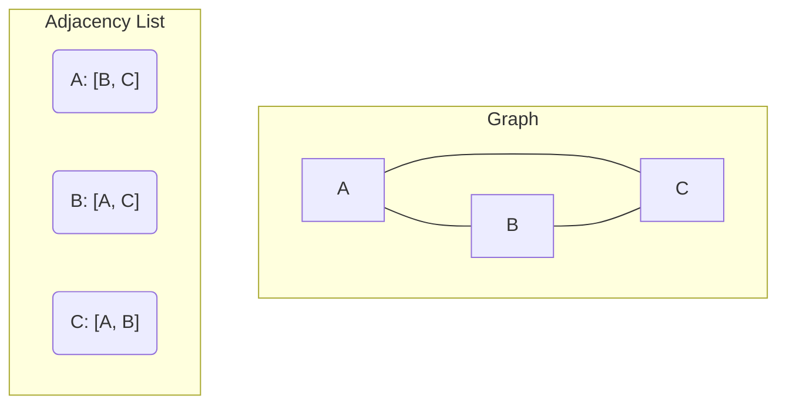

# 21 - Graphs: Modeling a Connected World

If trees represent hierarchies, graphs represent networks. A graph is a data structure used to model relationships between objects. Social networks, road maps, the internet itself—these are all graphs. They are arguably the most versatile and powerful data structure in computer science.

**What's in this chapter:**
*   [Graph Terminology](#1-graph-terminology)
*   [How to Represent a Graph](#2-how-to-represent-a-graph)
*   [Graph Traversal: BFS and DFS](#3-graph-traversal-bfs-and-dfs)
*   [Advanced Topic: Topological Sort](#4-advanced-topic-topological-sort)
*   [Hands-On Lab: Building and Traversing a Graph](#5-hands-on-lab-building-and-traversing-a-graph)
*   [Interview Deep Dives](#interview-deep-dives)

---

## 1. Graph Terminology
*   **Vertex (or Node):** A point or object in the graph.
*   **Edge:** A connection between two vertices.
*   **Undirected Graph:** Edges have no direction (e.g., a Facebook friendship).
*   **Directed Graph (Digraph):** Edges have a direction (e.g., a Twitter follow).
*   **Weighted Graph:** Each edge has a cost or weight associated with it (e.g., a map with distances between cities).

---

## 2. How to Represent a Graph

There are two common ways to represent a graph in code. Choosing the right one depends on the graph's density (how many edges it has).

#### a. Adjacency Matrix
A 2D array where `matrix[i][j] = 1` (or the edge weight) if there is an edge from vertex `i` to `j`.
*   **Pros:** Fast to check if an edge exists between two nodes (`O(1)`).
*   **Cons:** Uses a lot of memory (`V²`, where V is the number of vertices), even for graphs with few edges.

#### b. Adjacency List
An array (or map) of lists, where `adj.get(i)` contains a list of all vertices connected to vertex `i`.
*   **Pros:** Space-efficient for sparse graphs (graphs with few edges). The space complexity is `O(V + E)`, where E is the number of edges.
*   **Cons:** Slower to check if a specific edge exists (`O(k)`, where k is the number of neighbors).
*   **Conclusion:** The Adjacency List is the most common and generally preferred representation.



---

## 3. Graph Traversal: BFS and DFS

Traversal means visiting every vertex in a graph. The two fundamental algorithms for this are Breadth-First Search (BFS) and Depth-First Search (DFS).

```mermaid
graph TD
    subgraph "Graph"
        A --> B
        A --> C
        B --> D
        B --> E
        C --> F
    end

    subgraph "BFS (Queue-based)"
        direction LR
        T1_A(A) --> T1_B(B) --> T1_C(C) --> T1_D(D) --> T1_E(E) --> T1_F(F)
        note for T1_F "Visits level-by-level"
    end

    subgraph "DFS (Stack-based)"
        direction LR
        T2_A(A) --> T2_B(B) --> T2_D(D) --> T2_E(E) --> T2_C(C) --> T2_F(F)
        note for T2_F "Goes deep, then backtracks"
    end
```

### a. Breadth-First Search (BFS)
BFS explores the graph layer by layer. It starts at a source vertex, explores all of its immediate neighbors, and then for each of those neighbors, explores their unexplored neighbors, and so on.

*   **Implementation:** Uses a `Queue`.
*   **Use Case:** Perfect for finding the **shortest path** between two nodes in an unweighted graph.

### b. Depth-First Search (DFS)
DFS explores as far as possible along each branch before backtracking. It starts at a source vertex, explores one of its neighbors, then that neighbor's neighbor, and so on, until it hits a dead end. Then it backtracks and explores the next available path.

*   **Implementation:** Uses a `Stack` (iteratively) or the call stack (recursively).
*   **Use Cases:** Detecting cycles in a graph, checking for connectivity, and as a building block for other algorithms like Topological Sort.

---

## 4. Advanced Topic: Topological Sort
For a **Directed Acyclic Graph (DAG)**, a topological sort is a linear ordering of its vertices such that for every directed edge from vertex `u` to `v`, `u` comes before `v` in the ordering.

*   **Real-world example:** A university course schedule. If "Calculus II" is a prerequisite for "Linear Algebra", you must take "Calculus II" first. A topological sort gives you a valid sequence of courses to take.
*   **How it works:** It's an application of DFS. It relies on detecting cycles—if a graph has a cycle, a topological sort is not possible.

---

## 5. Hands-On Lab: Building and Traversing a Graph
We've created a runnable project in the `code/` directory that:
1.  Implements a `Graph` class using an adjacency list.
2.  Builds a sample social network graph.
3.  Implements both BFS and DFS traversals starting from a given node.

**To run it:**
1.  Navigate to the `code/` directory.
2.  Run `mvn compile exec:java`.
3.  Explore the source code to see how the graph is built and traversed.

---

## Interview Deep Dives

### Q: What is the time and space complexity of BFS and DFS on an adjacency list?
*   **Answer:** For a graph represented by an adjacency list, both BFS and DFS have a time complexity of **O(V + E)**, where V is the number of vertices and E is the number of edges. This is because you have to visit every vertex and look at every edge once. The space complexity is **O(V)** to store the visited set and the queue/stack.

### Q: How do you detect a cycle in a directed graph?
*   **Answer:** The most common way is to use DFS. You need to keep track of the nodes you are currently visiting in the *current recursion stack*. If you encounter a node that is already in the current recursion stack, you have found a cycle. This requires three states for each node: unvisited, visiting (in the current stack), and visited (finished with that node and its neighbors).

### Q: What is the difference between a connected graph and a complete graph?
*   **Connected Graph:** There is a path from any vertex to any other vertex.
*   **Complete Graph:** Every vertex is connected to every other vertex. A complete graph is always connected, but a connected graph is not always complete.
