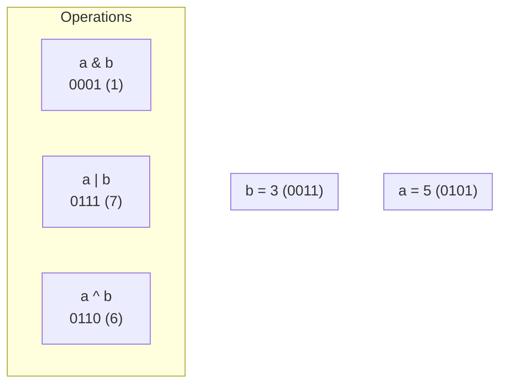

# 23 - Bit Manipulation: The Art of Twiddling Bits

Bit manipulation is the act of operating on data at its lowest level: the individual bits (`0`s and `1`s). While it may seem esoteric, it's a powerful technique for optimization, low-level control, and solving a specific class of algorithmic problems with incredible efficiency.

**What's in this chapter:**
*   [The Bitwise Operators](#1-the-bitwise-operators)
*   [Common Bitwise "Tricks"](#2-common-bitwise-tricks)
*   [Hands-On Lab: A Bitwise Playground](#3-hands-on-lab-a-bitwise-playground)
*   [Interview Deep Dives](#interview-deep-dives)

---

## 1. The Bitwise Operators

These operators work directly on the binary representation of integers. Let's use `a = 5 (0101)` and `b = 3 (0011)` for our examples.

| Operator | Name | Description | Example (`a op b`) | Result |
|:---:|---|---|---|:---:|
| `&` | AND | `1` if both bits are `1`. | `0101 & 0011` | `0001` (1) |
| `|` | OR | `1` if at least one bit is `1`. | `0101 | 0011` | `0111` (7) |
| `^` | XOR | `1` if the bits are different. | `0101 ^ 0011` | `0110` (6) |
| `~` | NOT | Inverts all bits. | `~0101` | `...11111010` (-6) |
| `<<` | Left Shift | Shifts bits to the left. | `0101 << 1` | `1010` (10) |
| `>>` | Signed Right Shift | Shifts bits to the right, preserving the sign bit. | `...11111010 >> 1` | `...11111101` (-3) |
| `>>>`| Unsigned Right Shift | Shifts bits to the right, filling with `0`s. | `...11111010 >>> 1`| `0...011111101` |

**Key Idea:**
*   `x << y` is equivalent to multiplying by `2^y`.
*   `x >> y` is equivalent to dividing by `2^y`.



---

## 2. Common Bitwise "Tricks"

There are several clever and widely-used idioms in bit manipulation.

#### Getting the i-th bit
To check if the i-th bit is set, you can AND the number with a mask that has a `1` at the i-th position.
*   **Trick:** `number & (1 << i)`
*   **Example:** Is the 2nd bit of `5 (0101)` set? `0101 & (1 << 2)` -> `0101 & 0100` -> `0100` (non-zero, so yes).

#### Setting the i-th bit
To set the i-th bit to `1`, you can OR the number with a mask.
*   **Trick:** `number | (1 << i)`
*   **Example:** Set the 1st bit of `5 (0101)`: `0101 | (1 << 1)` -> `0101 | 0010` -> `0111` (7).

#### Clearing the i-th bit
To set the i-th bit to `0`, you AND the number with a mask that has a `0` at the i-th position and `1`s everywhere else.
*   **Trick:** `number & ~(1 << i)`
*   **Example:** Clear the 2nd bit of `5 (0101)`: `0101 & ~(1 << 2)` -> `0101 & ...11111011` -> `0001` (1).

#### Clearing the lowest set bit
This is a famous trick used in the "Hamming Weight" problem.
*   **Trick:** `n & (n - 1)`
*   **Example:** `n = 12 (1100)`. `n-1 = 11 (1011)`. `1100 & 1011` -> `1000` (8). The lowest set bit was cleared.

---

## 3. Hands-On Lab: A Bitwise Playground

Bit manipulation can be abstract. To make it concrete, we've created a runnable project in the `code/` directory that:
1.  Includes a helper utility to print the binary representation of integers.
2.  Demonstrates each of the bitwise operators (`&`, `|`, `^`, etc.).
3.  Implements the classic interview problems: Single Number, Hamming Weight, and Power of Two.

**To run it:**
1.  Navigate to the `code/` directory.
2.  Run `mvn compile exec:java`.
3.  Explore the source code to see how these low-level operations work.

---

## Interview Deep Dives

### Q: How do you swap two integers without using a temporary variable?
*   **Answer:** You can use the XOR operator. The properties `x ^ x = 0` and `x ^ 0 = x` make this possible.
*   **The Code:**
    ```java
    a = a ^ b;
    b = a ^ b; // b is now original a
    a = a ^ b; // a is now original b
    ```

### Q: How do you find the single number in an array where every other element appears *three* times?
*   **Answer:** The XOR trick doesn't work here. Instead, you can count the number of times each bit position (0 to 31) is set across all numbers in the array. For each bit position, the total count of set bits will be a multiple of 3 if the single number has a `0` in that position, and `(a multiple of 3) + 1` if the single number has a `1`. You can then reconstruct the single number bit by bit.

### Q: What is Two's Complement?
*   **Answer:** It's the standard way computers represent negative integers. To get the two's complement of a positive number, you invert all the bits (`~`) and then add one. This is why the `~` operator on `5 (0101)` results in `-6 (...1010)` and not `-5`. This representation makes computer arithmetic for signed numbers much simpler.
