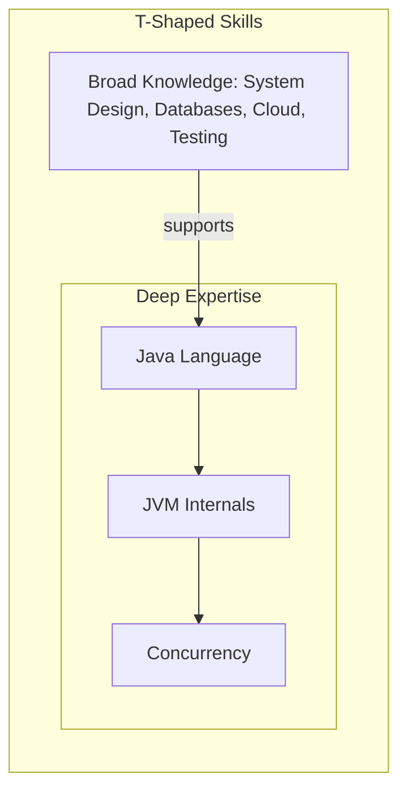

# 25 - The Modern Java Engineer's Handbook: Interviews and Growth

Technical skill is only part of a successful career. This chapter provides a curated guide to preparing for technical interviews and a framework for continuous professional growth, focusing on the mindset of a senior engineer.

**What's in this chapter:**
*   [The Interview: Thinking in Trade-offs](#1-the-interview-thinking-in-trade-offs)
*   [The Essential Coding Patterns](#2-the-essential-coding-patterns)
*   [The Growth Plan: Beyond the Code](#3-the-growth-plan-beyond-the-code)

---

## 1. The Interview: Thinking in Trade-offs

Senior engineers are distinguished by their ability to see trade-offs. Any junior developer can answer "What is a HashMap?". A senior can explain *why* they'd choose it over a `TreeMap` and what the consequences of that choice are.

Here's how to approach common interview topics with this mindset.

#### **Topic: Java Collections**
*   **Question:** "Tell me about `HashMap`."
*   **Simple Answer:** "It's a data structure for storing key-value pairs with O(1) average performance for get and put."
*   **Deeper Dive (The "Why"):** "I'd use a `HashMap` when I need fast lookups and the insertion order doesn't matter. It achieves O(1) performance by using the key's `hashCode()` to find a bucket. The trade-off is higher memory usage compared to a list and unordered elements. If I needed sorted keys, I'd use a `TreeMap`, accepting the O(log n) performance trade-off for the benefit of ordering."

#### **Topic: Concurrency**
*   **Question:** "How do you prevent a race condition?"
*   **Simple Answer:** "Use the `synchronized` keyword or a `Lock`."
*   **Deeper Dive (The "Why"):** "The core issue is managing access to shared, mutable state. The simplest tool is `synchronized`, but it's a coarse-grained lock on the whole object. For better performance, I'd prefer a more granular `synchronized` block on a private lock object. For more complex scenarios, the `java.util.concurrent` package is the modern approach. For a simple counter, `AtomicInteger` is the most efficient, as it uses lock-free, hardware-level atomic instructions. For managing tasks, I would always use the `ExecutorService` to avoid manual thread management."

#### **Topic: System Design**
*   **Question:** "How would you design a URL shortener?"
*   **Simple Answer:** "I'd use a database to store a mapping from a short ID to the original URL."
*   **Deeper Dive (The "Why"):** "First, I'd clarify the non-functional requirements: what's our expected RPS for reads vs. writes? For a read-heavy system, I'd focus on a fast lookup. A `HashMap`-like key-value store like Redis or DynamoDB would be a great choice for the core lookup, mapping the short ID to the long URL. The trade-off is that these stores might offer weaker consistency guarantees than a traditional SQL database. We also need to consider how the short ID is generated to avoid collisions at scale; a base-62 encoding of a counter from a dedicated ID-generation service would be a robust solution."

---

## 2. The Essential Coding Patterns

Don't just memorize 100 random problems. Master the underlying **patterns**. If you know the pattern, you can solve any problem of that type.

#### The "Must-Know" Patterns and a Classic Example for Each:
*   **Sliding Window:** *Maximum Sum Subarray of Size K*
*   **Two Pointers:** *Sort Colors (Dutch National Flag problem)*
*   **Tree Traversal (BFS/DFS):** *Maximum Depth of a Binary Tree*
*   **Graph Traversal (BFS/DFS):** *Number of Islands*
*   **Backtracking:** *Subsets* or *Combinations*
*   **Dynamic Programming:** *Coin Change* or *Longest Increasing Subsequence*
*   **Top K Elements:** *Top K Frequent Elements* (uses a Min-Heap/`PriorityQueue`)

Master these patterns, and you will be well-prepared for a huge range of coding challenges.

---

## 3. The Growth Plan: Beyond the Code

A great engineer has T-shaped skills: deep expertise in one area, and broad knowledge across many others.

#### Deepen Your Core Java Knowledge
*   **The Language:** Go beyond the syntax. Read "Effective Java" by Joshua Bloch to understand the *why* behind the language's design.
*   **The JVM:** You don't need to be a JVM engineer, but you should understand how garbage collection works (G1GC), what the JIT compiler does, and how to read a thread dump.
*   **Concurrency:** Master the `java.util.concurrent` package and understand the principles of the Java Memory Model.

#### Broaden Your Ecosystem Knowledge
*   **Frameworks:** Get proficient with **Spring Boot**. It's the industry standard.
*   **Testing:** Go beyond unit tests. Learn how to write meaningful integration tests using **Testcontainers**.
*   **Databases:** Understand the trade-offs between SQL (like PostgreSQL) and NoSQL (like DynamoDB or Redis).
*   **Build & CI/CD:** Understand how Maven/Gradle work and how a CI/CD pipeline (like GitHub Actions) builds, tests, and deploys your code.
*   **Cloud & Containers:** Get comfortable with **Docker**. Deploy a personal project to a cloud provider like AWS, GCP, or Azure.

#### Develop Your Engineering Mindset
*   **Read Code:** Read the source code of popular open-source Java libraries. How is Spring's `JdbcTemplate` implemented? How does Guava's `Cache` work?
*   **Write and Share:** Build small projects. Write blog posts about what you've learned. Contribute to an open-source project.
*   **Think in Systems:** For any feature you build, think about its non-functional requirements: How will it be monitored? How does it scale? What happens when its dependencies fail? This is the path from a coder to an engineer.
