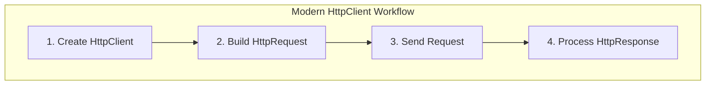
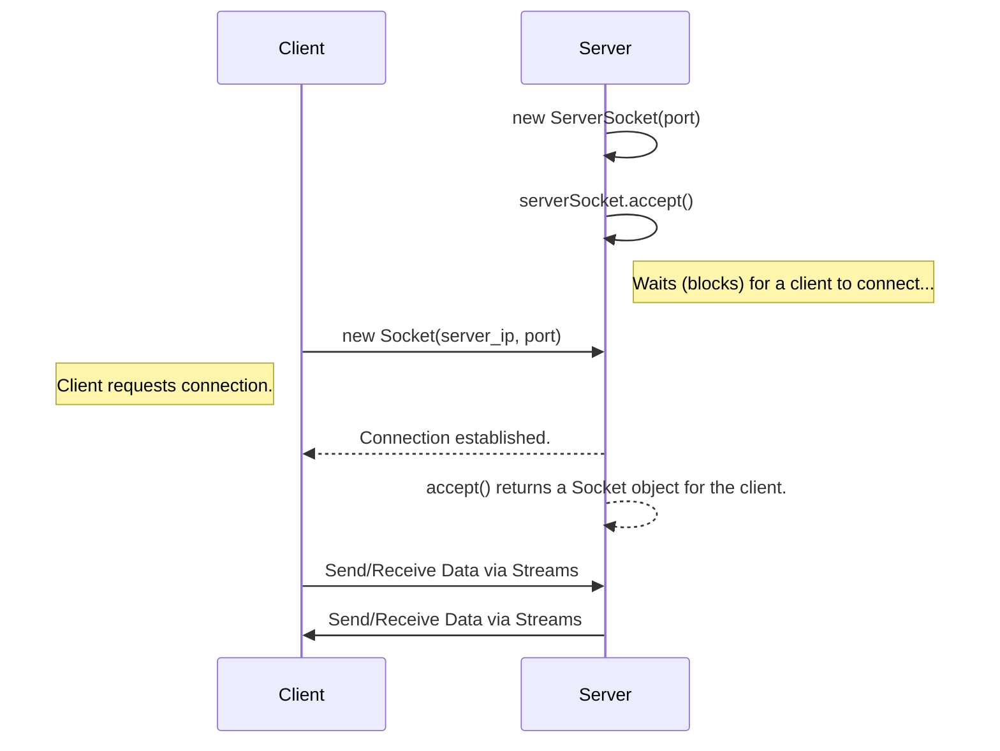

# 26 - Java Networking: Talking to the Internet

Modern applications are rarely self-contained. They communicate with databases, web services, and other applications over a network. We designed Java with networking in mind from day one, providing a powerful toolkit for network communication.

**What's in this chapter:**
*   [Networking Fundamentals: Sockets and Ports](#1-networking-fundamentals-sockets-and-ports)
*   [The Modern Way: The `HttpClient`](#2-the-modern-way-the-httpclient)
*   [Low-Level Networking: `Socket` and `ServerSocket`](#3-low-level-networking-socket-and-serversocket)
*   [Hands-On Lab: Fetching Data from a Web API](#4-hands-on-lab-fetching-data-from-a-web-api)

---

## 1. Networking Fundamentals: Sockets and Ports

At the lowest level, network communication happens through **sockets**. A socket is one endpoint of a two-way communication link between two programs running on the network.

*   **IP Address:** The unique address of a computer on a network (e.g., `172.217.14.228`).
*   **Port:** A number that identifies a specific application or service on that computer (e.g., port `80` for HTTP, port `443` for HTTPS).

A connection is uniquely identified by the combination of IP addresses and port numbers of the two endpoints.

---

## 2. The Modern Way: The `HttpClient`

For most applications today, "networking" means communicating with web services over **HTTP**. In Java 11, we introduced a new, modern `HttpClient` that provides a clean and powerful API for this purpose. It supports HTTP/1.1, HTTP/2, and asynchronous operations out of the box.

This is the **preferred** way to make HTTP requests in modern Java.

**Making a Simple GET Request:**



```java
// 1. Create an HttpClient
HttpClient client = HttpClient.newHttpClient();

// 2. Create an HttpRequest
HttpRequest request = HttpRequest.newBuilder()
    .uri(URI.create("https://api.publicapis.org/entries"))
    .build();

// 3. Send the request and get the response
// The response body is handled as a String here.
HttpResponse<String> response = client.send(request, HttpResponse.BodyHandlers.ofString());

// 4. Process the response
System.out.println("Status Code: " + response.statusCode());
System.out.println("Body: " + response.body());
```
This API is designed to be fluent, easy to use, and highly efficient.

---

## 3. Low-Level Networking: `Socket` and `ServerSocket`

For non-HTTP communication, or for building your own custom network protocols, you can use the original `Socket` and `ServerSocket` classes.

*   **`ServerSocket`:** A class used by a server application to listen for incoming connection requests from clients on a specific port.
*   **`Socket`:** A class used by a client to connect to a server and exchange data.

**Client-Server Handshake:**


While powerful, this level of programming is more complex as you have to manage your own data streams and application-level protocols.

---

## 4. Hands-On Lab: Fetching Data from a Web API

To see the modern `HttpClient` in action, we've created a runnable project in the `code/` directory that:
1.  Uses `HttpClient` to make a GET request to a public JSON API.
2.  Receives the JSON response as a string.
3.  Prints the status code and the response body.

**To run it:**
1.  Navigate to the `code/` directory.
2.  Run `mvn compile exec:java`.
3.  Observe the JSON data fetched from the live web API.
