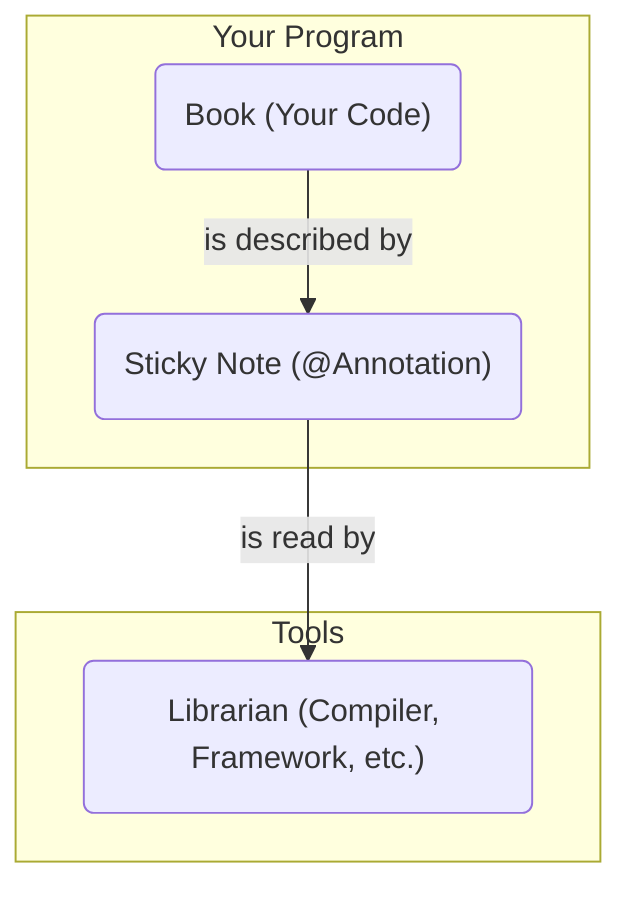
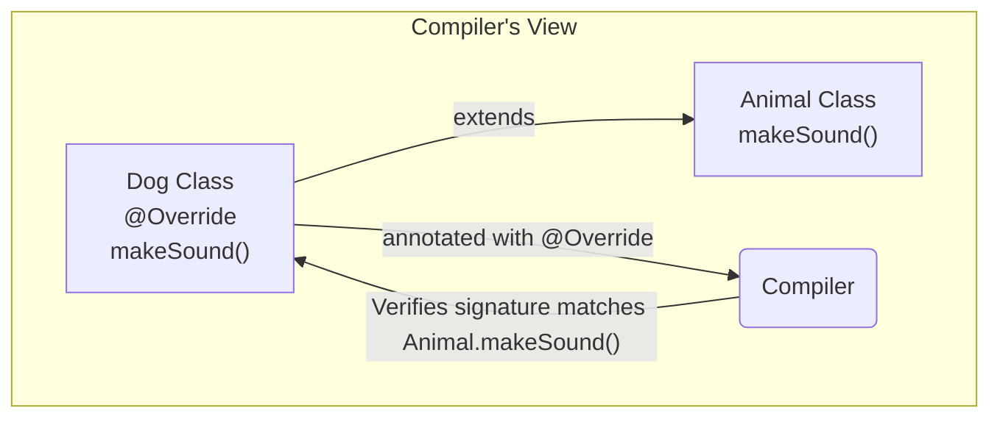
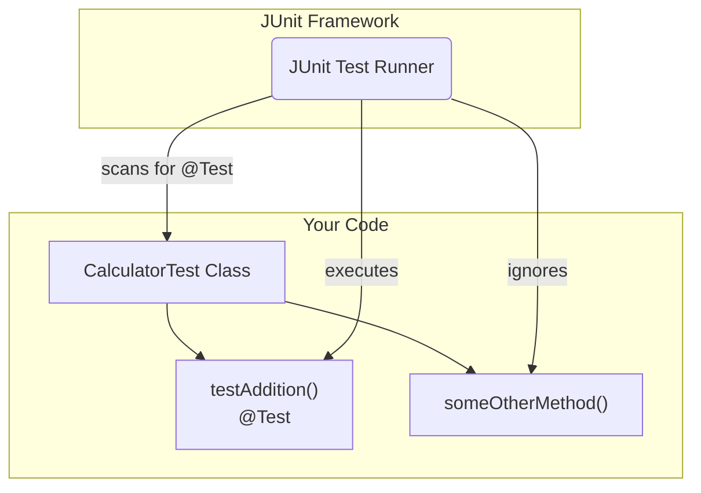
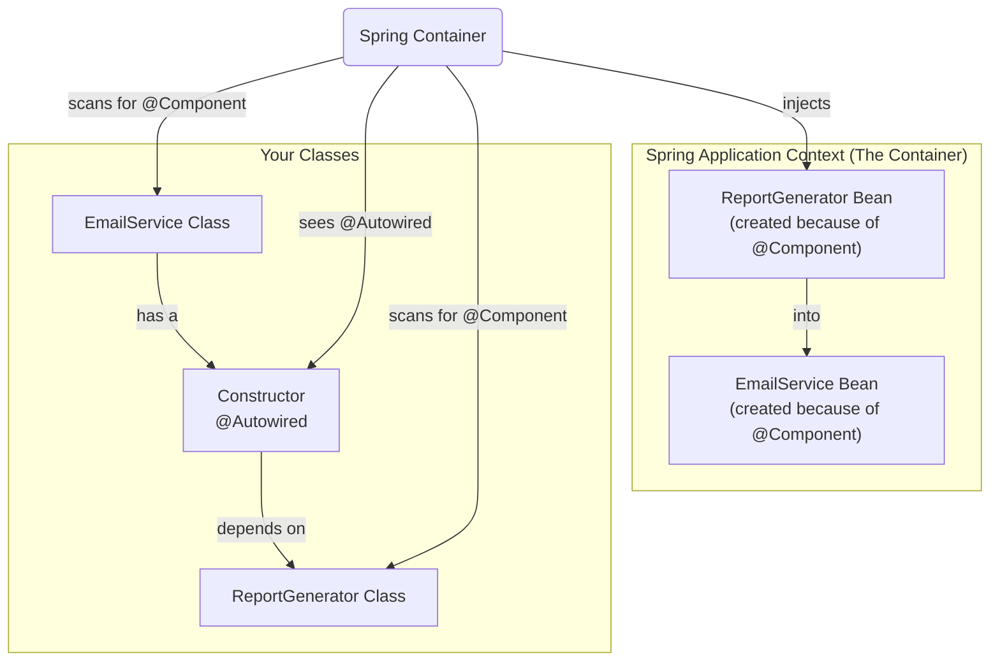

# 27 - Java Annotations: Metadata for Your Code

In modern software development, we don't just write code that executes; we also write code that *describes* other code. Java Annotations are a powerful way to add this descriptive metadata directly into your programs.

## What Are Annotations?

At its core, an **annotation** is a form of metadata that can be added to Java source code. It provides extra information about a program element (like a class, method, or variable) but does not affect the execution of the code itself.

Think of them as labels or tags you can attach to your code. These labels don't change what your code does, but they can be read and used by:

1.  **The Compiler:** The compiler can use annotations to detect errors or suppress warnings (e.g., `@Override`, `@SuppressWarnings`).
2.  **Build Tools:** Build tools (like Maven or Gradle) and other code analysis tools can use annotations to generate code, documentation, or other files.
3.  **The Runtime (JVM):** The Java Virtual Machine can inspect annotations at runtime to enable powerful features like dependency injection, object-relational mapping (ORM), and unit testing frameworks.

### How Annotations Work: A Simple Analogy

Imagine you are organizing a library. You could put a sticky note on a book with labels like "Fiction," "History," or "Needs Repair."

*   The book's content (the story) doesn't change.
*   The sticky note (`@Annotation`) provides information *about* the book.
*   A librarian (the compiler, a framework, or the JVM) can look at these notes to decide how to categorize, process, or handle the book.



### Categories of Annotations

Annotations can be grouped into three main categories based on where they come from and what they are used for:

1.  **Standard JDK Annotations:** Built into Java itself. These are fundamental annotations that every Java developer should know (e.g., `@Override`, `@Deprecated`).
2.  **Framework/Library Annotations:** Provided by external libraries and frameworks like Spring, Hibernate, or JUnit. These are essential for using the features of those frameworks (e.g., `@Autowired`, `@Entity`, `@Test`).
3.  **Custom Annotations:** Annotations that you define yourself. These are used to create your own metadata for specific purposes within your application.

In this chapter, we'll explore examples from all three categories.

---
## 1. Standard JDK Annotations

These are the annotations that are part of the core Java language. They are primarily used to give instructions or hints to the compiler.

### `@Override`

This is one of the most common annotations. It informs the compiler that the annotated method is intended to override a method in a superclass.

*   **Reason for use:** To prevent subtle bugs. If the method signature doesn't exactly match a method in the superclass (e.g., due to a typo), the compiler will produce an error. Without the annotation, it would be treated as a new method, and the bug would be much harder to find.

**Example:**
```java
class Animal {
    void makeSound() {
        System.out.println("Some generic animal sound");
    }
}

class Dog extends Animal {
    @Override
    void makeSound() {
        System.out.println("Bark");
    }
}
```

**Diagram:**


### `@Deprecated`

This annotation indicates that the marked element (e.g., a method or class) is obsolete and should no longer be used.

*   **Reason for use:** To signal to other developers that a piece of code is outdated and may be removed in future versions. The compiler will issue a warning if you use a deprecated element. It also helps guide developers to a newer, preferred alternative.

**Example:**
```java
class OldCalculator {
    /**
     * @deprecated This method is outdated. Use add(int... numbers) instead.
     */
    @Deprecated
    int addTwoNumbers(int a, int b) {
        return a + b;
    }

    int add(int... numbers) {
        int sum = 0;
        for (int num : numbers) {
            sum += num;
        }
        return sum;
    }
}
```

**Diagram:**
```mermaid
graph TD
    Developer --> |uses| OldCalculator.addTwoNumbers()
    subgraph "Compiler's Reaction"
        OldCalculator.addTwoNumbers["addTwoNumbers()<br>@Deprecated"]
        Compiler --> |issues| Warning("Warning: Using deprecated method")
        OldCalculator.addTwoNumbers -- "triggers" --> Compiler
    end
    Developer -- "receives" --> Warning
```

### `@SuppressWarnings`

This annotation tells the compiler to suppress specific warnings that it would normally generate.

*   **Reason for use:** To clean up compiler output when you are certain that a warning is not a real issue. This is common when dealing with legacy code or generic type erasure. It's important to be specific about what warning you are suppressing.

**Example:**
```java
import java.util.ArrayList;
import java.util.List;

class WarningDemo {
    @SuppressWarnings("unchecked")
    void addRawToList() {
        List<String> myList = new ArrayList<>();
        // This would normally cause an "unchecked" warning
        List rawList = myList;
        rawList.add(123); // This is unsafe, but the warning is suppressed
    }
}
```

**Diagram:**
```mermaid
graph TD
    subgraph "Code with Potential Issue"
        UnsafeCode("Unsafe generic operation")
    end

    subgraph "Compiler's Default Behavior"
        Compiler --> |generates| Warning("Unchecked cast warning")
        UnsafeCode -- "causes" --> Compiler
    end

    subgraph "With @SuppressWarnings"
        AnnotatedCode("Unsafe generic operation<br>@SuppressWarnings(\"unchecked\")")
        CompilerWithSuppression("Compiler")
        AnnotatedCode -- "instructs" --> CompilerWithSuppression
        CompilerWithSuppression -- "suppresses warning" --> AnnotatedCode
    end
```

### `@FunctionalInterface`

This annotation is used to indicate that an interface is intended to be a "functional interface," meaning it contains exactly one abstract method.

*   **Reason for use:** To ensure at compile time that the interface meets the requirements for a functional interface. This allows it to be the target for lambda expressions and method references. If you add a second abstract method to an interface marked with `@FunctionalInterface`, the compiler will produce an error.

**Example:**
```java
@FunctionalInterface
interface StringOperation {
    String operate(String s);
    // Adding another abstract method here would cause a compile error.
}

class Greeter {
    void sayHello(String name, StringOperation format) {
        System.out.println(format.operate(name));
    }
}

// Usage with a lambda
Greeter greeter = new Greeter();
greeter.sayHello("World", s -> "Hello, " + s + "!");
```

**Diagram:**
```mermaid
graph TD
    StringOperation["StringOperation Interface<br>@FunctionalInterface<br>operate(String s)"]
    Compiler("Compiler")

    StringOperation -- "is checked by" --> Compiler
    Compiler -- "Ensures exactly one abstract method" --> StringOperation

    Lambda["Lambda Expression<br>s -> \"Hello, \" + s"]
    Lambda -- "is a valid implementation of" --> StringOperation
```

---
## 2. Framework and Library Annotations

Most modern Java frameworks (like Spring, Hibernate, and JUnit) are heavily reliant on annotations. Annotations are used to configure the framework, reducing the need for verbose XML configuration files and making the code more readable.

### JUnit: `@Test`

The JUnit framework uses annotations to identify and configure test methods.

*   **Reason for use:** The `@Test` annotation marks a method as a test case. When you run the JUnit framework, it scans your classes for methods annotated with `@Test` and executes them. This is a classic example of a tool reading annotations at runtime to do its work.

**Example:**
```java
import static org.junit.jupiter.api.Assertions.assertEquals;
import org.junit.jupiter.api.Test;

class CalculatorTest {
    @Test
    void testAddition() {
        Calculator calculator = new Calculator();
        assertEquals(5, calculator.add(2, 3), "2 + 3 should equal 5");
    }

    // This method will not be run as a test
    void someOtherMethod() {
        // ...
    }
}
```

**Diagram:**


### Spring Framework: `@Component` and `@Autowired`

The Spring Framework uses annotations for **Dependency Injection (DI)**. Spring manages the lifecycle of objects (called "beans") and injects them where they are needed.

*   **`@Component`**: Marks a class as a "component." This tells the Spring container to automatically create an instance of this class (a bean) when the application starts.
*   **`@Autowired`**: Marks a constructor, field, or setter method to be "autowired" with a dependency. This tells Spring to find a suitable bean from its container and inject it here.

*   **Reason for use:** To decouple components. The `EmailService` doesn't need to know how to create a `ReportGenerator`. It just declares that it needs one, and Spring provides it. This makes the code cleaner, easier to test, and more maintainable.

**Example:**
```java
// Spring will create a bean of this class
@Component
class ReportGenerator {
    public String generateReport() {
        return "Here is your report.";
    }
}

// Spring will create a bean of this class too
@Component
class EmailService {
    private final ReportGenerator reportGenerator;

    // Spring will inject the ReportGenerator bean here
    @Autowired
    public EmailService(ReportGenerator reportGenerator) {
        this.reportGenerator = reportGenerator;
    }

    public void sendReport() {
        String report = reportGenerator.generateReport();
        System.out.println("Sending email with report: " + report);
    }
}
```

**Diagram:**


---
## 3. Data and Persistence Annotations (JPA)

The **Java Persistence API (JPA)** is a standard specification for **Object-Relational Mapping (ORM)**, which means mapping Java objects to records in a relational database. JPA uses annotations extensively to define this mapping.

### `@Entity`, `@Id`, `@Column`, and `@GeneratedValue`

These annotations work together to map a Java class to a database table.

*   **`@Entity`**: Marks a class as a JPA entity. This tells the JPA provider (like Hibernate) that this class corresponds to a a table in the database.
*   **`@Id`**: Marks a field as the primary key for that entity.
*   **`@GeneratedValue`**: Specifies that the primary key value will be generated automatically by the database (e.g., as an auto-incrementing integer).
*   **`@Column`**: (Optional) Marks a field as corresponding to a column in the table. You can use it to specify details like the column name, length, or whether it can be null.

*   **Reason for use:** To bridge the gap between the object-oriented world of Java and the relational world of SQL databases. These annotations allow you to define your database schema directly in your Java code, making it the single source of truth and removing the need to manage separate SQL schema files.

**Example:**
```java
import javax.persistence.Entity;
import javax.persistence.Id;
import javax.persistence.GeneratedValue;
import javax.persistence.GenerationType;
import javax.persistence.Column;

// This class is mapped to a table named "User"
@Entity
public class User {

    // This field is the primary key, and its value is auto-generated
    @Id
    @GeneratedValue(strategy = GenerationType.IDENTITY)
    private Long id;

    // This field maps to the "user_name" column, which cannot be null
    @Column(name = "user_name", nullable = false)
    private String name;

    private String email; // This will map to a column named "email" by default

    // Getters and setters...
}
```

**Diagram:**
```mermaid
graph TD
    subgraph "Java Code (Your Application)"
        UserClass["User Class<br>@Entity"]
        IdField["id: Long<br>@Id<br>@GeneratedValue"]
        NameField["name: String<br>@Column(name=\"user_name\")"]
        EmailField["email: String"]

        UserClass --> IdField
        UserClass --> NameField
        UserClass --> EmailField
    end

    subgraph "Database (e.g., PostgreSQL)"
        UserTable["User Table"]
        IdColumn["id BIGINT (Primary Key, Auto-Increment)"]
        UserNameColumn["user_name VARCHAR(255) (Not Null)"]
        EmailColumn["email VARCHAR(255)"]

        UserTable --> IdColumn
        UserTable --> UserNameColumn
        UserTable --> EmailColumn
    end

    JPAProvider["JPA Provider (e.g., Hibernate)"]

    UserClass -- "is mapped by" --> JPAProvider
    JPAProvider -- "to" --> UserTable
```

---
## 4. Creating Your Own Custom Annotations

While the standard and framework-provided annotations are powerful, the true flexibility of this system comes from being able to create your own. This is useful for creating your own frameworks, adding special validation, or marking code for processing by custom tools.

### Defining a Custom Annotation

You define a custom annotation using the `@interface` keyword. Inside, you can declare elements that act like parameters.

You also need to use **meta-annotations** to specify how your annotation should be treated:
*   **`@Retention`**: Specifies *how long* the annotation should be kept.
    *   `RetentionPolicy.SOURCE`: Discarded by the compiler.
    *   `RetentionPolicy.CLASS`: Kept in the `.class` file but not available at runtime. (Default)
    *   `RetentionPolicy.RUNTIME`: Available to the JVM at runtime via reflection. This is the most common for custom annotations.
*   **`@Target`**: Specifies *where* the annotation can be applied (e.g., classes, methods, fields).

**Example: A `@JsonField` annotation**

Let's create an annotation that could be used by a custom JSON serialization tool to map a class field to a specific name in a JSON object.

**1. Define the Annotation:**
```java
import java.lang.annotation.ElementType;
import java.lang.annotation.Retention;
import java.lang.annotation.RetentionPolicy;
import java.lang.annotation.Target;

@Retention(RetentionPolicy.RUNTIME) // This annotation can be read at runtime
@Target(ElementType.FIELD) // This annotation can only be applied to fields
public @interface JsonField {
    public String value() default ""; // An element to hold the JSON key name
}
```

**2. Use the Annotation:**
```java
class Car {
    @JsonField("make")
    private final String carMaker;

    @JsonField("model")
    private final String carModel;

    private final int year; // This field won't be part of the JSON

    public Car(String carMaker, String carModel, int year) {
        this.carMaker = carMaker;
        this.carModel = carModel;
        this.year = year;
    }
    // ... getters
}
```

**3. Process the Annotation (using Reflection):**
A tool would then use reflection to inspect an object, find the fields marked with `@JsonField`, and use the provided value as the key in the resulting JSON string.

```java
// Simplified example of a processor
import java.lang.reflect.Field;
import java.util.HashMap;
import java.util.Map;
import java.util.stream.Collectors;

class JsonSerializer {
    public String serialize(Object object) throws IllegalAccessException {
        Map<String, String> jsonMap = new HashMap<>();
        for (Field field : object.getClass().getDeclaredFields()) {
            if (field.isAnnotationPresent(JsonField.class)) {
                field.setAccessible(true); // Allow access to private fields
                JsonField jsonField = field.getAnnotation(JsonField.class);
                String key = jsonField.value();
                String value = (String) field.get(object);
                jsonMap.put(key, value);
            }
        }
        // Creates a simple JSON string like {"key": "value", ...}
        return "{" + jsonMap.entrySet().stream()
                .map(e -> "\"" + e.getKey() + "\":\"" + e.getValue() + "\"")
                .collect(Collectors.joining(",")) + "}";
    }
}
```

**Diagram:**
```mermaid
graph TD
    subgraph "1. Definition"
        JsonFieldAnnotation["@interface JsonField<br>@Retention(RUNTIME)<br>@Target(FIELD)"]
    end

    subgraph "2. Usage"
        CarClass["Car Class"]
        CarMakerField["carMaker: String<br>@JsonField(\"make\")"]
        CarClass --> CarMakerField
    end

    subgraph "3. Processing (at Runtime)"
        JsonSerializerTool["JsonSerializer Tool"]
        CarObject["Car Object instance"]

        JsonSerializerTool -- "inspects" --> CarObject
        CarObject -- "finds @JsonField via Reflection" --> JsonSerializerTool
        JsonSerializerTool -- "produces" --> JsonString("{\"make\":\"Ford\", ...}")
    end

    JsonFieldAnnotation -- "is used by" --> CarMakerField
    CarMakerField -- "is part of" --> CarObject
```
