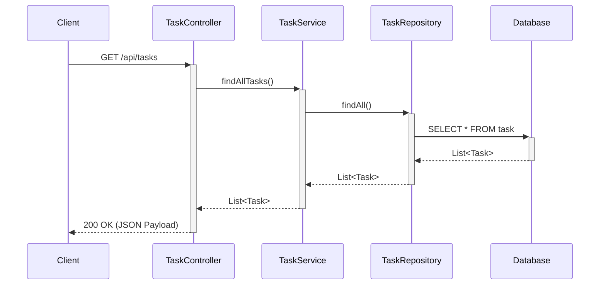

# Spring Boot Sample App

This is a simple Spring Boot application that demonstrates a classic 3-tier architecture with a RESTful API for managing tasks.

## Architecture Overview

The application is divided into three main layers:

*   **Controller (`TaskController.java`):** Handles incoming HTTP requests, validates input, and returns HTTP responses. It delegates business logic to the Service layer.
*   **Service (`TaskService.java`):** Contains the core business logic. It orchestrates calls to the Repository layer and can handle transactions.
*   **Repository (`TaskRepository.java`):** Responsible for data access. It extends Spring Data JPA's `JpaRepository`, which provides standard database operations (CRUD) out of the box.

### Sequence Diagram: Get All Tasks

This diagram shows the sequence of events when a client requests all tasks from the API.

